# Chain-of-Thought
> **Disclaimer:**
>
> This document contains my personal notes on the topic,
> compiled from publicly available documentation and various cited sources.
> The materials are intended for educational purposes, personal study, and reference.
> The content is dual-licensed:
> 1. **MIT License:** Applies to all code implementations (Swift, Mermaid, and other programming languages).
> 2. **Creative Commons Attribution 4.0 International License (CC BY 4.0):** Applies to all non-code content, including text, explanations, diagrams, and illustrations.
---

```mermaid
---
title: Chain-of-Thought (CoT)
config:
  layout: elk
  look: handDrawn
  theme: dark
---
%%{
  init: {
    'fontFamily': 'verdana',
    'themeVariables': {
      'primaryColor': '#BB2528',
      'primaryTextColor': '#f529',
      'primaryBorderColor': '#7C0000',
      'lineColor': '#F8B229',
      'secondaryColor': '#006100',
      'tertiaryColor': '#fff'
    }
  }
}%%
graph LR
    A["Chain-of-Thought (CoT)"] --> B{Key Idea}
    B --> C(Decompose complex problems into smaller, sequential reasoning steps)
    B --> D(Mimic human-like problem-solving)
    
    subgraph CoT_Example["CoT Example"]
        C --> CA(Example: Calculating Average)
        CA --> CB(Input: Calculate the average of 2, 4, and 9)
        CA --> CC(Reasoning Steps)
            CC --> CC1(Add numbers: 2 + 4 + 9 = 15)
            CC --> CC2(Count numbers: There are 3 numbers)
            CC --> CC3(Divide sum by count: 15 / 3 = 5)
            CC --> CC4(Answer: The average is 5)
        CA --> CD(Output: 5)
    end
    
    subgraph Benefits_of_CoT["Benefits of CoT"]
        D --> DA(Improved Accuracy)
        D --> DB(Enhanced Transparency)
        D --> DC(Increased Trustworthiness)
        D --> DD(Efficient Adaptation)
    end
    
    subgraph Types_of_CoT["Types of CoT"]
        B --> E(Few-shot CoT)
        B --> F(Zero-shot CoT)
    end
    
    subgraph CoT_Improvements["CoT Improvements"]
        B --> G(Dynamic Problem Decomposition)
        G --> G1(Generating sub-problems during problem solving)
        G --> G2(Utilizing multiple LLMs or other external tools for sub-problem solving)
        G --> G3(Hierarchical problem-solving structure)
        
        B --> H(Advanced Prompting Techniques)
        H --> H1(Integrating CoT with other prompting techniques)
    end
    
    
    style A fill:#ccf3,stroke:#333,stroke-width:1px;
    style B fill:#ccf3,stroke:#333,stroke-width:1px;
    style C fill:#ccf3,stroke:#333,stroke-width:1px;
    style D fill:#ccf3,stroke:#333,stroke-width:1px;
    style CA fill:#ccf3,stroke:#333,stroke-width:1px;
    style CC fill:#ccf3,stroke:#333,stroke-width:1px;
    style CD fill:#ccf3,stroke:#333,stroke-width:1px;
    style DA fill:#ccf3,stroke:#333,stroke-width:1px;
    style DB fill:#ccf3,stroke:#333,stroke-width:1px;
    style DC fill:#ccf3,stroke:#333,stroke-width:1px;
    style DD fill:#ccf3,stroke:#333,stroke-width:1px;
    style E fill:#ccf3,stroke:#333,stroke-width:1px;
    style F fill:#ccf3,stroke:#333,stroke-width:1px;
    style G fill:#ccf3,stroke:#333,stroke-width:1px;
    style H fill:#ccf3,stroke:#333,stroke-width:1px;

```

----

### Explanation

This Mermaid graph visualizes "Chain-of-Thought" (CoT) prompting, highlighting its key idea, a breakdown of a complex problem into smaller steps, and mimicking human problem-solving.  It also illustrates the benefits of CoT (accuracy, transparency, trustworthiness, adaptation) and different ways to implement CoT, including few-shot and zero-shot approaches, and how it can be improved with dynamic decomposition and advanced prompting techniques.

---
**Licenses:**

- **MIT License:**   - Full text in [LICENSE](LICENSE) file.
- **Creative Commons Attribution 4.0 International:**  - Legal details in [LICENSE-CC-BY](LICENSE-CC-BY) and at [Creative Commons official site](http://creativecommons.org/licenses/by/4.0/).

---