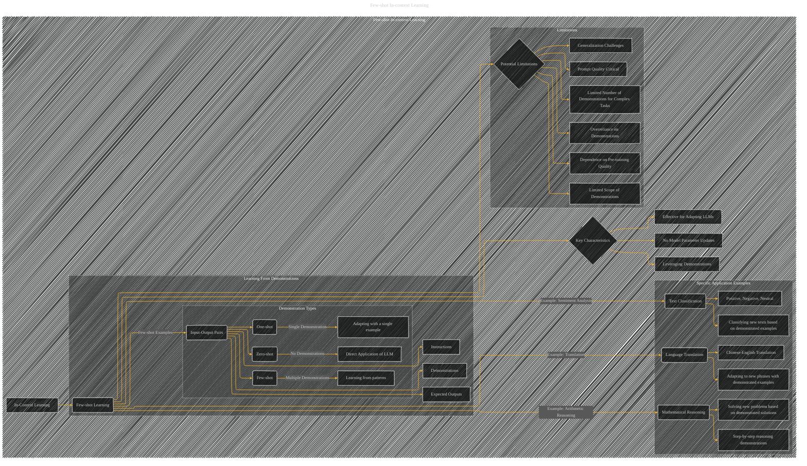

# Few-shot In-context Learning
> **Disclaimer:**
>
> This document contains my personal notes on the topic,
> compiled from publicly available documentation and various cited sources.
> The materials are intended for educational purposes, personal study, and reference.
> The content is dual-licensed:
> 1. **MIT License:** Applies to all code implementations (Swift, Mermaid, and other programming languages).
> 2. **Creative Commons Attribution 4.0 International License (CC BY 4.0):** Applies to all non-code content, including text, explanations, diagrams, and illustrations.
---

---

### Explanation

*   **Few-shot Learning:**  A central concept.
*   **Key Characteristics:** Highlights the core features: No parameter updates, leveraging demonstrations, and adapting LLMs efficiently.
*   **Learning from Demonstrations:**  This subgraph delves into the idea of providing input-output pairs (demonstrations) to guide the LLM. It further breaks down demonstration types (zero-shot, one-shot, few-shot).
*   **Specific Application Examples:** Shows how few-shot in-context learning can be applied to different NLP tasks like sentiment analysis, translation, and mathematical reasoning, illustrating the different types of input-output demonstrations required for each.
*   **Potential Limitations:**  This subgraph acknowledges the potential challenges, such as prompt quality, overreliance on demonstrations, generalization to new scenarios, and the dependence on the quality of the pre-trained LLM.  It also emphasizes that the number and complexity of demonstrations matter when handling complex tasks.

---
**Licenses:**

- **MIT License:**   - Full text in [LICENSE](LICENSE) file.
- **Creative Commons Attribution 4.0 International:**  - Legal details in [LICENSE-CC-BY](LICENSE-CC-BY) and at [Creative Commons official site](http://creativecommons.org/licenses/by/4.0/).

---