# Foundations of Large Language Models - V2
> **Disclaimer:**
>
> This document contains my personal notes on the topic,
> compiled from publicly available documentation and various cited sources.
> The materials are intended for educational purposes, personal study, and reference.
> The content is dual-licensed:
> 1. **MIT License:** Applies to all code implementations (Swift, Mermaid, and other programming languages).
> 2. **Creative Commons Attribution 4.0 International License (CC BY 4.0):** Applies to all non-code content, including text, explanations, diagrams, and illustrations.
---

Below diagram is the expanded version from the initial version at [here](./Foundations_of_LLMs_V1.md).

This expanded diagram provides a much more comprehensive and up-to-date overview of the foundations of large language models.  It covers historical context, core concepts, training techniques, prompting strategies, alignment methods, evaluation, and key challenges. It's suitable for a wide range of audiences, from beginners to experts, and provides a solid foundation for further exploration of this rapidly evolving field. The use of `classDef detail` allows for highlighting specific nodes.

## Foundations of Large Language Models (Expanded)

```mermaid
---
title: "Foundations of Large Language Models (Expanded)"
config:
  layout: elk
  look: handDrawn
  theme: dark
---
%%%%%%%% Mermaid version v11.4.1-b.14
%%%%%%%% Available curve styles include the following keywords:
%% basis, bumpX, bumpY, cardinal, catmullRom, linear, monotoneX, monotoneY, natural, step, stepAfter, stepBefore.
%%{
  init: {
    "graph": { "htmlLabels": true, 'curve': 'linear' },
    'fontFamily': 'Fantasy',
    'themeVariables': {
      'primaryColor': '#BB2528',
      'primaryTextColor': '#f529',
      'primaryBorderColor': '#7C0000',
      'lineColor': '#F8B229',
      'secondaryColor': '#006100',
      'tertiaryColor': '#fff'
    }
  }
}%%

graph LR
    subgraph Foundations_of_LLMs["Foundations of Large Language Models"]
        A[Introduction] --> B(Pre-training)
        A --> Z[Key Concepts & Definitions]
        A --> Y[Historical Context & Evolution]

        Y --> Y1["Early Language Models<br>(n-gram models, statistical LMs)"]
        Y --> Y2["Rise of Neural Networks<br>(RNNs, LSTMs, GRUs)"]
        Y --> Y3["The Transformer Revolution<br>(2017 - 'Attention is All You Need')"]
        Y --> Y4["Scaling Laws and Emergent Abilities"]
        Y --> Y5["Open Source vs. Closed Source LLMs"]

        Z --> Z1[Tokenization]
        Z1 --> Z11["Subword Tokenization<br>(Byte Pair Encoding (BPE), WordPiece, SentencePiece, Unigram LM)"]
        Z1 --> Z12["Tokenization Challenges<br>(handling rare words, multilingual support)"]
        Z --> Z2[Embeddings]
        Z2 --> Z21["Word Embeddings<br>(Word2Vec, GloVe, FastText - pre-Transformer)"]
        Z2 --> Z22["Contextualized Embeddings<br>(ELMo, BERT, Transformer embeddings)"]
        Z2 --> Z23["Embedding Visualization & Analysis"]
        Z --> Z3[Attention Mechanism]
        Z3 --> Z31["Self-Attention"]
        Z3 --> Z32["Multi-Head Attention"]
        Z3 --> Z33["Scaled Dot-Product Attention"]
        Z3 --> Z34["Attention Visualization"]
        Z3 --> Z35["Attention Variants<br>(e.g., Relative Positional Embeddings)"]
        Z --> Z4[Transformer Architecture]
        Z4 --> Z41["Encoder-Decoder Structure"]
        Z4 --> Z42["Encoder-Only Models<br>(BERT, RoBERTa)"]
        Z4 --> Z43["Decoder-Only Models<br>(GPT family)"]
        Z4 --> Z44["Layer Normalization"]
        Z4 --> Z45["Residual Connections"]
        Z4 --> Z46["Feed-Forward Networks"]
        Z --> Z5[Generative vs. Discriminative Models]
        Z5 --> Z51["Generative: Focus on generating text<br>(e.g., GPT)"]
        Z5 --> Z52["Discriminative: Focus on classification/prediction<br>(e.g., BERT for sentence classification)"]
        Z --> Z6[Parameters vs. Hyperparameters]
        Z6 --> Z61["Parameters: Learned during training"]
        Z6 --> Z62["Hyperparameters: Set before training<br>(learning rate, batch size, etc.)"]
        Z --> Z7["Loss Functions<br>(e.g., Cross-Entropy)"]
        Z7 --> Z71["Cross-Entropy Loss"]
        Z7 --> Z72["Other Loss Functions<br>(e.g., KL Divergence for VAEs)"]
        Z --> Z8["Evaluation Metrics<br>(e.g., Perplexity, BLEU, ROUGE)"]
        Z8 --> Z81["Perplexity (Intrinsic)"]
        Z8 --> Z82["BLEU (Machine Translation)"]
        Z8 --> Z83["ROUGE (Summarization)"]
        Z8 --> Z84["METEOR (Machine Translation)"]
        Z8 --> Z85["CIDEr (Image Captioning)"]
        Z8 --> Z86["Human Evaluation"]
        Z8 --> Z87["Task-Specific Metrics"]
        Z --> Z9[Regularization Techniques]
        Z9 --> Z91["Dropout"]
        Z9 --> Z92["Weight Decay"]
        Z9 --> Z93["Label Smoothing"]

        B --> B1[Unsupervised Pre-training]
        B1 --> B11["Masked Language Modeling (MLM) - BERT-style"]
        B11 --> B111["Dynamic Masking"]
        B1 --> B12["Causal Language Modeling (CLM) - GPT-style"]
        B12 --> B121["Autoregressive Modeling"]
        B1 --> B13["Next Sentence Prediction (NSP) - BERT<br>(often removed in later models)"]
        B1 --> B14["Permutation Language Modeling (PLM) - XLNet"]
        B1 --> B15[Contrastive Learning]
        B15 --> B151["SimCLR"]
        B15 --> B152["MoCo"]
        B15 --> B153["InfoNCE Loss"]
        B1 --> B16["Token-Level Prediction"]
        B1 --> B17["Sequence-Level Prediction"]
        B1 --> B18["Mixture-of-Experts (MoE) Pre-training"]

        B --> B2[Supervised Pre-training]
        B2 --> B21["Task-Specific Pre-training<br>(e.g., on labeled datasets)"]
        B2 --> B22[Multi-Task Learning]

        B --> B3[Self-Supervised Pre-training]
        B3 --> B31[Definition: Learning from unlabeled data using inherent structure]
        B3 --> B32[Examples:<br>MLM, CLM are forms of self-supervision]

        B --> B4[Adapting Pre-trained Models]
        B4 --> B41[Fine-tuning]
        B41 --> B411["Full Fine-tuning<br>(all parameters updated)"]
        B41 --> B412["Parameter-Efficient Fine-tuning<br>(PEFT)"]
        B412 --> B4121[Adapters]
        B4121 --> B41211["Bottleneck Adapters"]
        B4121 --> B41212["AdapterFusion"]
        B412 --> B4122["LoRA<br>(Low-Rank Adaptation)"]
        B412 --> B4123[Prefix Tuning]
        B412 --> B4124[Prompt Tuning]
        B412 --> B4125["(IA)³<br>(Infused Adapter by Inhibiting and Amplifying Inner Activations)"]
        B412 --> B4126["BitFit<br>(Bias-Term Fine-tuning)"]
        B412 --> B4127["Ladder-Side Tuning"]
        B41 --> B413["Fine-tuning Strategies"]
        B413 --> B4131["Learning Rate Schedules<br>(warmup, decay)"]
        B413 --> B4132["Catastrophic Forgetting Mitigation"]
        B413 --> B4133["Layer Freezing"]


        B4 --> B42[Prompting]
        B42 --> B421[Zero-Shot Prompting]
        B42 --> B422[Few-Shot Prompting]
        B42 --> B423["Chain-of-Thought (CoT) Prompting"]
        B42 --> B424["Tree-of-Thoughts (ToT) Prompting"]
        B42 --> B425["Retrieval-Augmented Generation<br>(RAG)"]
        B42 --> B426["Instruction Prompting"]
        B42 --> B427["Role Prompting"]
        B42 --> B428["Multi-Turn Conversations"]

        B --> C(Generative Models & Training)
        C --> C1["LLMs (Large Language Models)"]
        C1 --> C11[Examples: GPT-3/4, LLaMA, PaLM, Claude, Gemini, Mistral]
        C1 --> C12["Model Architectures<br>(variations on Transformer)"]

        C --> C2[Training at Scale]
        C2 --> C21[Data Parallelism]
        C2 --> C22[Tensor Parallelism]
        C2 --> C23[Pipeline Parallelism]
        C2 --> C24["ZeRO<br>(Zero Redundancy Optimizer)"]
        C24 --> C241["ZeRO Stage 1 (Optimizer State Partitioning)"]
        C24 --> C242["ZeRO Stage 2 (Gradient Partitioning)"]
        C24 --> C243["ZeRO Stage 3 (Parameter Partitioning)"]
        C2 --> C25["Mixed Precision Training<br>(FP16, BF16)"]
        C2 --> C26["Gradient Checkpointing"]
        C2 --> C27["Optimizer Choices<br>(Adam, AdamW, LAMB)"]
        C2 --> C28["Distributed Training Frameworks<br>(DeepSpeed, Megatron-LM, PyTorch FSDP)"]
        C2 --> C29["Hardware Considerations<br>(GPUs, TPUs, specialized accelerators)"]

        C --> C3[Long Sequence Modeling]
        C3 --> C31[Attention Mechanisms for Long Sequences]
        C31 --> C311[Sparse Attention]
        C311 --> C3111["Longformer"]
        C311 --> C3112["Big Bird"]
        C31 --> C312[Linear Attention]
        C312 --> C3121["Linformer"]
        C31 --> C313[Sliding Window Attention]
        C31 --> C314[Global Attention]
        C31 --> C315["Attention Sinks"]
        C3 --> C32["Recurrent Models<br>(for comparison, not typically used in LLMs)"]

        C --> C5[Aligning LLMs with the World]
        C5 --> C51[Instruction Alignment]
        C51 --> C511["Supervised Fine-tuning<br>(SFT)"]
        C511 --> C5111[Instruction Tuning Methods]
        C5111 --> C51111["FLAN<br>(Finetuned Language Net)"]
        C5111 --> C51112["T0<br>(Cross-Task Generalization via Natural Language Instruction Tuning)"]
        C5111 --> C51113["Self-Instruct"]
        C51 --> C512["Data Collection for Instruction Tuning"]
        C5 --> C52[Human Preference Alignment]
        C52 --> C521["RLHF (Reinforcement Learning from Human Feedback)"]
        C521 --> C5211[Reward Model Training]
        C5211 --> C52111[Collecting Human Preference Data]
        C5211 --> C52112["Training a Reward Model<br>(RM)"]
        C5211 --> C52113["Reward Hacking/Overtraining Issues"]
        C521 --> C5212[Policy Training]
        C5212 --> C52121["PPO (Proximal Policy Optimization)"]
        C5212 --> C52122["Other RL Algorithms<br>(e.g., A2C, TRPO)"]
        C52 --> C522["Direct Preference Optimization<br>(DPO)"]
        C52 --> C523[Constitutional AI]
        C523 --> C5231["Self-Critique and Revision"]
        C52 --> C524["Kahneman-Tversky Optimization<br>(KTO)"]
        C52 --> C525["Rejection Sampling Fine-tuning"]
        C52 --> C526["RRHF (Rank Responses to align Human Feedback)"]

        C5 --> C53[Safety and Security Alignment]
        C53 --> C531["Red Teaming"]
        C53 --> C532["Adversarial Training"]
        C53 --> C533["Toxicity Detection and Mitigation"]
        C53 --> C534["Bias Detection and Mitigation"]
        C5 --> C54[Alignment Tax]


        F3 --> F35["Plan-and-Solve Prompting"]
        F3 --> F36["Least-to-Most Prompting"]
        F3 --> F37["Self-Refine"]
        
        F4 --> F42["Automatic Prompt Generation"]
        
        F51 --> F511["Retrieval Mechanisms<br>(dense embeddings, BM25)"]
        F51 --> F512["Integration with LLMs"]
        
        F5 --> F54["Agent Frameworks<br>(LangChain, AutoGen)"]


        F8 --> F82["Prompt Distillation"]

        C --> G[Evaluation and Benchmarking]
        G --> G1[Intrinsic Evaluation]
        G1 --> G11[Perplexity]
        G1 --> G12[Next Token Prediction Accuracy]
        G --> G2[Extrinsic Evaluation]
        G2 --> G21["Task-Specific Benchmarks<br>(e.g., GLUE, SuperGLUE, MMLU)"]
        G2 --> G22[Human Evaluation]
        G2 --> G23["Multi-task Evaluation"]
        G --> G3[Bias and Fairness Evaluation]
        G3 --> G31["Bias Detection Tools"]
        G3 --> G32["Fairness Metrics"]
        G --> G4[Robustness and Adversarial Testing]
        G4 --> G41["Adversarial Attacks<br>(prompt injection, jailbreaking)"]
        G4 --> G42["Robustness Benchmarks"]
        G --> G5[Efficiency Evaluation]
        G5 --> G51["Inference Speed"]
        G5 --> G52["Memory Footprint"]
        G5 --> G53["Energy Consumption"]

        C --> H[Challenges and Future Directions]
        H --> H1[Hallucination]
        H1 --> H11[Factuality vs. Creativity]
        H1 --> H12["Mitigation Strategies<br>(RAG, knowledge grounding)"]
        H --> H2[Bias and Toxicity]
        H2 --> H21["Sources of Bias<br>(training data, model architecture)"]
        H2 --> H22["Mitigation Strategies<br>(data filtering, debiasing techniques)"]
        H --> H3[Interpretability and Explainability]
        H3 --> H31["Attention Visualization"]
        H3 --> H32["Probing Techniques"]
        H3 --> H33["Explainable AI (XAI) Methods for LLMs"]
        H --> H4[Computational Efficiency]
        H4 --> H41["Model Compression<br>(quantization, pruning, distillation)"]
        H4 --> H42["Efficient Inference Techniques"]
        H --> H5[Multimodality]
        H5 --> H51["Text and Image<br>(e.g., DALL-E, Stable Diffusion, LLaVA)"]
        H5 --> H52["Text and Video"]
        H5 --> H53["Text and Audio"]
        H --> H6[Continual Learning]
        H6 --> H61["Catastrophic Forgetting"]
        H6 --> H62["Lifelong Learning Techniques"]
        H --> H7[Safety and Security]
        H7 --> H71["Data Poisoning"]
        H7 --> H72["Model Stealing"]
        H7 --> H73["Privacy Concerns"]
        H --> H8[Data Scarcity]
        H8 --> H81["Few-Shot Learning"]
        H8 --> H82["Data Augmentation"]
        H --> H9[Generalization]
        H9 --> H91["Out-of-Distribution Generalization"]
        H9 --> H92["Domain Adaptation"]
        H --> H10[Reasoning and Common Sense]
        H10 --> H11["Symbolic Reasoning"]
        H10 --> H12["Neuro-Symbolic AI"]
        H --> H11[Ethical Considerations]
        H11 --> H111["Responsible AI Development"]
        H11 --> H112["Societal Impact of LLMs"]
        H --> H12["Multilingual Capabilities"]
        H12 --> H121["Cross-lingual Transfer Learning"]
        H12 --> H122["Machine Translation"]
    end

    classDef detail fill:#f9f3,stroke:#333,stroke-width:2px;

```

Key Changes and Explanations:

1.  **Historical Context & Evolution (Y):**  This is *crucially* important.  Understanding LLMs requires understanding their predecessors.
    *   **Y1 (Early Language Models):**  n-gram models, which are fundamental to understanding the probabilistic nature of language.
    *   **Y2 (Rise of Neural Networks):**  RNNs, LSTMs, and GRUs were important steps before Transformers.  Understanding their limitations motivates the need for attention.
    *   **Y3 (The Transformer Revolution):**  The "Attention is All You Need" paper (2017) is the watershed moment.
    *   **Y4 (Scaling Laws and Emergent Abilities):**  The observation that larger models exhibit qualitatively different behaviors.
    *   **Y5 (Open Source vs. Closed Source):**  A major trend in the LLM landscape, with significant implications for access, research, and commercialization.

2.  **Tokenization (Z1):**
    *   **Z11 (Subword Tokenization):**  *Essential* to explain.  BPE, WordPiece, SentencePiece, and Unigram LM are the dominant methods.  LLMs *cannot* operate without this.
    *   **Z12 (Tokenization Challenges):**  Highlights practical difficulties, especially with rare words and multiple languages.

3.  **Embeddings (Z2):**
    *   **Z21 (Word Embeddings):**  Pre-Transformer embeddings (Word2Vec, GloVe, FastText) provide context.
    *   **Z22 (Contextualized Embeddings):**  The key innovation.  ELMo is a good example of a pre-Transformer contextualized embedding.
    *   **Z23 (Embedding Visualization & Analysis):**  Techniques like t-SNE and UMAP are used to understand embedding spaces.

4.  **Attention Mechanism (Z3):**
    *   **Z31-Z34:**  Breaks down the core components of self-attention, multi-head attention, and scaled dot-product attention.  Includes visualization.
    *   **Z35 (Attention Variants):**  Important variations like relative positional embeddings.

5.  **Transformer Architecture (Z4):**
    *   **Z41-Z43:**  Distinguishes between encoder-decoder, encoder-only, and decoder-only architectures.  This is fundamental to understanding BERT vs. GPT.
    *   **Z44-Z46:**  Highlights key architectural components within a Transformer block.

6.  **Generative vs. Discriminative Models (Z5):**  Clarifies the fundamental difference in purpose.

7.  **Parameters vs. Hyperparameters (Z6):**  A basic but crucial distinction.

8.  **Loss Functions (Z7):**
    *   **Z71 (Cross-Entropy Loss):**  The most common loss function.
    *   **Z72 (Other Loss Functions):**  Mentions alternatives, like KL Divergence for variational autoencoders (though VAEs are less common for text than images).

9.  **Evaluation Metrics (Z8):**  Expands beyond the basics to include:
    *   **Z84 (METEOR):**  Common in machine translation.
    *   **Z85 (CIDEr):**  Used in image captioning (relevant for multimodal models).
    *   **Z86 (Human Evaluation):**  *Always* important, as automated metrics don't capture everything.
    *   **Z87 (Task-Specific Metrics):**  Acknowledges that different tasks may have specialized metrics.

10. **Regularization Techniques (Z9):** Added to cover techniques used to prevent overfitting.
    * **Z91 (Dropout)**
    * **Z92 (Weight Decay)**
    * **Z93 (Label Smoothing)**

11. **Unsupervised Pre-training (B1):**
    *   **B111 (Dynamic Masking):**  A refinement of MLM.
    *   **B121 (Autoregressive Modeling):**  The core principle behind CLM.
    *   **B15 (Contrastive Learning):**  A powerful pre-training approach, with examples like SimCLR, MoCo, and the InfoNCE loss.
    *   **B16, B17:**  Distinguishes between predicting individual tokens and entire sequences.
    * **B18 (Mixture-of-Experts (MoE) Pre-training):** Important for scaling up models.

12. **Parameter-Efficient Fine-tuning (B412):**  Expands on PEFT methods:
    *   **B41211, B41212:**  Types of adapters.
    *   **B4126 (BitFit):**  Another PEFT technique.
    *   **B4127 (Ladder-Side Tuning):** A less common but relevant PEFT approach.
     * **B413 (Fine-tuning Strategies):**  Covers crucial aspects of the fine-tuning process.

13. **Prompting (B42):**
    *   **B426 (Instruction Prompting):**  Explicitly giving instructions.
    *   **B427 (Role Prompting):**  Telling the LLM to act as a specific persona.
    *   **B428 (Multi-Turn Conversations):**  Handling dialogue.

14. **Generative Models & Training (C):**
    * **C12 (Model Architectures):** Recognizes that many LLMs are variations on the basic Transformer.
    *   **C2 (Training at Scale):**  This is a *huge* area.
        *   **C24 (ZeRO):**  Breaks down the different stages of ZeRO for memory optimization.
        *   **C26 (Gradient Checkpointing):**  A memory-saving technique.
        *   **C27 (Optimizer Choices):**  AdamW and LAMB are common.
        *   **C28 (Distributed Training Frameworks):**  Essential tools.
        *   **C29 (Hardware Considerations):**  LLM training is hardware-intensive.

15. **Long Sequence Modeling (C3):**
    *   **C31 (Attention Mechanisms for Long Sequences):**  This is crucial because standard self-attention is quadratic in sequence length.
        *   **C3111, C3112, C3121:**  Specific sparse and linear attention mechanisms.
        *   **C314 (Global Attention):**  Used in some models to capture long-range dependencies.
        *  **C315 (Attention Sinks):** Important for handling very long sequences.

16. **Aligning LLMs with the World (C5):**
    *   **C512 (Data Collection for Instruction Tuning):**  How instruction datasets are created.
    *   **C52113 (Reward Hacking/Overtraining Issues):**  A major challenge in RLHF.
    *   **C523 (Constitutional AI):**  Includes self-critique and revision.
    *   **C525 (Rejection Sampling Fine-tuning):**  An alternative to RLHF.
    *    **C526 (RRHF):** An improvement over RLHF
    *   **C53 (Safety and Security Alignment):**  A critical area, with subtopics like red teaming, adversarial training, and toxicity/bias mitigation.
    *  **C54 (Alignment Tax)**

17. **Advanced Prompting Methods (F3):**
        *   **F35 (Plan-and-Solve Prompting):**  Breaking down tasks into planning and execution.
        *   **F36 (Least-to-Most Prompting):**  Progressively solving subproblems.
        *   **F37 (Self-Refine):**  Iteratively improving the LLM's output.

18.  **Learning to Prompt (F4):**
       *   **F42 (Automatic Prompt Generation):**  Generating prompts automatically.

19. **RAG and Tool Use (F5):**
    *   **F511, F512:**  Details of RAG, including retrieval mechanisms and integration with LLMs.
    *   **F54 (Agent Frameworks):**  LangChain and AutoGen are popular examples.

20. **Prompt Optimization (F6):**
     * **F62 (Prompt Tuning):** links to soft prompts.

21. **Prompt Length Reduction (F8):**
     *  **F82 (Prompt Distillation):** making prompts shorter and more efficient.

22. **Evaluation and Benchmarking (G):**
    *   **G23 (Multi-task Evaluation):**  Evaluating on multiple tasks simultaneously.
    *   **G3 (Bias and Fairness Evaluation):**
        *   **G31 (Bias Detection Tools):**  Tools to identify biases in models.
        *   **G32 (Fairness Metrics):**  Quantifying fairness.
    *   **G4 (Robustness and Adversarial Testing):**
        *   **G41 (Adversarial Attacks):**  Includes prompt injection and jailbreaking.
        *   **G42 (Robustness Benchmarks):**  Datasets designed to test robustness.
     *   **G5 (Efficiency Evaluation):**
        *   **G51-G53:**  Metrics for inference speed, memory usage, and energy consumption.

23. **Challenges and Future Directions (H):**
    *   **H1 (Hallucination):**
        *   **H11 (Factuality vs. Creativity):**  The tension between generating factual and creative text.
        *   **H12 (Mitigation Strategies):**  RAG and knowledge grounding are important here.
    *   **H2 (Bias and Toxicity):**
        *   **H21 (Sources of Bias):**  Where bias comes from.
        *   **H22 (Mitigation Strategies):**  How to reduce bias.
    *   **H3 (Interpretability and Explainability):**
        *   **H31-H33:**  Techniques for understanding LLM behavior.
    *   **H4 (Computational Efficiency):**
        *   **H41 (Model Compression):**  Quantization, pruning, and distillation are key.
        *   **H42 (Efficient Inference Techniques):**  Optimizing for speed and cost.
    *   **H5 (Multimodality):**  LLMs are increasingly combined with other modalities.
    *   **H6 (Continual Learning):**  The ability to learn new things without forgetting old ones.
    *   **H7 (Safety and Security):**  Critical issues like data poisoning, model stealing, and privacy.
    *   **H8 (Data Scarcity):**  Addressing limitations when training data is limited.
    *   **H9 (Generalization):**  Ensuring LLMs work well on unseen data.
    *   **H10 (Reasoning and Common Sense):**  A major challenge for LLMs.
        *    **H101 (Symbolic Reasoning)**
        *    **H102 (Neuro-Symbolic AI)**
    *   **H11 (Ethical Considerations):**  Responsible AI development and societal impact.
    * **H12 (Multilingual Capabilities):**
        *    **H121 (Cross-lingual Transfer learning)**
        *    **H122 (Machine Translation)**

---
**Licenses:**

- **MIT License:**   - Full text in [LICENSE](LICENSE) file.
- **Creative Commons Attribution 4.0 International:**  - Legal details in [LICENSE-CC-BY](LICENSE-CC-BY) and at [Creative Commons official site](http://creativecommons.org/licenses/by/4.0/).

---