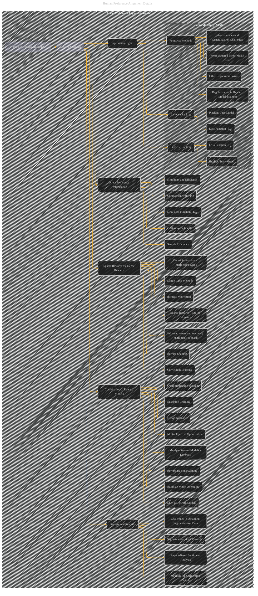

# Human Preference Alignment Details
> **Disclaimer:**
>
> This document contains my personal notes on the topic,
> compiled from publicly available documentation and various cited sources.
> The materials are intended for educational purposes, personal study, and reference.
> The content is dual-licensed:
> 1. **MIT License:** Applies to all code implementations (Swift, Mermaid, and other programming languages).
> 2. **Creative Commons Attribution 4.0 International License (CC BY 4.0):** Applies to all non-code content, including text, explanations, diagrams, and illustrations.
---

---

### Explanation

This Mermaid graph provides a detailed breakdown of the "HumanPreferenceAlignmentDetails" subgraph.  It shows the various facets of reward modeling in human preference alignment for LLMs. Key elements include:

* **Subgraphs:**  Organizes related concepts within the larger "Human Preference Alignment" category, enhancing readability and hierarchical structure.
* **Nodes:** Represents core concepts like reward modeling techniques (e.g., Bradley-Terry, Plackett-Luce, and pointwise methods), different types of supervision signals, and the combination strategies for reward models.
* **Edges:**  Connects related concepts to show the relationships between different techniques and challenges.  For instance, the "Supervision Signals" node branches to the specific ranking models, highlighting their dependence on different kinds of human feedback.
* **Detailed Node Labels:**  Provides more specific labels within each category (e.g., types of loss functions, challenges in data acquisition). This is crucial for accurate representation.

---

### Important Considerations

* **Context and Connections:**  This diagram, while a significant improvement, is still a high-level overview. You can further expand by:
    * Adding details like specific equations (e.g., the Bradley-Terry loss function formula).
    * Including figures (e.g., Figure 4.9 from the original text).
    * Linking nodes to specific sections and subsections in the original text to create clear references.
* **Clarity and Visual Hierarchy:**  Maintain a clear and concise visual structure.  Use different colors or shapes to distinguish between different types of concepts and their relationships.
* **Focus on Key Ideas:**  Prioritize the most significant concepts in human preference alignment.

This more granular diagram gives a stronger representation of the intricacies of human preference alignment in the context of large language models.

---
**Licenses:**

- **MIT License:**   - Full text in [LICENSE](LICENSE) file.
- **Creative Commons Attribution 4.0 International:**  - Legal details in [LICENSE-CC-BY](LICENSE-CC-BY) and at [Creative Commons official site](http://creativecommons.org/licenses/by/4.0/).

---