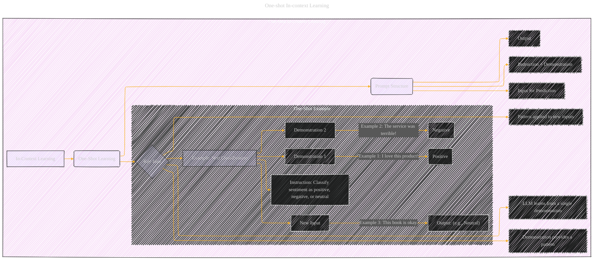

# One-shot In-context Learning
> **Disclaimer:**
>
> This document contains my personal notes on the topic,
> compiled from publicly available documentation and various cited sources.
> The materials are intended for educational purposes, personal study, and reference.
> The content is dual-licensed:
> 1. **MIT License:** Applies to all code implementations (Swift, Mermaid, and other programming languages).
> 2. **Creative Commons Attribution 4.0 International License (CC BY 4.0):** Applies to all non-code content, including text, explanations, diagrams, and illustrations.
---

---

### Explanation

This Mermaid graph visually represents one-shot in-context learning.  It's a simplified version of the broader in-context learning concept, focusing specifically on the case where a single demonstration is used to guide the model.

* **Subgraph `One-Shot In-Context Learning`:** Encloses the core elements.
* **Node `A` (In-Context Learning):** Represents the overall concept.
* **Node `B` (One-Shot Learning):** The specific focus of the diagram.
* **Node `C` (Key Idea):**  Highlights the fundamental idea—learning from a single example.
* **Subgraph `OneShotExample` (Example):**  Illustrates the concept with a concrete text-classification scenario.
    *   **Node `D` (Example):** Shows the task.
    *   **Nodes `D1` to `D7`:** Detail the instruction, demonstrations, and the resulting output for a new input.
* **Node `E` (Prompt Structure):** Shows the structure of the prompt containing the instruction and the example.

---
**Licenses:**

- **MIT License:**   - Full text in [LICENSE](LICENSE) file.
- **Creative Commons Attribution 4.0 International:**  - Legal details in [LICENSE-CC-BY](LICENSE-CC-BY) and at [Creative Commons official site](http://creativecommons.org/licenses/by/4.0/).

---