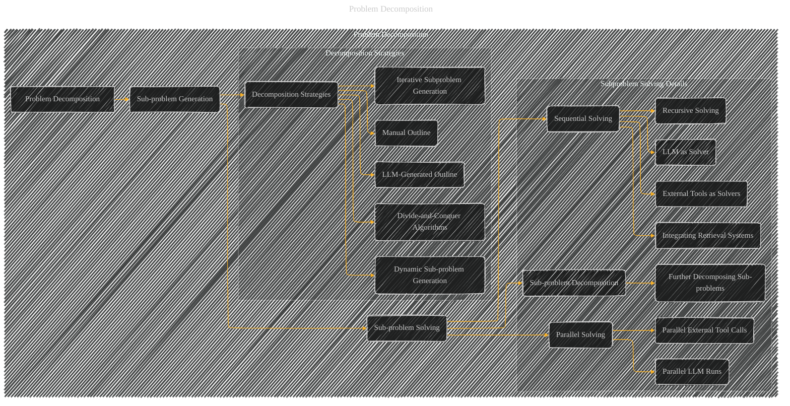

# Problem Decomposition
> **Disclaimer:**
>
> This document contains my personal notes on the topic,
> compiled from publicly available documentation and various cited sources.
> The materials are intended for educational purposes, personal study, and reference.
> The content is dual-licensed:
> 1. **MIT License:** Applies to all code implementations (Swift, Mermaid, and other programming languages).
> 2. **Creative Commons Attribution 4.0 International License (CC BY 4.0):** Applies to all non-code content, including text, explanations, diagrams, and illustrations.
---

----

### Explanation of the Diagram

* **Problem Decomposition:**  The top-level node represents the overarching concept of decomposing a complex problem into smaller, more manageable sub-problems.
* **Sub-problem Generation (B):** This node focuses on the methods used to identify and create these smaller sub-problems.  It branches out into various strategies like manual outlining, using LLMs to generate outlines, iterative generation, divide-and-conquer approaches, and dynamically generating sub-problems based on prior results.
* **Sub-problem Solving (D):** This node focuses on the methods used to tackle the generated sub-problems. It branches into different types of solving approaches like sequential (one at a time), parallel (multiple sub-problems concurrently), recursive decomposition, and incorporating external resources like information retrieval systems (e.g., RAG).
* **Relationship (within the subgraph) and Connections (between subgraphs):**  The diagram explicitly shows the links and flow of information. For example, you can visually see that LLM-based approaches to sub-problem generation (e.g., asking an LLM to generate an outline) often lead directly to LLMs solving these sub-problems (e.g., using the generated outline to produce content for each section).  The connection between dynamic sub-problem generation and solving highlights that the solution to a sub-problem informs the next sub-problem to be tackled.  This crucial relationship is central to the concept of problem decomposition, where solutions are not predetermined in advance.

---
**Licenses:**

- **MIT License:**   - Full text in [LICENSE](LICENSE) file.
- **Creative Commons Attribution 4.0 International:**  - Legal details in [LICENSE-CC-BY](LICENSE-CC-BY) and at [Creative Commons official site](http://creativecommons.org/licenses/by/4.0/).

---