```mermaid
---
title: Prompting Details
config:
  layout: elk
  look: handDrawn
  theme: dark
---
%%{
  init: {
    'fontFamily': 'verdana',
    'themeVariables': {
      'primaryColor': '#BB2528',
      'primaryTextColor': '#f529',
      'primaryBorderColor': '#7C0000',
      'lineColor': '#F8B229',
      'secondaryColor': '#006100',
      'tertiaryColor': '#fff'
    }
  }
}%%
graph LR
    subgraph PromptingDetails["Prompting Details"]
        A[Prompting] --> B(General Prompt Design)
        B --> C(Prompt Templates)
        B --> D(Prompt Formats)
        B --> E(Task Descriptions)
        
        subgraph PromptTemplateDetails
            C --> C1(Placeholders/Variables)
            C --> C2(Example: Weekend Suggestions)
            C --> C3(Example: Semantic Similarity)
            C --> C4(Example: Conversation Templates)
            C --> C5(Example: Translation Tasks)
            C --> C6(Example: Role-playing/System Information)
        end
        
        subgraph PromptFormatDetails
            D --> D1(Name-Content Style)
            D --> D2(Question-Answer Style)
            D --> D3(Code-Style)
            D --> D4(Structured Input/Output)
        end
        
        subgraph TaskDescriptionDetails
            E --> E1(Clarity and Specificity)
            E --> E2(Problem Decomposition)
            E --> E3(Examples/Demonstrations)
            E --> E4(Contextual Information)
            E --> E5(Detailed Instructions)
            E --> E6(Role Assignment)
        end


        B --> F(In-context Learning)
        F --> G(Zero-Shot Learning)
        F --> H(One-Shot Learning)
        F --> I(Few-Shot Learning)

        subgraph InContextLearningDetails
            G --> G1(Direct Application)
            G --> G2(Adapting prompts)
            H --> H1(Single Demonstration)
            H --> H2(Example: Grammar Correction)
            I --> I1(Multiple Demonstrations)
            I --> I2(Example: Sentiment Classification)
            I --> I3(Example: Phrase Translation)
            I --> I4(Example: Mathematical Reasoning)
        end


        B --> J(Advanced Methods)
        J --> K("Chain-of-Thought (CoT)")
        J --> L(Problem Decomposition)
        J --> M(Self-Refinement)
        J --> N(Ensembling)
        J --> O("Retrieval Augmented Generation (RAG)")
        J --> P(Tool Use)
        
        subgraph AdvancedMethodDetails
            K --> K1(Few-Shot CoT)
            K --> K2(Zero-Shot CoT)
            K --> K3(Problem Decomposition Steps)
            K --> K4(Multi-Round Interactions)
            
            L --> L1(Iterative Refinement)
            L --> L2(Feedback-driven refinement)
            L --> L3(Error Detection)
            
            N --> N1(Model Combination)
            N --> N2(Prompt Diversity)
            N --> N3(Hypothesis Selection)
            
            O --> O1(Data Retrieval)
            O --> O2(Query Input)
            O --> O3(LLM Response)
            O --> O4(Accuracy and Fidelity)
            
            P --> P1(API Calls)
            P --> P2(External Tool Integration)
            P --> P3(Tool Use Commands)

        end


        B --> Q(Learning to Prompt)
        Q --> R(Prompt Optimization)
        Q --> S(Soft Prompts)
        Q --> T(Prompt Length Reduction)
        
        subgraph LearningToPromptDetails
            R --> R1(Prompt Search Space)
            R --> R2(Performance Estimation)
            R --> R3(Search Strategies)
            R --> R4(LLM-based Prompt Optimization)
            R --> R5(Paraphrasing)
            R --> R6(Edits/Modifications)
            R --> R7(Feedback-driven Prompt Refinement)
            
            S --> S1(Implicit Representations)
            S --> S2(Dense, Low-dimensional Representations)
            S --> S3(Adapting LLMs with Less Prompting)
            S --> S4(Context Distillation)
            S --> S5(Parameter-efficient Fine-tuning)
            
            T --> T1(Redundancy Removal)
            T --> T2(Heuristics)
            T --> T3(Sequence-to-Sequence Simplification)
            T --> T4(LLM-based Simplification)
        end
    end

    style A fill:#ccf3,stroke:#333,stroke-width:1px;
    style B fill:#ccf3,stroke:#333,stroke-width:1px;
    style C fill:#ccf3,stroke:#333,stroke-width:1px;
    style D fill:#ccf3,stroke:#333,stroke-width:1px;
    style E fill:#ccf3,stroke:#333,stroke-width:1px;
    style F fill:#ccf3,stroke:#333,stroke-width:1px;
    style G fill:#ccf3,stroke:#333,stroke-width:1px;
    style H fill:#ccf3,stroke:#333,stroke-width:1px;
    style I fill:#ccf3,stroke:#333,stroke-width:1px;
    style J fill:#ccf3,stroke:#333,stroke-width:1px;
    style K fill:#ccf3,stroke:#333,stroke-width:1px;
    style L fill:#ccf3,stroke:#333,stroke-width:1px;
    style M fill:#ccf3,stroke:#333,stroke-width:1px;
    
```

# Prompting Details
> **Disclaimer:**
>
> This document contains my personal notes on the topic,
> compiled from publicly available documentation and various cited sources.
> The materials are intended for educational purposes, personal study, and reference.
> The content is dual-licensed:
> 1. **MIT License:** Applies to all code implementations (Swift, Mermaid, and other programming languages).
> 2. **Creative Commons Attribution 4.0 International License (CC BY 4.0):** Applies to all non-code content, including text, explanations, diagrams, and illustrations.
---

---

### Explaination

This improved diagram provides a more detailed breakdown of "Prompting Details" based on the provided source material. It includes sub-graphs to organize various aspects of prompt engineering and in-context learning, making it easier to understand the relationships between different prompting techniques.  Remember that you can further expand each node with specific examples, equations, or references from the original text to make the diagram even more comprehensive.

---
**Licenses:**

- **MIT License:**   - Full text in [LICENSE](LICENSE) file.
- **Creative Commons Attribution 4.0 International:**  - Legal details in [LICENSE-CC-BY](LICENSE-CC-BY) and at [Creative Commons official site](http://creativecommons.org/licenses/by/4.0/).

---