# Retrieval Augmented Generation - RAG
> **Disclaimer:**
>
> This document contains my personal notes on the topic,
> compiled from publicly available documentation and various cited sources.
> The materials are intended for educational purposes, personal study, and reference.
> The content is dual-licensed:
> 1. **MIT License:** Applies to all code implementations (Swift, Mermaid, and other programming languages).
> 2. **Creative Commons Attribution 4.0 International License (CC BY 4.0):** Applies to all non-code content, including text, explanations, diagrams, and illustrations.
---

```mermaid
---
title: Retrieval Augmented Generation - RAG
config:
  layout: elk
  look: handDrawn
  theme: dark
---
%%{
  init: {
    'fontFamily': 'verdana',
    'themeVariables': {
      'primaryColor': '#BB2528',
      'primaryTextColor': '#f529',
      'primaryBorderColor': '#7C0000',
      'lineColor': '#F8B229',
      'secondaryColor': '#006100',
      'tertiaryColor': '#fff'
    }
  }
}%%
graph LR
    subgraph RAG["Retrieval Augmented Generation <br>(RAG)"]
        A[RAG] --> B(Problem Decomposition)
        B --> C(Sub-problem Generation)
        C --> D(Information Retrieval)
        D --> E(Knowledge Sources)
        E --> F(Query)
        F --> G(Relevant Texts)
        G --> H(LLM Processing)
        H --> I(Response Generation)
        
        subgraph RAG_Details["RAG Details"]
            C -- Example: Decomposing a complex question into simpler sub-queries --> C1
            D -- Example: Vector databases for efficient similarity search --> D1
            E -- Example: Documents, knowledge bases, external APIs --> E1
            F -- Example: 'Where will the 2028 Olympics be held?' --> F1
            G -- Example: Retrieved texts from Wikipedia and The Sporting News --> G1
            H -- Example: LLM takes query and relevant texts as input --> H1
            I -- Example: 'The 2028 Olympics will be held in Los Angeles' --> I1
            
            
            H -- Example: LLM must generate an answer in its own words, not simply copy from context --> H2
            H -- Example: LLM can choose to output 'No answer!' if insufficient context --> H3
            
            H -- Example: Prompt includes instructions to avoid plagiarism --> H4
        end
        
        B --> J(Sub-problem Solving)
        J --> K(LLM Output)
        J --> L(Feedback/Evaluation)
        
        subgraph Subproblem_Solving_Details["Subproblem Solving Details"]
            K -- Example: LLMs generate responses based on provided context --> K1
            K -- Example: LLMs can be prompted to generate an answer that uses their own words --> K2
            K -- Example: LLMs can be instructed to avoid plagiarism --> K3
            
            L -- Example: LLMs evaluate the quality of retrieved texts --> L1
            L -- Example:  LLMs evaluate whether generated answer is consistent with context --> L2
        end
    end
    
    style A fill:#ccf3,stroke:#333,stroke-width:1px;
    style B fill:#ccf3,stroke:#333,stroke-width:1px;
    style C fill:#ccf3,stroke:#333,stroke-width:1px;
    style D fill:#ccf3,stroke:#333,stroke-width:1px;
    style E fill:#ccf3,stroke:#333,stroke-width:1px;
    style F fill:#ccf3,stroke:#333,stroke-width:1px;
    style G fill:#ccf3,stroke:#333,stroke-width:1px;
    style H fill:#ccf3,stroke:#333,stroke-width:1px;
    style I fill:#ccf3,stroke:#333,stroke-width:1px;
    style J fill:#ccf3,stroke:#333,stroke-width:1px;
    style K fill:#ccf3,stroke:#333,stroke-width:1px;
    style L fill:#ccf3,stroke:#333,stroke-width:1px;
    
```

-----

### Explanation

This Mermaid diagram visualizes Retrieval Augmented Generation (RAG) as a process.  It uses a subgraph for clarity and emphasizes the key steps, from the initial decomposition of a problem into sub-problems to the final response generation by the LLM, integrating feedback loops and knowledge sources.  The included examples within the subgraph `RAG_Details` illustrate the concepts more concretely.

---
**Licenses:**

- **MIT License:**   - Full text in [LICENSE](LICENSE) file.
- **Creative Commons Attribution 4.0 International:**  - Legal details in [LICENSE-CC-BY](LICENSE-CC-BY) and at [Creative Commons official site](http://creativecommons.org/licenses/by/4.0/).

---