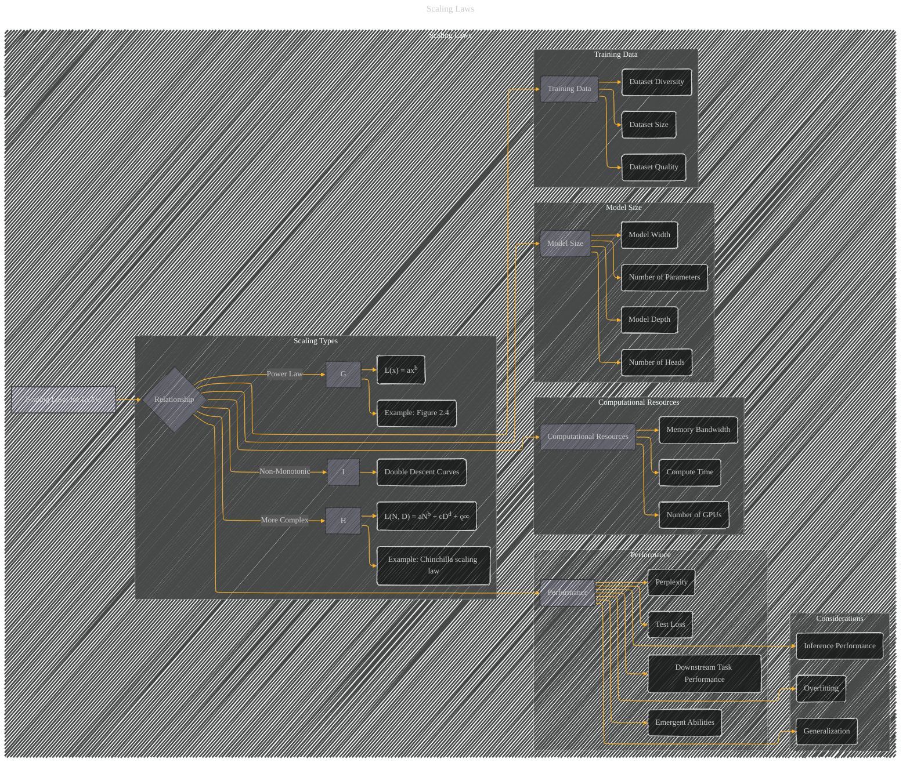

# Scaling Laws
> **Disclaimer:**
>
> This document contains my personal notes on the topic,
> compiled from publicly available documentation and various cited sources.
> The materials are intended for educational purposes, personal study, and reference.
> The content is dual-licensed:
> 1. **MIT License:** Applies to all code implementations (Swift, Mermaid, and other programming languages).
> 2. **Creative Commons Attribution 4.0 International License (CC BY 4.0):** Applies to all non-code content, including text, explanations, diagrams, and illustrations.
---

---

### Explanation

This Mermaid graph represents scaling laws for LLMs, connecting model size, training data, resources, and performance.  Key elements include:

*   **Relationships:**  The graph shows the interconnectedness of model size, data, resources, and performance.  Power laws, more complex formulations, and non-monotonic relationships are all highlighted as different types of scaling relationships.
*   **Components:**  Nodes representing specific aspects like model size (number of parameters, depth, width), training data (size, quality, diversity), computational resources (compute time, hardware), and performance metrics (test loss, perplexity, emergent abilities) are clearly identified.
*   **Considerations:**  Important aspects like overfitting, generalization, and inference performance are highlighted as crucial factors to consider when interpreting scaling laws.

---
**Licenses:**

- **MIT License:**   - Full text in [LICENSE](LICENSE) file.
- **Creative Commons Attribution 4.0 International:**  - Legal details in [LICENSE-CC-BY](LICENSE-CC-BY) and at [Creative Commons official site](http://creativecommons.org/licenses/by/4.0/).

---