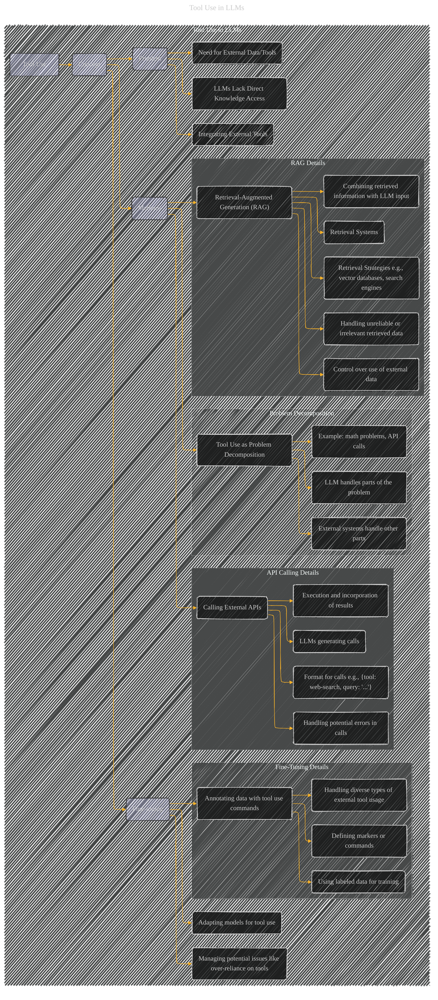

# Tool Use in LLMs
> **Disclaimer:**
>
> This document contains my personal notes on the topic,
> compiled from publicly available documentation and various cited sources.
> The materials are intended for educational purposes, personal study, and reference.
> The content is dual-licensed:
> 1. **MIT License:** Applies to all code implementations (Swift, Mermaid, and other programming languages).
> 2. **Creative Commons Attribution 4.0 International License (CC BY 4.0):** Applies to all non-code content, including text, explanations, diagrams, and illustrations.
---

----

### Explanation

This Mermaid graph visually represents the key concepts of "Tool Use" in large language models (LLMs). It's a more detailed breakdown of the "Tool Use" aspect from the previous response, showing the underlying problem, methods for tool integration, and the fine-tuning considerations involved.

*   **Subgraphs:**  Each subgraph (e.g., API Calling Details, RAG Details) helps organize related aspects of tool use.
*   **Nodes:**  Nodes (e.g., Problem, Methods, Fine-tuning) represent different categories within the topic.  The nodes under each category provide further granularity.
*   **Arrows:**  Arrows connect the concepts and ideas, showing relationships between different parts of tool use.

---
**Licenses:**

- **MIT License:**   - Full text in [LICENSE](LICENSE) file.
- **Creative Commons Attribution 4.0 International:**  - Legal details in [LICENSE-CC-BY](LICENSE-CC-BY) and at [Creative Commons official site](http://creativecommons.org/licenses/by/4.0/).

---