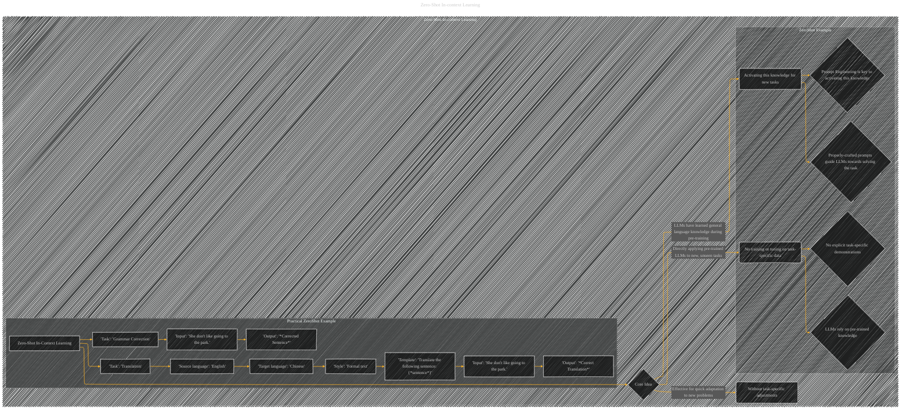

# Zero-shot In-context Learning
> **Disclaimer:**
>
> This document contains my personal notes on the topic,
> compiled from publicly available documentation and various cited sources.
> The materials are intended for educational purposes, personal study, and reference.
> The content is dual-licensed:
> 1. **MIT License:** Applies to all code implementations (Swift, Mermaid, and other programming languages).
> 2. **Creative Commons Attribution 4.0 International License (CC BY 4.0):** Applies to all non-code content, including text, explanations, diagrams, and illustrations.
---

----

### Explanation

* **Zero-Shot In-Context Learning (A):** This subgraph encapsulates the overall concept.
* **Core Idea (B):**  This node highlights the fundamental idea: directly applying a pre-trained LLM to a new task without any further training or tuning on that specific task.  It leverages the general knowledge learned during pre-training.
* **No training or tuning on task-specific data (C):**  Zero-shot learning avoids any need for task-specific data.
* **Activating this knowledge for new tasks (D):** This is crucial; the general knowledge must be "activated" by the right prompt.  Proper prompt engineering is essential.
* **Effective for quick adaptation to new problems (E):**  This summarizes the practical benefit.
* **Zero-Shot Example (subgraph ZeroShot_Example):**  This subgraph further illustrates the concept.
* **Practical Zero-Shot Example (subgraph Practical_ZeroShot_Example):** This subgraph demonstrates the core steps involved in a zero-shot learning use case, including a translation task and grammar correction, and how a suitable prompt guides the LLM to produce the expected output.

---
**Licenses:**

- **MIT License:**   - Full text in [LICENSE](LICENSE) file.
- **Creative Commons Attribution 4.0 International:**  - Legal details in [LICENSE-CC-BY](LICENSE-CC-BY) and at [Creative Commons official site](http://creativecommons.org/licenses/by/4.0/).

---