> ⚠️🏗️🚧🦺🧱🪵🪨🪚🛠️👷
> 
> This is a working draft in progress
> 
> 
>
> gif image is provided by [Giphy](https://giphy.com)
> 
> ⚠️🏗️🚧🦺🧱🪵🪨🪚🛠️👷


----


# AI Tools Architecture Overview
<details open>
<summary>Click to show/hide the full disclaimer.</summary>
   
> <ins>📢 **Disclaimer** 🚨</ins>
>
> This document contains my personal notes on the topic,
> compiled from publicly available documentation and various cited sources.
> The materials are intended for educational purposes (<ins>sometimes, entertainment purposes</ins>), personal study, and reference.
> The content is dual-licensed:
> 1. **MIT License:** Applies to all code implementations (Swift, Mermaid, and other programming languages).
> 2. **Creative Commons Attribution-ShareAlike 4.0 International License (CC BY-SA 4.0):** Applies to all non-code content, including text, explanations, diagrams, and illustrations.

</details>


----

## 🚀 Core Technology Stack

The foundation of this ecosystem seems to be `ggml`, a machine learning tensor library. This library underpins specialized C++ projects for speech-to-text (`whisper.cpp`) and LLM inference (`llama.cpp`). These, in turn, have integrations for popular code editors.

Here's how these components connect:

```mermaid
---
title: "Core Technology Stack"
author: "Cong Le"
version: "1.0"
license(s): "MIT, CC BY-SA 4.0"
copyright: "Copyright (c) 2025 Cong Le. All Rights Reserved."
config:
  layout: elk
  theme: base
---
%%%%%%%% Mermaid version v11.4.1-b.14
%%%%%%%% Available curve styles include the following keywords:
%% basis, bumpX, bumpY, cardinal, catmullRom, linear, monotoneX, monotoneY, natural, step, stepAfter, stepBefore.
%%{
  init: {
    'flowchart': { 'htmlLabels': true, 'curve': 'linear'},
    'fontFamily': 'Monaco',
    'themeVariables': {
      'primaryColor': '#22BB',
      'primaryTextColor': '#F8B229',
      'lineColor': '#F8B229',
      'primaryBorderColor': '#27AE60',
      'secondaryColor': '#EEF2',
      'secondaryTextColor': '#6C3483',
      'secondaryBorderColor': '#A569BD',
      'fontSize': '15px'
    }
  }
}%%
flowchart TD
    A["<code>ggml</code><br/>Machine learning library<br/>🧠 Tensor Operations"] --> B["<code>whisper.cpp</code><br/>Speech-to-text<br/>🗣️ Transcribes audio"]
    A --> C["<code>llama.cpp</code><br/>LLM inference<br/>📝 Runs language models"]
    C --> D["<code>llama.vim</code><br/>Vim/Neovim plugin<br/>💻 IDE Integration"]
    C --> E["<code>llama.vscode</code><br/>VSCode plugin<br/>✍️ IDE Integration"]

    style A fill:#f9f,stroke:#333,stroke-width:2px,color:#333
    style B fill:#ccf,stroke:#333,stroke-width:2px,color:#333
    style C fill:#cfc,stroke:#333,stroke-width:2px,color:#333
    style D fill:#ff9,stroke:#333,stroke-width:2px,color:#333
    style E fill:#ff9,stroke:#333,stroke-width:2px,color:#333
```



A little note on `ggml`: As a tensor library, `ggml` is designed for numerical computation, which is the heart of machine learning. Tensors are multi-dimensional arrays, and operations on them, like matrix multiplication ($C = AB$) or more complex tensor contractions ($T_{i_1…i_n} = \sum_{j_1…j_m} A_{i_1…k_p…i_n} B_{j_1…k_p…j_m}$), are fundamental for neural network calculations. The efficiency of these operations is key for model performance.

----

## 📊 Repository Insights

Let's peek at some meta-information about this project:

### 🧑‍💻 People

The project has contributions from these individuals:
- [ggerganov (Georgi Gerganov) · GitHub](https://github.com/ggerganov)
- [slaren (Diego Devesa) · GitHub](https://github.com/slaren)

### 💻 Top Languages

The main programming languages used in this repository are:
*   🟢 Shell
*   🔴 C++
*   🟡 JavaScript
*   🔵 TypeScript
*   🟢 Vim Script

It's a diverse mix, highlighting a blend of system-level programming (C++), scripting (Shell, Vim Script), and web technologies (JavaScript, TypeScript).

### 🏷️ Most Used Topics

The project is commonly tagged with or relates to these topics:
*   `llama`
*   `copilot`
*   `developer-tool`
*   `llm`

This reinforces its focus on Large Language Models and its utility as a tool for developers.

---

## 📰 News & Updates Timeline

The project seems to be actively developed, with a stream of exciting news and updates. Here's a timeline view:


*(Durations are illustrative, representing the announcement period.)*

----

## 🛠️ Use Cases

This technology stack powers a variety of applications across different domains. Here's a summary:

| Category      | Project / Tool                                              |
|---------------|-------------------------------------------------------------|
| 💬 **Chat**   | `LM Studio`, `KoboldCpp`, `LocalAI`, `Jan`, `text-generation-webui` |
| 🎙️ **STT**    | `MacWhisper`, `VLC media player`, `wchess`, `superwhisper`  |
| 📱 **Mobile** | `PocketPal AI`, `LLMFarm`, `ChatterUI`, `SmolChat`          |
| 🏗️ **Infra**  | `RamaLama`, `paddler`, `llama-swap`                         |
| ☁️ **Cloud**  | `Hugging Face`                                              |
| 💾 **Code**   | `llama.vim`, `llama.vscode`, `VSCode`                       |

This shows great versatility, from developer tools and chat interfaces to mobile applications and infrastructure components.

----

## 🤝 Partners

The project acknowledges partnerships with key players in the AI and hardware space:
*   🤗 **Hugging Face**: A leading platform for open-source machine learning models and tools.
*   💚 **NVIDIA**: A major producer of GPUs, crucial for accelerating machine learning workloads.

These collaborations likely contribute significantly to the project's capabilities and reach.

-----

```mermaid
---
title: "❓...CongLeSolutionX....❓"
author: "Cong Le"
version: "1.0"
license(s): "MIT, CC BY-SA 4.0"
copyright: "Copyright (c) 2025 Cong Le. All Rights Reserved."
config:
  theme: base
---
%%%%%%%% Mermaid version v11.4.1-b.14
%%{
  init: {
    'flowchart': { 'htmlLabels': false },
    'fontFamily': 'Bradley Hand',
    'themeVariables': {
      'primaryColor': '#fc82',
      'primaryTextColor': '#F8B229',
      'primaryBorderColor': '#27AE60',
      'secondaryColor': '#5229',
      'secondaryTextColor': '#6C3483',
      'lineColor': '#F8B229',
      'fontSize': '20px'
    }
  }
}%%
flowchart LR
    My_Meme@{ img: "https://raw.githubusercontent.com/CongLeSolutionX/CongLeSolutionX/refs/heads/main/assets/images/My-meme-and-question-marks-open-book-old-characters-background.png", label: "..🙉..👀..📖..", pos: "b", w: 200, h: 150, constraint: "off" }
   
    Link_to_my_profile{{"<a href='https://github.com/CongLeSolutionX' target='_blank'>Click here if you care about my profile</a>"}}

  Closing_quote@{ shape: braces, label: "..👀..<br/>'Unfortunately,<br/>no one can be told<br/> what the Matrix is.<br/>You have to see it<br/>for yourself'<br/>...📚..<br/>-<ins>Morpheus,<br/>a character from the movie The Matrix 1999</ins>"}

   Closing_quote ~~~ My_Meme

    My_Meme animatingEdge@--> Link_to_my_profile
  
  animatingEdge@{ animate: true }

```

---
><b>Licenses</b>:
>
>- <b>MIT License</b>:  [](LICENSE) - Full text in [LICENSE](LICENSE) file.
>- <b>Creative Commons Attribution-ShareAlike 4.0 International</b>: [CC BY-SA 4.0](https://creativecommons.org/licenses/by-sa/4.0/) [](https://creativecommons.org/licenses/by-sa/4.0/) - Legal details in [LICENSE-CC-BY-SA-4.0](THE_PAST/LICENSE-CC-BY-SA-4.0) and at [Creative Commons official site](https://creativecommons.org/licenses/by-sa/4.0/).
>
---
