> ⚠️🏗️🚧🦺🧱🪵🪨🪚🛠️👷
> 
> This is a working draft in progress
> 
> 
>
> gif image is provided by [Giphy](https://giphy.com)
> 
> ⚠️🏗️🚧🦺🧱🪵🪨🪚🛠️👷


----

# 🐑 `ggml`: A Tensor Library for Machine Learning
<details open>
<summary>Click to show/hide the full disclaimer.</summary>
   
> <ins>📢 **Disclaimer** 🚨</ins>
>
> This document contains my personal notes on the topic,
> compiled from publicly available documentation and various cited sources.
> The materials are intended for educational purposes (<ins>sometimes, entertainment purposes</ins>), personal study, and reference.
> The content is dual-licensed:
> 1. **MIT License:** Applies to all code implementations (Swift, Mermaid, and other programming languages).
> 2. **Creative Commons Attribution-ShareAlike 4.0 International License (CC BY-SA 4.0):** Applies to all non-code content, including text, explanations, diagrams, and illustrations.

</details>


---

`ggml` is a tensor library designed for machine learning tasks. It's noteworthy for its focus on efficiency, broad hardware compatibility, and minimal dependencies. As highlighted, it's under active development, with significant contributions also seen in projects like [llama.cpp](https://github.com/ggerganov/llama.cpp) and [whisper.cpp](https://github.com/ggerganov/whisper.cpp).

You can check out the project's direction via its [Roadmap](https://github.com/users/ggerganov/projects/7) and underlying philosophy in its [Manifesto](https://github.com/ggerganov/llama.cpp/discussions/205).

Let's visualize the core aspects of `ggml`:


----

## ✨ Core Features of ggml

`ggml` packs a punch with several key features tailored for efficient machine learning:

```mermaid
---
title: "✨ Core Features of ggml 🌟"
author: "Cong Le"
version: "1.0"
license(s): "MIT, CC BY-SA 4.0"
copyright: "Copyright (c) 2025 Cong Le. All Rights Reserved."
config:
  layout: elk
  theme: base
  look: handDrawn
---
%%%%%%%% Mermaid version v11.4.1-b.14
%%%%%%%% Available curve styles include the following keywords:
%% basis, bumpX, bumpY, cardinal, catmullRom, linear, monotoneX, monotoneY, natural, step, stepAfter, stepBefore.
%%{
  init: {
    'flowchart': { 'htmlLabels': true, 'curve': 'basis' },
    'fontFamily': 'American Typewriter, monospace',
    'logLevel': 'fatal',
    'themeVariables': {
      'primaryColor': '#22BB',
      'primaryTextColor': '#F8B229',
      'lineColor': '#F8B229',
      'primaryBorderColor': '#27AE60',
      'secondaryColor': '#E2F1',
      'secondaryTextColor': '#6C3483',
      'secondaryBorderColor': '#A569BD',
      'fontSize': '20px'
    }
  }
}%%
flowchart LR
    subgraph Core_Attributes["Core Attributes"]
    style Core_Attributes fill:#F2F2,stroke:#333,stroke-width:1px, color: #FFFF
        A1["Low-level cross-platform <br> implementation ⚙️"]
        A2["No third-party <br> dependencies 🚫"]
        A3["Zero memory allocations <br> during runtime 💨"]
    end

    subgraph ML_Specific_Capabilities["ML Specific Capabilities"]
    style ML_Specific_Capabilities fill:#2B2B,stroke:#333,stroke-width:2px, color: #FFFF
        B1["Integer quantization support <br> (e.g., float32 → int8) 📉"]
        B1 --> B1_Note("Reduces model size & <br> speeds up inference")
        B2["Automatic differentiation <br> (autodiff) 📈"]
        B2 --> B2_Note("Essential for training models")
        B3["Optimizers Included 🧭"]
        B3 --> B3a["ADAM"]
        B3 --> B3b["L-BFGS"]
        B3_Note("Algorithms to minimize <br> loss functions during training")
    end

    subgraph Hardware_Support["Hardware Support"]
    style Hardware_Support fill:#B2FF,stroke:#333,stroke-width:1px, color: #FFFF
        C1["Broad hardware support 💻 <br/> (CPU, GPU via CUDA, ROCm, SYCL)"]
    end

    style A1 fill:#e6fa,stroke:#333
    style A2 fill:#e6fa,stroke:#333
    style A3 fill:#e6fa,stroke:#333
    style B1 fill:#b2bb,stroke:#333
    style B2 fill:#b2bb,stroke:#333
    style B3 fill:#b2bb,stroke:#333
    style C1 fill:#f2b2,stroke:#333

    B1_Note ----> B1
    B2_Note ----> B2
    B3_Note ----> B3

    %% Conceptual Math for Quantization
    %% x_q = round(x_f / scale) + zero_point
    %% $$ x_q = \text{round}\left(\frac{x_f}{\text{scale}}\right) + \text{zero_point} $$

    %% Conceptual Math for Autodiff (Chain Rule)
    %% If L = f(g(h(x))), then dL/dx = (dL/df)(df/dg)(dg/dh)(dh/dx)
    %% $$ \frac{dL}{dx} = \frac{dL}{df} \cdot \frac{df}{dg} \cdot \frac{dg}{dh} \cdot \frac{dh}{dx} $$

    %% ADAM
    %% $$ m_t = \beta_1 m_{t-1} + (1 - \beta_1) g_t $$
    %% $$ v_t = \beta_2 v_{t-1} + (1 - \beta_2) g_t^2 $$
    %% $$ \hat{m}_t = \frac{m_t}{1 - \beta_1^t} $$
    %% $$ \hat{v}_t = \frac{v_t}{1 - \beta_2^t} $$
    %% $$ \theta_{t+1} = \theta_t - \frac{\eta}{\sqrt{\hat{v}_t} + \epsilon} \hat{m}_t $$
```



**Note on Quantization**: Integer quantization is a process that can significantly reduce the memory footprint and computational cost of neural network models. It involves converting model weights and/or activations from floating-point numbers (e.g., 32-bit floats) to lower-precision integers (e.g., 8-bit integers). A simplified linear quantization might follow:
$$
\text{value}_{\text{quantized}} = \text{round}\left(\frac{\text{value}_{\text{float}}}{\text{scale}}\right) + \text{zero_point}
$$
where `scale` and `zero_point` are quantization parameters.

**Note on Automatic Differentiation**: This is a technique that allows for the automatic computation of gradients (derivatives) of functions defined by computer programs. It's the backbone of training most neural networks, enabling algorithms like backpropagation. Optimizers like ADAM (Adaptive Moment Estimation) and L-BFGS (Limited-memory Broyden–Fletcher–Goldfarb–Shanno) use these gradients to iteratively adjust model parameters to minimize a loss function.

----

## 🛠️ Building ggml (Standard Setup)

Here's the typical workflow to get `ggml` built from source:

```mermaid
---
title: "🛠️ Building ggml 🚧 (Standard Setup) 🏗️"
author: "Cong Le"
version: "1.0"
license(s): "MIT, CC BY-SA 4.0"
copyright: "Copyright (c) 2025 Cong Le. All Rights Reserved."
config:
  layout: elk
  theme: base
  look: handDrawn
---
%%%%%%%% Mermaid version v11.4.1-b.14
%%%%%%%% Available curve styles include the following keywords:
%% basis, bumpX, bumpY, cardinal, catmullRom, linear, monotoneX, monotoneY, natural, step, stepAfter, stepBefore.
%%{
  init: {
    'flowchart': { 'htmlLabels': true, 'curve': 'basis' },
    'fontFamily': 'American Typewriter, monospace',
    'logLevel': 'fatal',
    'themeVariables': {
      'primaryColor': '#22BB',
      'primaryTextColor': '#F8B229',
      'lineColor': '#F8B229',
      'primaryBorderColor': '#27AE60',
      'secondaryColor': '#E2F1',
      'secondaryTextColor': '#6C3483',
      'secondaryBorderColor': '#A569BD',
      'fontSize': '20px'
    }
  }
}%%
flowchart TD
    A["Start Building 🚀"] --> B("<code>git clone <a href='https://github.com/ggml-org/ggml'>https://github.com/ggml-org/ggml</a></code>")
    B --> C("<code>cd ggml</code>")
    C --> D{"Setup Python Virtual Environment 🐍"}
    D --> E("<code>python3.10 -m venv .venv</code>")
    E --> F("<code>source .venv/bin/activate</code>")
    F --> G("<code>pip install -r requirements.txt</code>")
    G --> H{"Configure with CMake ⚙️"}
    H --> I("<code>mkdir build && cd build</code>")
    I --> J("<code>cmake ..</code>")
    J --> K{"Build the Project 👨‍💻"}
    K --> L("<code>cmake --build . --config Release -j 8</code>")
    L --> M["Build Complete! ✅"]

    style A fill:#B2A2,stroke:#2874A6,stroke-width:2px
    style M fill:#2BAA,stroke:#239B56,stroke-width:2px
    style D fill:#FCF2,stroke:#F1C40F,stroke-width:2px
    style H fill:#F2AA,stroke:#F1C40F,stroke-width:2px
    style K fill:#F2AA,stroke:#F1C40F,stroke-width:2px
```



----

## 🧠 GPT Inference Example

The documentation provides an example of running a GPT-2 model. Here's how that flows:

```mermaid
---
title: "🧠 GPT Inference Example ⚡"
author: "Cong Le"
version: "1.0"
license(s): "MIT, CC BY-SA 4.0"
copyright: "Copyright (c) 2025 Cong Le. All Rights Reserved."
config:
  layout: elk
  theme: base
  look: handDrawn
---
%%%%%%%% Mermaid version v11.4.1-b.14
%%%%%%%% Available curve styles include the following keywords:
%% basis, bumpX, bumpY, cardinal, catmullRom, linear, monotoneX, monotoneY, natural, step, stepAfter, stepBefore.
%%{
  init: {
    'flowchart': { 'htmlLabels': true, 'curve': 'basis' },
    'fontFamily': 'American Typewriter, monospace',
    'logLevel': 'fatal',
    'themeVariables': {
      'primaryColor': '#22BB',
      'primaryTextColor': '#F8B229',
      'lineColor': '#F8B229',
      'primaryBorderColor': '#27AE60',
      'secondaryColor': '#E2F1',
      'secondaryTextColor': '#6C3483',
      'secondaryBorderColor': '#A569BD',
      'fontSize': '20px'
    }
  }
}%%
flowchart TD
    A["Start Inference Example ✨"] --> B{"Download Model Script 📜"}
    B --> C("<code>../examples/gpt-2/download-ggml-model.sh 117M</code>")
    C -- Downloads & Converts --> D["<b>ggml-model.bin</b> <br> (in <b>models/gpt-2-117M/</b>)"]
    D --> E{"Run Backend Executable 💻"}
    E --> F("<code>./bin/gpt-2-backend -m models/gpt-2-117M/ggml-model.bin -p <b>This is an example</b></code>")
    F -- Outputs --> G["Generated Text Response 🗣️"]
    G --> H["Inference Done! ✔️"]

    style A fill:#DAF2,stroke:#2874A6,stroke-width:2px
    style H fill:#BF25,stroke:#239B56,stroke-width:2px
    style B fill:#FCF2,stroke:#F1C40F,stroke-width:2px
    style E fill:#FCF2,stroke:#F1C40F,stroke-width:2px
```



For more details, you should explore the programs in the `examples` folder of the `ggml` repository.

----

## 🚀 Hardware Acceleration Options

`ggml` can be compiled with support for various hardware accelerators to boost performance.

### Using CUDA (NVIDIA GPUs) 🟢

```mermaid
---
title: "🛠️⚙️🛠️ Using CUDA (NVIDIA GPUs) 🟢"
author: "Cong Le"
version: "1.0"
license(s): "MIT, CC BY-SA 4.0"
copyright: "Copyright (c) 2025 Cong Le. All Rights Reserved."
config:
  layout: elk
  theme: base
  look: handDrawn
---
%%%%%%%% Mermaid version v11.4.1-b.14
%%%%%%%% Available curve styles include the following keywords:
%% basis, bumpX, bumpY, cardinal, catmullRom, linear, monotoneX, monotoneY, natural, step, stepAfter, stepBefore.
%%{
  init: {
    'flowchart': { 'htmlLabels': true, 'curve': 'basis' },
    'fontFamily': 'American Typewriter, monospace',
    'logLevel': 'fatal',
    'themeVariables': {
      'primaryColor': '#22BB',
      'primaryTextColor': '#F8B229',
      'lineColor': '#F8B229',
      'primaryBorderColor': '#27AE60',
      'secondaryColor': '#E2F1',
      'secondaryTextColor': '#6C3483',
      'secondaryBorderColor': '#A569BD',
      'fontSize': '20px'
    }
  }
}%%
flowchart TD
    A["Start CUDA Build"] --> B{"Prerequisite:<br/>CUDA Toolkit Installed"}
    B --> C{"Configure CMake with CUDA flags"}
    C --> D["<code>cmake -DGGML_CUDA=ON \\ <br> -DCMAKE_CUDA_COMPILER=/usr/local/cuda-12.1/bin/nvcc ..</code>"]
    D --> E{"Proceed with Standard Build Steps"}
    E --> F["<code>cmake --build . --config Release -j 8</code>"]
    F --> G["Build with CUDA Complete!"]
    style G fill:#9E92,stroke:#239B56
```



*Note: Ensure `/usr/local/cuda-12.1/bin/nvcc` points to your actual CUDA compiler path.*

### Using hipBLAS (AMD GPUs - ROCm) 🔴

```mermaid
---
title: "🛠️⚙️🛠️ Using hipBLAS (AMD GPUs - ROCm) 🔴"
author: "Cong Le"
version: "1.0"
license(s): "MIT, CC BY-SA 4.0"
copyright: "Copyright (c) 2025 Cong Le. All Rights Reserved."
config:
  layout: elk
  theme: base
  look: handDrawn
---
%%%%%%%% Mermaid version v11.4.1-b.14
%%%%%%%% Available curve styles include the following keywords:
%% basis, bumpX, bumpY, cardinal, catmullRom, linear, monotoneX, monotoneY, natural, step, stepAfter, stepBefore.
%%{
  init: {
    'flowchart': { 'htmlLabels': true, 'curve': 'basis' },
    'fontFamily': 'American Typewriter, monospace',
    'logLevel': 'fatal',
    'themeVariables': {
      'primaryColor': '#22BB',
      'primaryTextColor': '#F8B229',
      'lineColor': '#F8B229',
      'primaryBorderColor': '#27AE60',
      'secondaryColor': '#E2F1',
      'secondaryTextColor': '#6C3483',
      'secondaryBorderColor': '#A569BD',
      'fontSize': '20px'
    }
  }
}%%
flowchart TD
    A["Start hipBLAS Build"] --> B{"Prerequisite:<br/>ROCm/HIP Installed"}
    B --> C{"Configure CMake with HIP flags"}
    C --> D["<code>cmake -DCMAKE_C_COMPILER=$(hipconfig -l)/clang \\ <br> -DCMAKE_CXX_COMPILER=$(hipconfig -l)/clang++ \\ <br> -DGGML_HIP=ON</code>"]
    D --> E{"Proceed with Standard Build Steps"}
    E --> F["<code>cmake --build . --config Release -j 8</code>"]
    F --> G["Build with hipBLAS Complete!"]
    style G fill:#FBC5,stroke:#C0392B
```



### Using SYCL (Intel GPUs & other accelerators via oneAPI) 🔵

SYCL enables compilation for a range of accelerators, commonly Intel GPUs.

**For Linux:**

```mermaid
---
title: "🛠️⚙️🛠️ Using SYCL (Intel GPUs & other accelerators via oneAPI) 🔵 for Linux 🐧"
author: "Cong Le"
version: "1.0"
license(s): "MIT, CC BY-SA 4.0"
copyright: "Copyright (c) 2025 Cong Le. All Rights Reserved."
config:
  layout: elk
  theme: base
  look: handDrawn
---
%%%%%%%% Mermaid version v11.4.1-b.14
%%%%%%%% Available curve styles include the following keywords:
%% basis, bumpX, bumpY, cardinal, catmullRom, linear, monotoneX, monotoneY, natural, step, stepAfter, stepBefore.
%%{
  init: {
    'flowchart': { 'htmlLabels': true, 'curve': 'basis' },
    'fontFamily': 'American Typewriter, monospace',
    'logLevel': 'fatal',
    'themeVariables': {
      'primaryColor': '#22BB',
      'primaryTextColor': '#F8B229',
      'lineColor': '#F8B229',
      'primaryBorderColor': '#27AE60',
      'secondaryColor': '#E2F1',
      'secondaryTextColor': '#6C3483',
      'secondaryBorderColor': '#A569BD',
      'fontSize': '20px'
    }
  }
}%%
flowchart TD
    A["Start SYCL Build<br/>(Linux)"] --> B{"Prerequisite:<br/>Intel oneAPI Installed"}
    B --> C{"Setup oneAPI Environment"}
    C --> D["<code>source /opt/intel/oneapi/setvars.sh</code>"]
    D --> E{"Configure CMake with SYCL flags"}
    E --> F["<code>cmake -G 'Ninja' \\ <br> -DCMAKE_C_COMPILER=icx \\ <br> -DCMAKE_CXX_COMPILER=icpx \\ <br> -DGGML_SYCL=ON ..</code>"]
    F --> G{"Proceed with Standard Build Steps<br/>(using Ninja)"}
    G --> H["<code>cmake --build . --config Release -j 8</code>"]
    H --> I["Build with SYCL (Linux) Complete!"]
    style I fill:#AD86,stroke:#2980B9
```



**For Windows:**

```mermaid
---
title: "🛠️⚙️🛠️ Using SYCL (Intel GPUs & other accelerators via oneAPI) 🔵 for Windows 🪟"
author: "Cong Le"
version: "1.0"
license(s): "MIT, CC BY-SA 4.0"
copyright: "Copyright (c) 2025 Cong Le. All Rights Reserved."
config:
  layout: elk
  theme: base
  look: handDrawn
---
%%%%%%%% Mermaid version v11.4.1-b.14
%%%%%%%% Available curve styles include the following keywords:
%% basis, bumpX, bumpY, cardinal, catmullRom, linear, monotoneX, monotoneY, natural, step, stepAfter, stepBefore.
%%{
  init: {
    'flowchart': { 'htmlLabels': true, 'curve': 'basis' },
    'fontFamily': 'American Typewriter, monospace',
    'logLevel': 'fatal',
    'themeVariables': {
      'primaryColor': '#22BB',
      'primaryTextColor': '#F8B229',
      'lineColor': '#F8B229',
      'primaryBorderColor': '#27AE60',
      'secondaryColor': '#E2F1',
      'secondaryTextColor': '#6C3483',
      'secondaryBorderColor': '#A569BD',
      'fontSize': '20px'
    }
  }
}%%
flowchart TD
    A["Start SYCL Build<br/>(Windows)"] --> B{"Prerequisite:<br/>Intel oneAPI Installed"}
    B --> C{"Setup oneAPI Environment"}
    C --> D["<code>C:\\Program Files (x86)\\Intel\\oneAPI\\setvars.bat</code>"]
    D --> E{"Configure CMake with SYCL flags"}
    E --> F["<code>cmake -G 'Ninja'</code> \\ <br> <code>-DCMAKE_C_COMPILER=cl</code> \\ <br> <code>-DCMAKE_CXX_COMPILER=icx</code> \\ <br> <code>-DGGML_SYCL=ON ..</code>"]
    F --> G{"Proceed with Standard Build Steps<br/>(using Ninja)"}
    G --> H["<code>cmake --build . --config Release -j 8</code>"]
    H --> I["Build with SYCL (Windows) Complete!"]
    style I fill:#ADE6,stroke:#2980B9
```



----

## 📱 Compiling for Android

`ggml` can also be compiled for Android devices, allowing ML models to run directly on mobile.

### Android Build Steps


### Deploying and Running on Android Device

This involves using `adb` (Android Debug Bridge).

```mermaid
---
title: "🚀 Deploying and Running on Android Device 🔭"
author: "Cong Le"
version: "1.0"
license(s): "MIT, CC BY-SA 4.0"
copyright: "Copyright (c) 2025 Cong Le. All Rights Reserved."
config:
  layout: elk
  theme: base
  look: handDrawn
---
%%%%%%%% Mermaid version v11.4.1-b.14
%%%%%%%% Available curve styles include the following keywords:
%% basis, bumpX, bumpY, cardinal, catmullRom, linear, monotoneX, monotoneY, natural, step, stepAfter, stepBefore.
%%{
  init: {
    'flowchart': { 'htmlLabels': true, 'curve': 'basis' },
    'fontFamily': 'American Typewriter, monospace',
    'logLevel': 'fatal',
    'themeVariables': {
      'primaryColor': '#22BB',
      'primaryTextColor': '#F8B229',
      'lineColor': '#F8B229',
      'primaryBorderColor': '#27AE60',
      'secondaryColor': '#E2F1',
      'secondaryTextColor': '#6C3483',
      'secondaryBorderColor': '#A569BD',
      'fontSize': '20px'
    }
  }
}%%
flowchart TD
    subgraph Device_Preparation["Prepare Device Directories<br/>(via adb shell)"]
    style Device_Preparation fill:#F2F2,stroke:#333,stroke-width:1px, color: #FFFF
    direction LR
        P1["<code>adb shell 'mkdir /data/local/tmp/bin</code>"]
        P2["<code>adb shell 'mkdir /data/local/tmp/models</code>"]
    end

    subgraph Push_Files_To_Device["Push Compiled Files<br/>(via adb push)"]
    style Push_Files_To_Device fill:#FFB2,stroke:#333,stroke-width:1px, color: #FFFF
    direction LR
        PF1["<code>adb push bin/* /data/local/tmp/bin/</code>"]
        PF2["<code>adb push src/libggml.so /data/local/tmp/</code>"]
        PF3["<code>adb push models/gpt-2-117M/ggml-model.bin /data/local/tmp/models/</code>"]
    end

    subgraph Execute_On_Device["Run on Device<br/>(via adb shell)"]
    style Execute_On_Device fill:#FB22,stroke:#333,stroke-width:1px, color: #FFFF
    direction TB
        E1["<code>adb shell</code>"]
        E2["<code>cd /data/local/tmp</code>"]
        E3["<code>export LD_LIBRARY_PATH=/data/local/tmp</code>"]
        E4["<code>./bin/gpt-2-backend -m models/ggml-model.bin -p <b>'this is an example'</b></code>"]
    end

    A["Android Binaries Built"] --> Device_Preparation
    Device_Preparation --> Push_Files_To_Device
    Push_Files_To_Device --> Execute_On_Device
    Execute_On_Device --> Z["Output on Device! 🎉"]

    style Z fill:#D5E3,stroke:#239B56
```



---

## 📚 Additional Resources

The `ggml` documentation points to some valuable resources for further learning:

1.  **Introduction to ggml**:
	*   A blog post on Hugging Face providing an overview.
	*   🔗 [huggingface.co/blog/introduction-to-ggml](https://huggingface.co/blog/introduction-to-ggml)
2.  **The GGUF file format**:
	*   Documentation detailing the GGUF file format, which is important for storing `ggml`-compatible models.
	*   🔗 [github.com/ggerganov/ggml/blob/master/docs/gguf.md](https://github.com/ggerganov/ggml/blob/master/docs/gguf.md)

These resources can provide deeper insights into `ggml`'s architecture and how it handles model data. Understanding GGUF is particularly important if you plan to work with various models in the `ggml` ecosystem.

-----

```mermaid
---
title: "❓...CongLeSolutionX....❓"
author: "Cong Le"
version: "1.0"
license(s): "MIT, CC BY-SA 4.0"
copyright: "Copyright (c) 2025 Cong Le. All Rights Reserved."
config:
  theme: base
---
%%%%%%%% Mermaid version v11.4.1-b.14
%%{
  init: {
    'flowchart': { 'htmlLabels': false },
    'fontFamily': 'Bradley Hand',
    'themeVariables': {
      'primaryColor': '#fc82',
      'primaryTextColor': '#F8B229',
      'primaryBorderColor': '#27AE60',
      'secondaryColor': '#5229',
      'secondaryTextColor': '#6C3483',
      'lineColor': '#F8B229',
      'fontSize': '20px'
    }
  }
}%%
flowchart LR
  My_Meme@{ img: "https://raw.githubusercontent.com/CongLeSolutionX/CongLeSolutionX/refs/heads/main/assets/images/My-meme-and-question-marks-open-book-old-characters-background.png", label: "..🙉..👀..📖..", pos: "b", w: 200, h: 150, constraint: "off" }

  Link_to_my_profile{{"<a href='https://github.com/CongLeSolutionX' target='_blank'>Click here if you care about my profile</a>"}}

  Closing_quote@{ shape: braces, label: "..👀..<br/>A suit 🕴️ <br/> or<br/>a stack of proof 🗂️ <br/>❓<br/>💭 Where should your attention truly be 💬<br/>❓..."}

  Closing_quote ~~~ My_Meme
  My_Meme animatingEdge@--> Link_to_my_profile
  animatingEdge@{ animate: true }

```

---
><b>Licenses</b>:
>
>- <b>MIT License</b>:  [](LICENSE) - Full text in [LICENSE](LICENSE) file.
>- <b>Creative Commons Attribution-ShareAlike 4.0 International</b>: [CC BY-SA 4.0](https://creativecommons.org/licenses/by-sa/4.0/) [](https://creativecommons.org/licenses/by-sa/4.0/) - Legal details in [LICENSE-CC-BY-SA-4.0](THE_PAST/LICENSE-CC-BY-SA-4.0) and at [Creative Commons official site](https://creativecommons.org/licenses/by-sa/4.0/).
>
---
