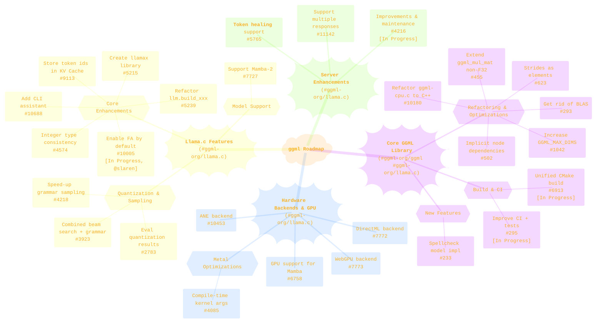
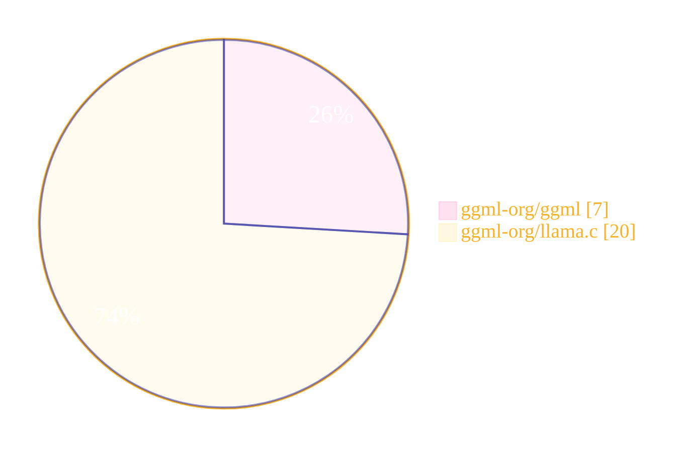
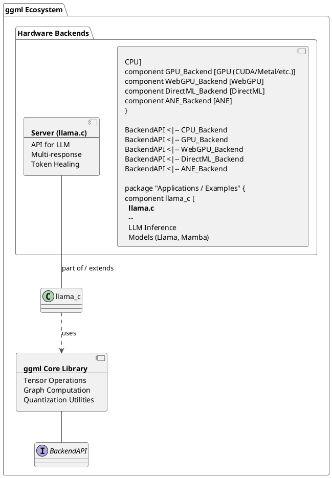

> ⚠️🏗️🚧🦺🧱🪵🪨🪚🛠️👷
> 
> This is a working draft in progress.
> 
> 
>
> gif image is provided by [Giphy](https://giphy.com)
> 
> ⚠️🏗️🚧🦺🧱🪵🪨🪚🛠️👷


----


# `ggml` project roadmap overview
<details open>
<summary>Click to show/hide the full disclaimer.</summary>
   
> <ins>📢 **Disclaimer** 🚨</ins>
>
> This document contains my personal notes on the topic,
> compiled from publicly available documentation and various cited sources.
> The materials are intended for educational purposes (<ins>sometimes, entertainment purposes</ins>), personal study, and reference.
> The content is dual-licensed:
> 1. **MIT License:** Applies to all code implementations (Swift, Mermaid, and other programming languages).
> 2. **Creative Commons Attribution-ShareAlike 4.0 International License (CC BY-SA 4.0):** Applies to all non-code content, including text, explanations, diagrams, and illustrations.

</details>


----

## 🗺️ Understanding the Roadmap Structure

The roadmap is presented in a table format with the following key columns:

*   **Title:** A brief description of the task, usually with an associated issue number (e.g., `#293`). Tasks are prefixed with `ggml:`, `llama:`, `server:`, or `metal:` indicating their primary domain.
*   **Repository:** The GitHub repository the task belongs to, either `ggml-org/ggml` (the core library) or `ggml-org/llama.c` (an implementation using `ggml`).
*   **Labels:** Tags categorizing the task (e.g., `performance`, `refactoring`, `enhancement`, `help wanted`, `research`).
*   **Assignees:** The person(s) assigned to the task. Most are unassigned in this view.
*   **Status:** The current state of the task, filtered here to show "Todo" ⏳ and "In Progress" 🚧.
*   **Linked pull requests:** Any pull requests directly linked to resolving the issue.

This specific view shows **27 tasks** that are either "Todo" or "In Progress".

---

## 📊 Visualizing the Roadmap

Let's use some diagrams to visualize different aspects of this roadmap.

### 🧠 Overall Roadmap Themes

This mind map shows the major development areas and the tasks under them.



---

### 📋 Task Status Overview

Here's a Kanban-style view of tasks currently "Todo" vs. "In Progress".

```mermaid
---
title: "📋 Task Status Overview"
author: "Cong Le"
version: "1.0"
license(s): "MIT, CC BY-SA 4.0"
copyright: "Copyright (c) 2025 Cong Le. All Rights Reserved."
config:
  layout: elk
  theme: base
  look: handDrawn
---
%%%%%%%% Mermaid version v11.4.1-b.14
%%%%%%%% Available curve styles include the following keywords:
%% basis, bumpX, bumpY, cardinal, catmullRom, linear, monotoneX, monotoneY, natural, step, stepAfter, stepBefore.
%%{
  init: {
    'flowchart': { 'htmlLabels': true, 'curve': 'basis' },
    'fontFamily': 'American Typewriter, monospace',
    'logLevel': 'fatal',
    'themeVariables': {
      'primaryColor': '#22BB',
      'primaryTextColor': '#F8B229',
      'lineColor': '#F8B229',
      'primaryBorderColor': '#27AE60',
      'secondaryColor': '#E2F1',
      'secondaryTextColor': '#6C3483',
      'secondaryBorderColor': '#A569BD',
      'fontSize': '20px'
    }
  }
}%%
flowchart TB
    subgraph Todo["Todo Tasks ⏳<br/>(23)"]
    style Todo fill:#F2F2,stroke:#333,stroke-width:1px, color: #FFFF
        T1["ggml:<br/>Get rid of BLAS <br/>#293"]
        T2["ggml:<br/>Spellcheck model <br/>#233"]
        T3["ggml:<br/>Extend ggml_mul_mat <br/>#455"]
        T4["ggml:<br/>Implicit node dependencies <br/>#502"]
        T5["ggml:<br/>Storing strides as elements <br/>#623"]
        T6["ggml:<br/>GPU support for Mamba <br/>#6758"]
        T7["ggml:<br/>DirectML backend <br/>#7772"]
        T8["ggml:<br/>WebGPU backend <br/>#7773"]
        T9["ggml:<br/>ANE backend <br/>#10453"]
        T10["ggml:<br/>Refactor ggml-cpu.c <br/>#10180"]
        T11["ggml:<br/>Increase GGML_MAX_DIMS <br/>#1042"]
        T12["llama:<br/>Eval quantization <br/>#2783"]
        T13["llama:<br/>Combined beam search <br/>#3923"]
        T14["llama:<br/>Speed-up grammar sampling <br/>#4218"]
        T15["llama:<br/>Create llamax library <br/>#5215"]
        T16["llama:<br/>Refactor llm.build_xxx <br/>#5239"]
        T17["llama:<br/>Integer type consistency <br/>#4574"]
        T18["llama:<br/>Support Mamba-2 <br/>#7727"]
        T19["llama:<br/>Store token ids in KV Cache <br/>#9113"]
        T20["llama:<br/>Add CLI assistant <br/>#10688"]
        T21["server:<br/>Multiple responses <br/>#11142"]
        T22["server:<br/>Token healing <br/>#5765"]
        T23["metal:<br/>Compile-time kernel args <br/>#4085"]
    end

    subgraph InProgress["In Progress Tasks 🚧<br/>(4)"]
    style InProgress fill:#6913,stroke:#333,stroke-width:1px, color: #FFFF
        IP1["ggml:<br/>Improve CI + tests <br/>#295"]
        IP2["ggml:<br/>Unified CMake build <br/>#6913"]
        IP3["llama:<br/>Enable FA by default <br/>#10005<br/>(@slaren)"]
        IP4["server:<br/>Improvements & maintenance <br/>#4216"]
    end
```



### 📦 Distribution of Tasks by Repository

This pie chart shows how tasks are split between the main `ggml` library and `llama.c`.



### 🏷️ Common Label Frequencies

A bar chart illustrating the occurrences of the most common labels across all 27 tasks.

```mermaid
---
title: "Common Label Frequencies"
author: "Cong Le"
version: "1.0"
license(s): "MIT, CC BY-SA 4.0"
copyright: "Copyright (c) 2025 Cong Le. All Rights Reserved."
config:
  layout: elk
  theme: base
---
%%%%%%%% Mermaid version v11.4.1-b.14
%%{
  init: {
	'fontFamily': 'Monaco',
    'gantt': {
      'titleTopMargin': 25,
      'barHeight': 15,
      'barGap': 10,
      'topPadding': 65,
      'rightPadding': 10,
      'leftPadding': 200,
      'gridLineStartPadding': 25,
      'sectionFontSize': 15,
      'numberSectionStyles': 4,
      'axisFormat': '%Y',
      'topAxis': true,
      'weekday': 'sunday'
    },
    'themeVariables': {
      'primaryColor': '#204',
      'primaryTextColor': '#F8B229',
      'primaryBorderColor': '#27AE60',
      'fontSize': '20px'
    }
  }
}%%
gantt
    title Common Label Frequencies
    dateFormat X
    axisFormat %s

    section Labels
    roadmap           :roadmap, 0, 27
    enhancement       :enhancement, 0, 19
    refactoring       :refactoring, 0, 10
    good first issue  :gfi, 0, 7
    help wanted       :help, 0, 6
    research          :research, 0, 6
    server            :server, 0, 3
    performance       :perf, 0, 3
    model             :model, 0, 2
    build             :build, 0, 2
```



*(Note: Gantt chart is used for a horizontal bar chart style representation here)*

### 🏗️ Conceptual Component Relationship

This diagram illustrates the conceptual relationship between `ggml`, its backends, and how `llama.c` and its server component might utilize them.



----

## 📝 Detailed Roadmap Items

Here is a list of all 27 tasks visible in the roadmap image:

| #  | Title                                                              | Repository         | Labels                                                                                | Status          | Assignee | PRs    | Emojis                                       |
|----|--------------------------------------------------------------------|--------------------|---------------------------------------------------------------------------------------|-----------------|----------|--------|----------------------------------------------|
| 1  | `ggml: get rid of BLAS and all it's variants #293`                 | `ggml-org/ggml`    | `performance`, `refactoring`, `roadmap`                                               | Todo            |          |        | :rocket: :gear: 🗺️                             |
| 2  | `ggml: improve CI + add more tests #295`                           | `ggml-org/ggml`    | `good first issue`, `help wanted`, `roadmap`, `testing`, `build`                      | In Progress     |          |        | :heavy_plus_sign: :sos: 🗺️ 🧪 :toolbox: 🚧      |
| 3  | `ggml: implement a spellcheck model (xfspell, t5-spellchecker, etc) #233` | `ggml-org/ggml`    | `good first issue`, `help wanted`, `model`, `roadmap`                                 | Todo            |          |        | :heavy_plus_sign: :sos: :books: 🗺️             |
| 4  | `ggml: extend ggml_mul_mat to support non-F32 input #455`            | `ggml-org/ggml`    | `enhancement`, `refactoring`, `roadmap`                                               | Todo            |          |        | :sparkles: :gear: 🗺️                          |
| 5  | `ggml: better way to express implicit node dependencies in a graph #502` | `ggml-org/ggml`    | `enhancement`, `refactoring`, `roadmap`                                               | Todo            |          |        | :sparkles: :gear: 🗺️                          |
| 6  | `ggml: storing strides as number of elements instead of bytes #623`  | `ggml-org/ggml`    | `refactoring`, `roadmap`                                                              | Todo            |          |        | :gear: 🗺️                                     |
| 7  | `ggml: add GPU support for Mamba models #6758`                     | `ggml-org/llama.c` | `enhancement`, `help wanted`, `Nvidia`, `GPU`, `roadmap`                              | Todo            |          |        | :sparkles: :sos: <:Nvidia:0> :computer: 🗺️       |
| 8  | `ggml: unified CMake build #6913`                                  | `ggml-org/llama.c` | `build`, `enhancement`, `refactoring`, `roadmap`                                      | In Progress     |          |        | :toolbox: :sparkles: :gear: 🗺️ 🚧              |
| 9  | `ggml: add DirectML backend #7772`                                 | `ggml-org/llama.c` | `help wanted`, `research`, `roadmap`, `enhancement`                                   | Todo            |          |        | :sos: :mag: 🗺️ :sparkles: :electric_plug:     |
| 10 | `ggml: add WebGPU backend #7773`                                   | `ggml-org/llama.c` | `help wanted`, `research`, `roadmap`, `enhancement`                                   | Todo            |          |        | :sos: :mag: 🗺️ :sparkles: :globe_with_meridians: |
| 11 | `ggml: add ANE backend #10453`                                     | `ggml-org/llama.c` | `help wanted`, `research`, `roadmap`, `enhancement`                                   | Todo            |          |        | :sos: :mag: 🗺️ :sparkles: :apple:              |
| 12 | `ggml: refactor ggml-cpu.c into multiple C++ source files #10180`  | `ggml-org/llama.c` | `refactoring`, `roadmap`, `enhancement`                                               | Todo            |          |        | :gear: 🗺️ :sparkles:                          |
| 13 | `ggml: increase GGML_MAX_DIMS #1042`                               | `ggml-org/ggml`    | `enhancement`, `roadmap`                                                              | Todo            |          |        | :sparkles: 🗺️                                |
| 14 | `llama: tool for evaluating quantization results per layer #2783`    | `ggml-org/llama.c` | `enhancement`, `generation quality`, `roadmap`                                        | Todo            |          |        | :llama: :sparkles: :chart_with_upwards_trend: 🗺️ |
| 15 | `llama: combined beam search + grammar sampling strategy #3923`    | `ggml-org/llama.c` | `generation quality`, `good first issue`, `research`, `enhancement`, `roadmap`        | Todo            |          |        | :llama: :chart_with_upwards_trend: :heavy_plus_sign: :mag: :sparkles: 🗺️ |
| 16 | `llama: speed-up grammar sampling #4218`                           | `ggml-org/llama.c` | `performance`, `refactoring`, `roadmap`                                               | Todo            |          |        | :llama: :rocket: :gear: 🗺️                    |
| 17 | `llama: create llamax library #5215`                               | `ggml-org/llama.c` | `refactoring`, `roadmap`, `enhancement`                                               | Todo            |          |        | :llama: :gear: 🗺️ :sparkles:                  |
| 18 | `llama: refactor the llm.build_xxx functions #5239`                | `ggml-org/llama.c` | `good first issue`, `refactoring`, `roadmap`                                          | Todo            |          |        | :llama: :heavy_plus_sign: :gear: 🗺️           |
| 19 | `llama: integer type consistency in llama.h #4574`                 | `ggml-org/llama.c` | `enhancement`, `good first issue`, `refactoring`, `roadmap`                           | Todo            |          |        | :llama: :sparkles: :heavy_plus_sign: :gear: 🗺️ |
| 20 | `llama: support Mamba-2 #7727`                                     | `ggml-org/llama.c` | `model`, `research`, `enhancement`, `roadmap`                                         | Todo            |          | `#9126`| :llama: :books: :mag: :sparkles: 🗺️ :link: |
| 21 | `llama: store token ids in the KV Cache #9113`                     | `ggml-org/llama.c` | `enhancement`, `roadmap`                                                              | Todo            |          |        | :llama: :sparkles: 🗺️                        |
| 22 | `llama: enable FA by default and disable it per-layer #10005`      | `ggml-org/llama.c` | `enhancement`, `roadmap`                                                              | In Progress     | `slaren` |        | :llama: :sparkles: 🗺️ 🚧 :bust_in_silhouette:   |
| 23 | `llama: add CLI assistant #10688`                                  | `ggml-org/llama.c` | `enhancement`, `good first issue`, `roadmap`                                          | Todo            |          |        | :llama: :sparkles: :heavy_plus_sign: 🗺️       |
| 24 | `server: add support for multiple responses #11142`                | `ggml-org/llama.c` | `roadmap`, `server`, `server/api`, `enhancement`                                      | Todo            |          |        | :cloud: 🗺️ :sparkles:                        |
| 25 | `server: improvements and maintenance #4216`                       | `ggml-org/llama.c` | `help wanted`, `refactoring`, `roadmap`, `server`, `server/web`                       | In Progress     |          |        | :cloud: :sos: :gear: 🗺️ 🚧                   |
| 26 | `server: add "token healing" support #5765`                        | `ggml-org/llama.c` | `enhancement`, `good first issue`, `roadmap`, `server`                                | Todo            |          |        | :cloud: :sparkles: :heavy_plus_sign: 🗺️       |
| 27 | `metal: compile-time kernel args and params #4085`                 | `ggml-org/llama.c` | `performance`, `research`, `roadmap`, `enhancement`                                   | Todo            |          |        | :apple: :rocket: :mag: 🗺️ :sparkles:          |

*(Note: Specific Nvidia emoji might not render consistently, using a generic PC icon as fallback.Assignee `slaren` is noted.)*

----

## 💡 Mathematical Context of GGML (Beyond the Roadmap Image)

While the roadmap image itself doesn't contain mathematical equations, `ggml` as a tensor library is fundamentally built on mathematics. Key operations and concepts involve:

*   **Matrix Multiplication:** Core to neural networks. If $A$ is an $m \times k$ matrix and $B$ is a $k \times n$ matrix, their product $C = AB$ is an $m \times n$ matrix where each element $C_{ij}$ is:
	$C_{ij} = \sum_{p=1}^{k} A_{ip} B_{pj}$
	Task #4 (`extend ggml_mul_mat`) directly relates to this.

*   **Quantization:** Reducing the precision of weights and activations (e.g., from 32-bit float to 8-bit integer) to save memory and speed up computation. This involves a mapping like:
	$r = S \cdot (q - Z)$
	Where:
	*   $r$ is the original real value.
	*   $q$ is the quantized value.
	*   $S$ is the scale factor (a float).
	*   $Z$ is the zero-point (an integer, representing the quantized value that maps to the real value 0).
	Task #14 (`llama: tool for evaluating quantization results`) is related to this.

*   **Tensor Operations:** `ggml` supports various operations on multi-dimensional arrays (tensors), such as addition, scaling, reshape, permute, etc., each with its own mathematical definition.

*   **Graph Computation:** `ggml` builds a computation graph where nodes are operations and edges represent data flow (tensors). The "implicit node dependencies" in task #5 relate to optimizing this graph.

These mathematical foundations enable `ggml` to efficiently execute machine learning models.

----

## ✨ Conclusion

This roadmap provides a fascinating insight into the active development and future direction of the `ggml` project. There's a strong focus on:
*   **Core library refactoring and optimization** (e.g., removing BLAS, improving `ggml_mul_mat`).
*   **Expanding hardware backend support** (DirectML, WebGPU, And, Metal).
*   **Enhancing `llama.c` capabilities** with better sampling, model support, and developer experience features.
*   **Improving server-side functionalities.**

The project clearly encourages community involvement with labels like `help wanted` and `good first issue`. It's an exciting time for those involved with or following `ggml`! 🎉

----

```mermaid
---
title: "❓...CongLeSolutionX....❓"
author: "Cong Le"
version: "1.0"
license(s): "MIT, CC BY-SA 4.0"
copyright: "Copyright (c) 2025 Cong Le. All Rights Reserved."
config:
  theme: base
---
%%%%%%%% Mermaid version v11.4.1-b.14
%%{
  init: {
    'flowchart': { 'htmlLabels': false },
    'fontFamily': 'Bradley Hand',
    'themeVariables': {
      'primaryColor': '#fc82',
      'primaryTextColor': '#F8B229',
      'primaryBorderColor': '#27AE60',
      'secondaryColor': '#5229',
      'secondaryTextColor': '#6C3483',
      'lineColor': '#F8B229',
      'fontSize': '20px'
    }
  }
}%%
flowchart LR
    My_Meme@{ img: "https://raw.githubusercontent.com/CongLeSolutionX/CongLeSolutionX/refs/heads/main/assets/images/My-meme-and-question-marks-open-book-old-characters-background.png", label: "..🙉..👀..📖..", pos: "b", w: 200, h: 150, constraint: "off" }
   
    Link_to_my_profile{{"<a href='https://github.com/CongLeSolutionX' target='_blank'>Click here if you care about my profile</a>"}}

  Closing_quote@{ shape: braces, label: "..👀..<br/>'Unfortunately,<br/>no one can be told<br/> what the Matrix is.<br/>You have to see it<br/>for yourself'<br/>...📚..<br/>-<ins>Morpheus,<br/>a character from the movie The Matrix 1999</ins>"}

   Closing_quote ~~~ My_Meme

    My_Meme animatingEdge@--> Link_to_my_profile
  
  animatingEdge@{ animate: true }

```

---
><b>Licenses</b>:
>
>- <b>MIT License</b>:  [](LICENSE) - Full text in [LICENSE](LICENSE) file.
>- <b>Creative Commons Attribution-ShareAlike 4.0 International</b>: [CC BY-SA 4.0](https://creativecommons.org/licenses/by-sa/4.0/) [](https://creativecommons.org/licenses/by-sa/4.0/) - Legal details in [LICENSE-CC-BY-SA-4.0](THE_PAST/LICENSE-CC-BY-SA-4.0) and at [Creative Commons official site](https://creativecommons.org/licenses/by-sa/4.0/).
>
---

> <ins>📢 **Disclaimer** 🚨</ins>
> The analysis and interpretations are based solely on an snapshot image of the GitHub project roadmap.
> Some labels or details might be inferred based on common practices.

-----
