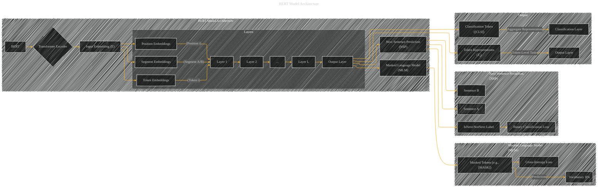

# BERT Model Architecture
> **Disclaimer:**
>
> This document contains my personal notes on the topic,
> compiled from publicly available documentation and various cited sources.
> The materials are intended for educational purposes, personal study, and reference.
> The content is dual-licensed:
> 1. **MIT License:** Applies to all code implementations (Swift, Mermaid, and other programming languages).
> 2. **Creative Commons Attribution 4.0 International License (CC BY 4.0):** Applies to all non-code content, including text, explanations, diagrams, and illustrations.
---

---

### Explanation and Improvements

This Mermaid diagram focuses specifically on the BERT model's architecture. It's structured to show the flow of information from input to output, highlighting the key components involved in pre-training and fine-tuning.  It's more precise and avoids the overly general structure of the previous attempt.

* **Input Embedding (E):**  The diagram explicitly shows the input embedding `E` as the combination of token, segment, and position embeddings.
* **Layers (L):** The repeated layers (`Layer 1`, `Layer 2`, ..., `Layer L`) are now represented to indicate the multi-layered transformer architecture.
* **Output Layer (K):** This layer is specifically labeled and connected to the MLM and NSP tasks.
* **Masked Language Model (MLM) and Next Sentence Prediction (NSP):**  The diagram explicitly shows how these tasks are incorporated as branches of the output layer, connecting the outputs to appropriate loss functions.
* **Output Representations:** The output of the model for both token-level and classification tasks is clearly illustrated. The `[CLS]` token's hidden state is used for classification.

---

### How to further improve

* **Connection to Special Tokens:** Add a visual link between the input embedding `E` and the special tokens ([CLS], [SEP]) to clarify their role in the input.
* **Attention Mechanism:**  While this diagram doesn't visualize the attention mechanism itself, consider adding a note or annotation to indicate its presence in each layer.
* **Fine-tuning Context:** Include a smaller subgraph showing the addition of a classification layer during fine-tuning, clarifying how downstream tasks are handled.

---
**Licenses:**

- **MIT License:**   - Full text in [LICENSE](LICENSE) file.
- **Creative Commons Attribution 4.0 International:**  - Legal details in [LICENSE-CC-BY](LICENSE-CC-BY) and at [Creative Commons official site](http://creativecommons.org/licenses/by/4.0/).

---