> ⚠️🏗️🚧🦺🧱🪵🪨🪚🛠️👷
> 
> This is a working draft in progress
> 
> 
>
> gif image is provided by [Giphy](https://giphy.com)
> 
> ⚠️🏗️🚧🦺🧱🪵🪨🪚🛠️👷


----


## 💎 Gemini 2.5: Pushing the Frontier 🚀

<details open>
<summary>Click to show/hide the full disclaimer.</summary>
   
> <ins>📢 **Disclaimer** 🚨</ins>
>
> This document contains my personal notes on the topic,
> compiled from publicly available documentation and various cited sources.
> The materials are intended for educational purposes (<ins>sometimes, entertainment purposes</ins>), personal study, and reference.
> The content is dual-licensed:
> 1. **MIT License:** Applies to all code implementations (Swift, Mermaid, and other programming languages).
> 2. **Creative Commons Attribution-ShareAlike 4.0 International License (CC BY-SA 4.0):** Applies to all non-code content, including text, explanations, diagrams, and illustrations.

</details>


This report introduces the Gemini 2.X model family, highlighting their advanced reasoning, multimodality, long context capabilities, and next-generation agentic functionalities.

----

## 📜 Table of Contents (Conceptual)

1.  **Introduction to Gemini 2.X Family** 👨‍👩‍👧‍👦
2.  **Model Architecture, Training & Dataset** 🏗️
	*   Architecture (Sparse MoE, Multimodality, Long Context)
	*   Dataset Details
	*   Training Infrastructure (TPUv5p, Elasticity, SDC Detection)
	*   Post-training (SFT, RM, RL)
	*   "Thinking" 🧠 Capability
	*   Capability-Specific Improvements (Code, Factuality, etc.)
	*   The Path to Gemini 2.5 (Experimental Models)
3.  **Quantitative Evaluation** 📊
	*   Methodology
	*   Core Capability Results (vs. Gemini 1.5)
	*   Evaluation vs. Other LLMs
	*   Audio & Video Understanding
4.  **Example Use Cases** 🎮📚
	*   Gemini Plays Pokémon
	*   Other Applications (Interactive Apps, Simulations)
	*   Gemini in Google Products
5.  **Safety, Security, and Responsibility**🛡️
	*   Process & Policies
	*   Training for Safety
	*   Development Evaluations
	*   Automated Red Teaming (ART)
	*   Memorization & Privacy
	*   Assurance Evaluations & Frontier Safety Framework (FSF)
	*   External Safety Testing
6.  **Discussion & Future Outlook** 🔮
7.  **Contributors & Acknowledgments** 🙏
8.  **Appendix** 📎 (Evaluation Details, Pokémon Details, Demos)

---

## 1. Introduction: The Gemini 2.X Family 🌟

The Gemini 2.X series builds upon Gemini 1.5, aiming for a universal AI assistant. The family includes:
*   **Gemini 2.5 Pro:** Most intelligent, excels in reasoning, coding, multimodal understanding (up to 3 hrs video), and long context (>1M tokens).
*   **Gemini 2.5 Flash:** Hybrid reasoning with controllable thinking budget; balances quality, cost, and latency.
*   **Gemini 2.0 Flash:** Fast, cost-efficient non-thinking model.
*   **Gemini 2.0 Flash-Lite:** Fastest, most cost-efficient for at-scale usage.

All are natively multimodal and support long context and tool use.

### Porównanie Model Comparison (Based on Table 1)

```mermaid
---
title: "Porównanie Model Comparison (Based on Table 1)"
author: "Cong Le"
version: "1.0"
license(s): "MIT, CC BY-SA 4.0"
copyright: "Copyright (c) 2025 Cong Le. All Rights Reserved."
config:
  layout: elk
  theme: base
  look: handDrawn
---
%%%%%%%% Mermaid version v11.4.1-b.14
%%%%%%%% Available curve styles include the following keywords:
%% basis, bumpX, bumpY, cardinal, catmullRom, linear, monotoneX, monotoneY, natural, step, stepAfter, stepBefore.
%%{
  init: {
    'flowchart': { 'htmlLabels': true, 'curve': 'basis' },
    'fontFamily': 'American Typewriter, monospace',
    'logLevel': 'fatal',
    'themeVariables': {
      'primaryColor': '#22BB',
      'primaryTextColor': '#F8B229',
      'lineColor': '#F8B229',
      'primaryBorderColor': '#27AE60',
      'secondaryColor': '#E2F1',
      'secondaryTextColor': '#6C3483',
      'secondaryBorderColor': '#A569BD',
      'fontSize': '20px'
    }
  }
}%%
flowchart LR
    subgraph Legend["Legend"]
        L1["📜 Text"]
        L2["🖼️ Image"]
        L3["🎬 Video"]
        L4["🔊 Audio"]
        L5["🔧 Tool Use"]
        L6["💡 Thinking"]
        L7["🗓️ Knowledge Cutoff"]
    end

    subgraph Gemini_Family["Gemini Model Family & Key Features"]
    direction LR
        G1_5F["Gemini 1.5 Flash"] --> F1_5F1["Input:<br/>📜🖼️🎬🔊<br/>1M tokens)"]
        G1_5F --> F1_5F2["Output:<br/>📜<br/>(8K tokens)"]
        G1_5F --> F1_5F3["💡 Thinking:<br/> No"]
        G1_5F --> F1_5F4["🔧 Tool Use:<br/> No"]
        G1_5F --> F1_5F5["🗓️ Cutoff:<br/> Nov 2023"]

        G1_5P["Gemini 1.5 Pro"] --> F1_5P1["Input:<br/> 📜🖼️🎬🔊<br/>(1M tokens)"]
        G1_5P --> F1_5P2["Output:<br/>📜<br/>(8K tokens)"]
        G1_5P --> F1_5P3["💡 Thinking:<br/> No"]
        G1_5P --> F1_5P4["🔧 Tool Use:<br/> No"]
        G1_5P --> F1_5P5["🗓️ Cutoff:<br/>Nov 2023"]

        G2_FL["Gemini 2.0 Flash-Lite"] --> F2_FL1["Input:<br/>📜🖼️🎬🔊<br/>(1M tokens)"]
        G2_FL --> F2_FL2["Output:<br/>📜<br/>(8K tokens)"]
        G2_FL --> F2_FL3["💡 Thinking:<br/>No"]
        G2_FL --> F2_FL4["🔧 Tool Use:<br/>No"]
        G2_FL --> F2_FL5["🗓️ Cutoff:<br/>June 2024"]

        G2_F["Gemini 2.0 Flash"] --> F2_F1["Input:<br/>📜🖼️🎬🔊<br/>(1M tokens)"]
        G2_F --> F2_F2["Output:<br/>📜🖼️* <br/>(8K tokens)"]
        G2_F --> F2_F3["💡 Thinking:<br/>Yes"]
        G2_F --> F2_F4["🔧 Tool Use:<br/>Yes"]
        G2_F --> F2_F5["🗓️ Cutoff:<br/>June 2024"]

        G2_5FL["Gemini 2.5 Flash"] --> F2_5FL1["Input:<br/>📜🖼️🎬🔊<br/>(1M tokens)"]
        G2_5FL --> F2_5FL2["Output:<br/>📜🔊* <br/>(64K tokens)"]
        G2_5FL --> F2_5FL3["💡 Thinking:<br/> Yes <br/>(Controllable)"]
        G2_5FL --> F2_5FL4["🔧 Tool Use:<br/> Yes"]
        G2_5FL --> F2_5FL5["🗓️ Cutoff:<br/> Jan 2025"]

        G2_5P["Gemini 2.5 Pro"] --> F2_5P1["Input:<br/>📜🖼️🎬🔊<br/>(1M tokens)"]
        G2_5P --> F2_5P2["Output:<br/> 📜🔊 <br/>(64K tokens)"]
        G2_5P --> F2_5P3["💡 Thinking: Yes <br/>(Controllable)"]
        G2_5P --> F2_5P4["🔧 Tool Use:<br/>Yes"]
        G2_5P --> F2_5P5["🗓️ Cutoff:<br/>Jan 2025"]
    end
    classDef default fill:#f9f2,stroke:#333,stroke-width:2px;
```



*Note: `*` indicates features currently limited to Experimental or Preview.*

### 📈 Cost-Performance Frontier (Conceptual Interpretation of Figure 1)

The report states Gemini 2.5 Pro significantly improves over Gemini 1.5 Pro, illustrated by a cost-performance plot (LMArena score vs. cost). This suggests a shift in the Pareto frontier, where Gemini 2.5 Pro offers higher capability at a comparable or optimized cost point relative to its power.


*(This DOT graph is a conceptual aid as the actual plot data isn't provided here for direct replication.)*

---

## 2. Model Architecture, Training & Dataset ⚙️

### 2.1. Model Architecture

*   **Foundation:** Sparse Mixture-of-Experts (MoE) Transformers.
	*   Allows decoupling total model capacity from computation/serving cost per token.
	*   Tokens are dynamically routed to a subset of parameters (experts).
*   **Improvements in Gemini 2.5:**
	*   Enhanced large-scale training stability.
	*   Better signal propagation and optimization dynamics.
	*   Superior performance in processing long-context inputs (up to 1M tokens) compared to Gemini 1.5 Pro.
	*   Architectural changes for vision processing leading to improved image/video understanding (e.g., processing 3-hour videos).
*   **Smaller Models (Flash size & below):** Utilize distillation.
	*   Teacher's next token prediction distribution approximated using a k-sparse distribution.
	*   Increases training data throughput/storage by factor of $k$.

#### Sparse MoE Concept


*Caption: Simplified Sparse MoE. The Router sends each input token to a small subset of 'experts'. Only activated experts compute for that token.*

#### Distillation for Smaller Models


### 2.2. Dataset 📚

*   **Pre-training:** Large-scale, diverse, multimodal (web documents, code, images, audio, video).
	*   Cutoff: June 2024 (for 2.0 series), January 2025 (for 2.5 series).
	*   Improved data quality (filtering, deduplication) vs. Gemini 1.5.
*   **Post-training:** Instruction tuning data (multimodal, paired instructions/responses), human preference data, tool-use data.

### 2.3. Training Infrastructure 🛠️

*   **Hardware:** First family trained on **TPUv5p** architecture.
	*   Synchronous data-parallel training across multiple 8960-chip pods.
*   **Software Advances (vs. Gemini 1.5):**
	1.  **Slice-Granularity Elasticity:** Automatic continuation with fewer TPU "slices" during localized failures.
		*   Reduces interruption time from ~10+ mins to tens of seconds.
		*   Maintains ~97% throughput during recovery.
	2.  **Split-Phase SDC (Silent Data Corruption) Detection:** Lightweight deterministic replay for rapid SDC detection and localization.
		*   Identifies faulty accelerators within minutes.
		*   ~0.25% of steps replayed; 6% of these were genuine hardware corruption.
*   **Efficiency:** ~93.4% of time spent on TPU computations. (~4.5% replays/rollbacks).
*   **Pathways System:** Single controller design facilitated these advancements.

```mermaid
---
title: "Training Infrastructure 🛠️"
author: "Cong Le"
version: "1.0"
license(s): "MIT, CC BY-SA 4.0"
copyright: "Copyright (c) 2025 Cong Le. All Rights Reserved."
config:
  layout: elk
  theme: base
  look: handDrawn
---
%%%%%%%% Mermaid version v11.4.1-b.14
%%%%%%%% Available curve styles include the following keywords:
%% basis, bumpX, bumpY, cardinal, catmullRom, linear, monotoneX, monotoneY, natural, step, stepAfter, stepBefore.
%%{
  init: {
    'flowchart': { 'htmlLabels': true, 'curve': 'basis' },
    'fontFamily': 'American Typewriter, monospace',
    'logLevel': 'fatal',
    'themeVariables': {
      'primaryColor': '#22BB',
      'primaryTextColor': '#F8B229',
      'lineColor': '#F8B229',
      'primaryBorderColor': '#27AE60',
      'secondaryColor': '#E2F1',
      'secondaryTextColor': '#6C3483',
      'secondaryBorderColor': '#A569BD',
      'fontSize': '20px'
    }
  }
}%%
flowchart TD
    A["TPUv5p Pods<br/>(e.g., 8960-chip)"] --> B("Synchronous Data-Parallel Training")
    B --> C{"Training Step"}
    C --> D{"Localized Failure?"}
    D -- Yes --> E["Slice-Granularity Elasticity"]
    E --> F["Continue Training<br/>(Reduced Slices, ~97% T-put)"]
    E --> G["Recover Failed Slice"]
    F --> C
    G --> F
    D -- No --> H{"Suspicious Metrics?"}
    H -- Yes --> I["Split-Phase SDC Detection"]
    I --> J["Deterministic Replay & <br/> Checksum Comparison"]
    J --> K{"Hardware Corruption Found?"}
    K -- Yes --> L["Exclude Faulty Accelerator"]
    L --> C
    K -- No --> C
    H -- No --> M["TPU Computations<br/>(93.4% time)"]
    M --> C
    C -.-> Z["Model Update"]

    subgraph Software_Advances["Software Advances"]
    style Software_Advances fill:#e6fffa,stroke:#00796b,stroke-width:2px
        E
        I
    end

    %% note right of B
    %%    Single Controller (Pathways System)
    %%    manages elasticity & SDC detection.
    %% end note
```



### 2.4. Post-training 🎓

*   Focus on **data quality** across SFT, Reward Modeling (RM), and RL.
*   Model itself used to assist in quality control.
*   Increased RL training compute for deeper exploration.
*   Focus on **verifiable rewards** and **model-based generative rewards**.
*   Algorithmic changes to RL for improved stability.
*   Enabled learning from diverse/complex RL environments (multi-step actions, tool use).
*   Resulted in significant LMArena ELO score increases.

```plantuml
/'
title: Post-training
author: Cong Le
version: 1.0
license(s): MIT, CC BY-SA 4.0
copyright: Copyright (c) 2025 Cong Le. All Rights Reserved.
'/
@startuml PostTrainingPipeline
title Gemini 2.5 Post-training Enhancements

actor UserInteractions
actor HumanAnnotators
actor PretrainedModel as "Base Gemini Model"

package "Supervised Fine-Tuning (SFT)" {
  Interface "Adversarial Prompts" as SFT_Prompts
  UserInteractions --> SFT_Prompts
  HumanAnnotators --> SFT_Prompts
  PretrainedModel --|> SFT_Prompts : Probed for weaknesses

  node "SFT Data Generation" as SFT_Data {
    UserInteractions --> SFT_Data : Example interactions
    HumanAnnotators --> SFT_Data : Curated examples, Revisions (Constitutional AI inspired)
  }
  SFT_Data --> SFT_Model["SFT Model"]
  PretrainedModel --> SFT_Model : Fine-tuning
}

package "Reward Modeling (RM)" {
  Interface "Preference Data Collection" as RM_Data_Collection
  SFT_Model --> RM_Data_Collection : Generate response candidates
  HumanAnnotators --> RM_Data_Collection : Rank/Rate responses

  node "Data Reward Model (DRM)" as DRM
  RM_Data_Collection --> DRM : Train DRM on human preferences

  node "Critic Model" as Critic
  SFT_Model --> Critic : Generate responses
  note right of Critic : Grades responses based on\npre-defined rubrics.\nIteration on rubrics.
}

package "Reinforcement Learning (RL*F)" {
  node "RL Agent (Gemini Model)" as RL_Agent
  SFT_Model --> RL_Agent : Initialize

  Interface "RL Environment" as RL_Env
  RL_Agent --> RL_Env : Takes actions (generates responses, uses tools)
  RL_Env --> RL_Agent : Provides observations/state

  DRM --> RL_Agent : Provides Reward Signal (Amortized Human Pref.)
  Critic --> RL_Agent : Provides Reward Signal (Model-based generative)

  UserInteractions --> RL_Env : Diverse/Complex tasks (multi-step, tool use)
  HumanAnnotators --> RL_Env : (Potentially defines tasks)
}

RL_Agent --> FinalModel["Fine-tuned Gemini 2.5 Model"]

note "Key Focus Areas:\n- Data Quality (SFT, RM, RL)\n- Model-assisted QA\n- Increased RL Compute\n- Verifiable & Model-based Rewards\n- Algorithmic RL Stability" as FocusAreas
SFT_Model .. FocusAreas
DRM .. FocusAreas
RL_Agent .. FocusAreas

caption Improved post-training pipeline leveraging model assistance, better rewards, and advanced RL for enhanced performance.
@enduml

```

### 2.5. Thinking 💡

*   Trained with RL to spend tens of thousands of forward passes ("thinking stage") before responding.
*   Integrated with multimodality and long context.
*   Model decides how long to think; users can set a "Thinking budget" to trade-off performance vs. cost.

```mermaid
---
title: "Thinking 💡"
author: "Cong Le"
version: "1.0"
license(s): "MIT, CC BY-SA 4.0"
copyright: "Copyright (c) 2025 Cong Le. All Rights Reserved."
config:
  layout: elk
  theme: base
  look: handDrawn
---
%%%%%%%% Mermaid version v11.4.1-b.14
%%%%%%%% Available curve styles include the following keywords:
%% basis, bumpX, bumpY, cardinal, catmullRom, linear, monotoneX, monotoneY, natural, step, stepAfter, stepBefore.
%%{
  init: {
    'flowchart': { 'htmlLabels': true, 'curve': 'basis' },
    'fontFamily': 'American Typewriter, monospace',
    'logLevel': 'fatal',
    'themeVariables': {
      'primaryColor': '#22BB',
      'primaryTextColor': '#F8B229',
      'lineColor': '#F8B229',
      'primaryBorderColor': '#27AE60',
      'secondaryColor': '#E2F1',
      'secondaryTextColor': '#6C3483',
      'secondaryBorderColor': '#A569BD',
      'fontSize': '20px'
    }
  }
}%%
flowchart TD
    A["User Query"] --> B{"Gemini Thinking Model"}
    B -- "Thinking Stage" --> C["Perform N Forward Passes<br/>(Reasoning, Exploration, Self-Correction)"]
    C --> B
    B -- "Thinking Budget<br/>(Optional)" --> D{"Budget Reached?"}
    D -- "Yes /<br/> Sufficient Confidence" --> E["Final Response"]
    D -- No --> C
    B -- "No/Low Budget or Simple Query" --> E

    subgraph RL_Training_for_Thinking["RL Training for Thinking"]
    direction LR
        RL1["Reinforcement Learning"] --> RL2{"Learn when & how much to <b>think</b>"}
        RL2 --> RL3["Optimize for accuracy given compute"]
    end
    RL_Training_for_Thinking --> B

    %% note right of C
    %%    N can be tens of thousands.
    %%    Model decides N, or constrained by budget.
    %% end note
```



*Caption: The "Thinking" process allows models to expend more computational effort before generating a final response, improving reasoning.*

### 2.6. Capability-Specific Improvements 🎯

*   **Code:** 💻
	*   Pre-training: More volume/diversity of code data. Enhanced evaluation metrics.
	*   Post-training: Novel techniques incorporating reasoning, curated engineering tasks.
	*   Significant gains on LiveCodeBench (30.5% to 69.0% for Pro), Aider Polyglot (16.9% to 82.2%), SWEBench-verified (34.2% to 67.2%).
*   **Factuality:** 🌍
	*   Expanded scope: multimodal inputs, long-context reasoning, model-retrieved info.
	*   Natively call tools like Google Search.
	*   Advanced reasoning to interleave search with internal thought.
	*   SoTA on SimpleQA, FACTS Grounding, Vectara Hallucination Leaderboard.
*   **Long Context:** 📏
	*   Modeling/data advances. Reworked internal evaluations.
	*   Targeted challenging retrieval (LOFT), reasoning (MRCR-V2), multimodal (VideoMME) tasks.
	*   Gemini 2.5 Pro can recall a 1-sec visual event from a 46-min video.
*   **Multilinguality:** 🗣️
	*   Holistic strategy: refined pre/post-training data, tokenization, core modeling, targeted hillclimbing.
	*   Striking impact in Indic, CJK languages. Improved language adherence and generative quality.
*   **Audio:** 🔊
	*   Beyond understanding (transcription, translation) to generation (TTS, audio-visual to audio dialog).
	*   Causal audio representations for low-latency streaming.
	*   Increased pre-training data (>200 languages). Integrated Thinking, affective dialog, tool use.
*   **Video:** 🎬
	*   Expanded pre/post-training video understanding data.
	*   Improved audio-visual and temporal understanding.
	*   More efficient visual token usage (66 vs 258 tokens/frame), enabling ~3hrs video in 1M context.
	*   New applications: interactive app from video, p5.js animation from video.
*   **Gemini as an Agent: Deep Research:** 🕵️
	*   Agent built on Gemini 2.5 Pro for strategic web browsing and informed answers.
	*   Improved task prioritization, dead-end identification.
	*   Humanity's Last Exam: 7.95% (Dec 2024) ➡️ 26.9% / 32.4% (June 2025) - SoTA.

### 2.7. The Path to Gemini 2.5 🛤️

Experimental models tested leading to Gemini 2.5:
*   **Gemini 2.0 Pro (Feb 2025):** Strong coding, world knowledge, 2M token context window.
*   **Gemini 2.0 Flash Native Image Generation (Mar 2025):** Integrated image generation/editing via natural language.
*   **Gemini 2.5 Audio Generation:**
	*   TTS Pro/Flash: >80 languages, style control, multi-speaker.
	*   Native Audio Dialog: >24 languages, style/accent control, tool use, understands user tone. 'Thinking' variant available.
*   **Gemini 2.5 Flash-Lite (June 2025):** Economical, ultra-low-latency, high throughput, thinking capability, 1M context.
*   **Gemini 2.5 Pro Deep Think (June 2025 - Trusted Testers):** Novel reasoning (parallel thinking, critiquing hypotheses). SoTA on Olympiad math, competitive coding, MMMU.

---

## 3. Quantitative Evaluation 📈

Key takeaway: Gemini 2.5 models show significant improvements, especially Gemini 2.5 Pro, which achieves SoTA on several benchmarks. Gemini 2.5 Flash also surpasses Gemini 1.5 Pro.

*Methodology: Pass@1, single attempt unless specified. AI Studio API used. Non-Gemini results from provider reports or leaderboards. Semantic-similarity and model-based decontamination used to mitigate eval set leakage.*

### 📊 Core Capabilities: Gemini 2.X vs 1.5 (Conceptual from Table 3 & Figure 4)

This can be visualized with bar charts, but in Markdown text, we can summarize the trend:
*   **LiveCodeBench:** Gemini 2.5 Pro (69.0%) >> Gemini 1.5 Pro (30.5%)
*   **Aider Polyglot:** Gemini 2.5 Pro (82.2%) >> Gemini 1.5 Pro (16.9%)
*   **SWE-bench Verified (mult. attempts):** Gemini 2.5 Pro (67.2%) >> Gemini 1.5 Pro (34.2%)
*   **GPQA (diamond):** Gemini 2.5 Pro (86.4%) >> Gemini 1.5 Pro (58.1%)
*   **AIME 2025:** Gemini 2.5 Pro (88.0%) >> Gemini 1.5 Pro (17.5%)
*   **HiddenMath-Hard:** Gemini 2.5 Pro (80.5%) >> Gemini 1.5 Pro (44.3%)
*   **MMMU:** Gemini 2.5 Pro (82.0%) >> Gemini 1.5 Pro (59.0%)

*Gemini 2.5 Flash consistently outperforms Gemini 1.5 Pro on these benchmarks.*

### 🆚 Gemini 2.5 Pro vs. Other LLMs (Conceptual from Table 4)

*   **Aider Polyglot:** Gemini 2.5 Pro (82.2%) - SoTA among listed.
*   **Humanity's Last Exam:** Gemini 2.5 Pro (21.6% no tools) - Highest among listed.
*   **GPQA (diamond):** Gemini 2.5 Pro (86.4%) - Highest among listed.
*   **SimpleQA:** Gemini 2.5 Pro (54.0%) - Highest among listed.
*   **FACTS Grounding:** Gemini 2.5 Pro (87.8%) - Highest among listed.
*   **LOFT (hard retrieval) & MRCR-V2 (8-needle) @ ≤128K:** Gemini 2.5 Pro (87.0% & 58.0%) - SoTA. Supports 1M+ tokens (others listed do not for these benchmarks).

### 🎧 Audio Understanding (Table 5) & 🎞️ Video Understanding (Table 6)

Gemini 2.5 Pro demonstrates SoTA or highly competitive performance on ASR, AST, and various video understanding benchmarks (ActivityNet-QA, VideoMMMU, etc.), often surpassing prior Gemini models and alternatives like GPT-4o/4.1 under comparable conditions.

---

## 4. Example Use Cases 💡

### 🎮 Gemini Plays Pokémon

An independent developer used Gemini 2.5 Pro to play Pokémon Blue. This showcased:
*   **Long Context Agentic Tooling:** Using specialized sub-agents (`pathfinder`, `boulder_puzzle_strategist`) to solve complex in-game puzzles (mazes, Safari Zone, boulder puzzles) by reasoning over 100K+ token contexts.
*   **Long Horizon Task Coherence:** Maintaining strategic goals to beat the game, including acquiring necessary items (HMs) and preparing for battles.
*   **Run 2 (fully autonomous):** Completed game in 406.5 hours (vs. 813 hours for Run 1 with harness development).

#### Agent Architecture (Conceptual based on Figure 13)

```mermaid
---
title: "Agent Architecture (Conceptual based on Figure 13)"
author: "Cong Le"
version: "1.0"
license(s): "MIT, CC BY-SA 4.0"
copyright: "Copyright (c) 2025 Cong Le. All Rights Reserved."
config:
  layout: elk
  theme: base
  look: handDrawn
---
%%%%%%%% Mermaid version v11.4.1-b.14
%%%%%%%% Available curve styles include the following keywords:
%% basis, bumpX, bumpY, cardinal, catmullRom, linear, monotoneX, monotoneY, natural, step, stepAfter, stepBefore.
%%{
  init: {
    'flowchart': { 'htmlLabels': true, 'curve': 'basis' },
    'fontFamily': 'American Typewriter, monospace',
    'logLevel': 'fatal',
    'themeVariables': {
      'primaryColor': '#22BB',
      'primaryTextColor': '#F8B229',
      'lineColor': '#F8B229',
      'primaryBorderColor': '#27AE60',
      'secondaryColor': '#E2F1',
      'secondaryTextColor': '#6C3483',
      'secondaryBorderColor': '#A569BD',
      'fontSize': '20px'
    }
  }
}%%
flowchart LR
    subgraph GameEnv["Pokémon Blue<br/>(Game Boy)"]
        Screen["Game Screen<br/>(Screenshot)"]
        RAM["Game State<br/>(RAM)"]
    end

    subgraph AgentCore["Agentic Core<br/>(Gemini 2.5 Pro)"]
    direction LR
        MainAgent["Main Agent Logic"]
        Memory["Persistent Memory & Context"]
        Tools["Agentic Tools"]
    end

    Screen --> MainAgent
    RAM --> MainAgent
    MainAgent --> MemoryManager["Memory Summarizer<br/>(100/1000 actions)"]
    MemoryManager --> Memory
    MainAgent --> ActionHistory["Action History & Summaries"]
    ActionHistory --> Memory

    MainAgent --> Goals["Goals Handler<br/>(Primary, Secondary, Contingency, etc.)"]
    Goals --> Memory

    MainAgent --> ButtonPresses["Execute Button Presses"]
    ButtonPresses --> GameEnv

    subgraph PeriodicProcesses
        Guidance["Guidance Gemini<br/>(Critique / 25 turns)"]
    end
    Memory --> Guidance
    Guidance --> MainAgent

    subgraph AgenticTools["Agentic Tools<br/>(Prompted Gemini 2.5 Pro Instances)"]
        Pathfinder["Pathfinder<br/>(Navigation)"]
        BoulderPuzzle["Boulder Puzzle Strategist"]
    end
    Tools --> Pathfinder
    Tools --> BoulderPuzzle
    MainAgent -- "Calls Tool" --> Tools
    Tools -- "Tool Output" --> MainAgent

    Memory <--> FogOfWar["Fog-of-War XML Map"]
    RAM --> FogOfWar

    %% note right of MainAgent
    %%     System Prompt:
    %%     - Goal: Beat the game
    %%     - Vision-to-text conventions
    %%     - Gameplay tips
    %%     - Explore!
    %% end
```



**Struggles Observed:**
*   **Screen Reading:** Primarily relied on text from RAM state, not raw pixels effectively.
*   **Long Context Reasoning (beyond 100k for agentic tasks):** Tendency to repeat past actions rather than novel plans with extremely long contexts.
*   **Hallucinations/Fixations:** E.g., searching for "TEA" item from a different game version.
*   **Topological Traps:** Difficulty with puzzles where the goal seems close but requires a detour.
*   **Agent Panic:** Degraded reasoning when in-game party health was low.

### 🛠️ Other Applications

*   Creating interactive apps from PDFs (e.g., Macbeth line practice).
*   Book recommendation app from a bookshelf photo.
*   Image-to-SVG conversion with good spatial reconstruction. (See Figure 15 description: 2.5 Pro better than 1.5 Pro).
*   Generating simulations (solar system) and visualizations (Fourier series logo).
*   Custom cartography tools, photorealistic 3D UI generation.

### 🌐 Gemini in Google Products

Incorporated into AI Overviews (Search), Project Astra, Gemini Deep Research, NotebookLM (podcast generation), Project Mariner (web agent), Jules (coding agent).

---

## 5. Safety, Security, and Responsibility 🛡️

A comprehensive approach to safety.

### 🔄 Our Process (Section 5.1)


### 📜 Policies and Desiderata (Section 5.2)

*   **Safety Policies (Prevent generation of):** Child sexual abuse, hate speech, dangerous content, harassment, sexually explicit content, medical advice contrary to consensus.
*   **Security:** Limit revealing private info, robust to prompt injection.
*   **Desiderata ("Helpfulness"):**
	1.  Help the user; refuse only if necessary.
	2.  Assume good intent; articulate refusals respectfully.

### 🏋️ Training for Safety (Section 5.3)

*   **Dataset filtering:** For strictest policies in pre-training.
*   **Pre-training monitoring:** Evaluate model's steerability towards different viewpoints.
*   **SFT:** Adversarial prompts, custom data generation (inspired by Constitutional AI - Bai et al., 2022), human revision.
*   **RL\*F (Reinforcement Learning from Human and Critic Feedback):**
	*   Reward from Data Reward Model (DRM - amortizes human preference) and Critic (prompted model grading responses).
	*   Steers away from undesirable behavior, trains for helpfulness.

### 📊 Results on Training/Development Evals (Section 5.4 & Table 7)

*   Gemini 2.0 safer than 1.5 but over-refused.
*   Gemini 2.5 focused on improving helpfulness/instruction following, reducing benign refusals.
*   Table 7 shows % changes vs. Gemini 1.5:
	*   Policy Violations (Text-to-Text EN & i18n, Image-to-Text): Mixed results for 2.5 vs 1.5, some increases marked as non-egregious, especially for sexually suggestive/hateful content requests in creative use-cases. *Automated evals updated, so not comparable to past reports.*
	*   Tone & Helpfulness/Instruction Following: Generally improved for 2.5 models.

### 🤖 Automated Red Teaming (ART) (Section 5.5)

*   **For Safety:** Multi-agent game (attacker Gemini models vs. target Gemini model).
	*   Discovered novel issues, accelerated mitigation.
	*   Consistent reduction in helpfulness violations discovered by ART for 2.5 models.
	*   Table 8: Lower "Dangerous Content" and "Helpfulness" violations for 2.5 Pro vs. 1.5 Pro.
*   **For Security (Indirect Prompt Injection):**
	*   Scenario: Attacker hides malicious instructions in external data to make Gemini take unauthorized actions (e.g., send email with private info).
	*   Automated attacks: Actor Critic, Beam Search, Tree of Attacks w/ Pruning (TAP - Mehrotra et al., 2024).
	*   Table 9: Gemini 2.5 Flash & Pro show greater resilience to these attacks vs. 1.5, due to security adversarial training. Pro still slightly less resilient than Flash.

#### Indirect Prompt Injection Scenario (Figure 6 Concept)


### 🤫 Memorization and Privacy (Section 5.6 & Figure 7)

*   **Discoverable Memorization:** Gemini 2.X family memorizes long-form text at much lower rates than prior models (log-axis significant).
	*   Higher proportion of *approximate* memorization (less severe) for 2.0 Flash-Lite & 2.5 Flash, also decreasing.
	*   No *personal information* observed in outputs classified as memorization for Gemini 2.X.
*   **Extractable Memorization (Divergence Attack - Nasr et al., 2023):**
	*   Divergence ~69% (2.0 Flash/Flash-Lite), ~59% (2.5 family).
	*   When divergence successful, memorization rate ~0.2% (often boilerplate code/web content).

### ✅ Assurance Evaluations & Frontier Safety Framework (FSF) (Section 5.7)

*   **Baseline Assurance:** For release decisions (content policies, bias, modality risks).
	*   Child Safety: 2.5 family meets/improves thresholds.
	*   Content Policies: Lower violation rates in most modalities for 2.5 vs 1.5/2.0. Image-to-text slightly higher. Thinking traces visible sometimes higher.
	*   Unfair Bias: Reduction in ungrounded inferences (image understanding) vs 1.5. Disparity in refusal by skin tone (more likely to make ungrounded inferences for lighter skin tones).
*   **Frontier Safety Framework (FSF - Google DeepMind, 2025a):** Addresses severe harm risks.
	*   **Risk Domains:** CBRN, Cybersecurity, Machine Learning R&D, Deceptive Alignment.
	*   **Critical Capability Levels (CCLs):** Levels where a model may pose significant risk without mitigations.
	*   **Alert Thresholds:** Set below CCLs for proactive signaling.
	*   **CCL Evaluation Results (Gemini 2.5 Pro up to 06-17, Table 10):**
		*   **CBRN (Uplift L1):** ❌ CCL Not Reached. Generates detailed knowledge but doesn't consistently enable progress through key bottleneck stages. (Performance on SecureBio, LAB-Bench, WMDP shown in Fig 8 - scores generally increasing with model versions).
		*   **Cybersecurity (Autonomy L1):** ❌ CCL Not Reached. Solved most easy, some medium, few hard CTF challenges (Fig 9).
		*   **Cybersecurity (Uplift L1):** ❌ CCL Not Reached. Passed alert threshold. Strong performance on key skills benchmark, especially hard challenges (Fig 10). Response plan activated.
		*   **ML R&D (Autonomy L1):** ❌ CCL Not Reached. On RE-Bench, best runs 50-125% of expert human solutions (Fig 11), but below alert threshold.
		*   **ML R&D (Uplift L1):** ❌ Likely No (given Autonomy L1 results).
		*   **Deceptive Alignment (Instrumental Reasoning L1 & L2):** ❌ CCLs Not Reached. Solved 2/5 stealth, 2/11 situational awareness challenges. Struggles with planning & long-horizon reasoning.

### 🌍 External Safety Testing (Section 5.8)

*   Independent external groups tested early versions of 2.0 Pro and 2.5 Pro (Preview 05-06).
*   **Autonomous Systems Risks:** Similar scheming capability to other models; minor harms (reward-hacking) possible, catastrophic unlikely. Deceptive Alignment evals confirm low risk due to limited situational awareness.
*   **Cyber Misuse Risks:**
	*   **Cybersecurity:** 2.5 Pro capable for cybersecurity tasks, marked increase from 1.5 Pro.
	*   **Indirect Prompt Injections:** Evaluated for vulnerabilities.
*   **CBRN Risks:**
	*   **Chemical/Biological:** Outputs detailed info, but often too broad/high-level to enable malicious actors.
	*   **Radiological/Nuclear:** Accurate but lacked sufficient technical detail to be actionable.
*   **Societal Risks:** Focused on democratic harms, radicalization.

---

## 6. Discussion 💬

*   Gemini 2.X family significantly advances model capability vs. cost. Gemini 2.5 Pro is the most capable Google model yet.
*   Step change in performance (coding, math, reasoning). SoTA on Aider Polyglot.
*   New capabilities unlocked (e.g., interactive app generation from video lectures).
*   Strong safety standards maintained, improved helpfulness.
*   **Challenge:** Evaluation benchmark development struggles to keep pace with model capability improvements.
	*   Benchmarks saturate quickly.
	*   New benchmarks are expensive and time-consuming to create.
	*   Agentic systems further complicate evaluation.
*   **Key Future Task:** Scaling evaluations (capability coverage, difficulty, economic value) to unlock next-gen AI.

---

This summary aims to capture the core technical details and findings of the Gemini 2.5 report using diagrams and structured text. The actual benchmark figures (1, 2, 3, 4, 7, 8, 9, 10, 11, 14, 15, 16) are described conceptually, as direct plot replication in Markdown is not feasible. For detailed data, please refer to the original report.


```mermaid
---
title: "❓...CongLeSolutionX....❓"
author: "Cong Le"
version: "1.0"
license(s): "MIT, CC BY-SA 4.0"
copyright: "Copyright (c) 2025 Cong Le. All Rights Reserved."
config:
  theme: base
---
%%%%%%%% Mermaid version v11.4.1-b.14
%%{
  init: {
    'flowchart': { 'htmlLabels': false },
    'fontFamily': 'Bradley Hand',
    'themeVariables': {
      'primaryColor': '#fc82',
      'primaryTextColor': '#F8B229',
      'primaryBorderColor': '#27AE60',
      'secondaryColor': '#5229',
      'secondaryTextColor': '#6C3483',
      'lineColor': '#F8B229',
      'fontSize': '20px'
    }
  }
}%%
flowchart LR
    My_Meme@{ img: "https://raw.githubusercontent.com/CongLeSolutionX/CongLeSolutionX/refs/heads/main/assets/images/My-meme-and-question-marks-open-book-old-characters-background.png", label: "..🙉..👀..📖..", pos: "b", w: 200, h: 150, constraint: "off" }
   
    Link_to_my_profile{{"<a href='https://github.com/CongLeSolutionX' target='_blank'>Click here if you care about my profile</a>"}}

  Closing_quote@{ shape: braces, label: "..👀..<br/>'Unfortunately,<br/>no one can be told<br/> what the Matrix is.<br/>You have to see it<br/>for yourself'<br/>...📚..<br/>-<ins>Morpheus,<br/>a character from the movie The Matrix 1999</ins>"}

   Closing_quote ~~~ My_Meme

    My_Meme animatingEdge@--> Link_to_my_profile
  
  animatingEdge@{ animate: true }

```

---
><b>Licenses</b>:
>
>- <b>MIT License</b>:  [](LICENSE) - Full text in [LICENSE](LICENSE) file.
>- <b>Creative Commons Attribution-ShareAlike 4.0 International</b>: [CC BY-SA 4.0](https://creativecommons.org/licenses/by-sa/4.0/) [](https://creativecommons.org/licenses/by-sa/4.0/) - Legal details in [LICENSE-CC-BY-SA-4.0](THE_PAST/LICENSE-CC-BY-SA-4.0) and at [Creative Commons official site](https://creativecommons.org/licenses/by-sa/4.0/).
>
---

### References 📚

As listed in the document, for example:
*   Anil, R., Pereyra, G., Passos, A., Ormandi, R., Dahl, G. E., & Hinton, G. E. (2018). *Large scale distributed neural network training through online distillation*. [arXiv:1804.03235](https://arxiv.org/abs/1804.03235).
*   Bai, Y., Kadavath, S., Kundu, S., Askell, A., Kernion, J., et al. (2022). *Constitutional ai: Harmlessness from ai feedback*. [arXiv:2212.08073](https://arxiv.org/abs/2212.08073).
*   Gemini Team. (2024). *Gemini 1.5: Unlocking multimodal understanding across millions of tokens of context*. [arXiv:2403.05530](https://arxiv.org/abs/2403.05530).
*   Google DeepMind. (2025a). *Frontier safety framework*. <https://deepmind.google/discover/governance/frontier-safety-framework/>.
*   Jacovi, A., Wang, A., Alberti, C., Tao, C., Lipovetz, J., Olszewska, K., Haas, L., Liu, M., Keating, N., Bloniarz, A., et al. (2025). *The facts grounding leaderboard: Benchmarking llms' ability to ground responses to long-form input*. [arXiv:2501.03200](https://arxiv.org/abs/2501.03200).
*   Mehrotra, A., Zampetakis, M., Kassianik, P., Nelson, B., Anderson, H., Singer, Y., & Karbasi, A. (2024). *Tree of attacks: Jailbreaking black-box llms automatically*. [arXiv:2312.02119](https://arxiv.org/abs/2312.02119).
*   Nasr, M., Carlini, N., Hayase, J., Jagielski, M., Cooper, A. F., et al. (2023). *Scalable extraction of training data from (production) language models*. [arXiv:2311.17035](https://arxiv.org/abs/2311.17035).
*   Phan, L. et al. (2025). *Humanity's last exam*. [arXiv:2501.14249](https://arxiv.org/abs/2501.14249).
*   Shazeer, N., Mirhoseini, A., Maziarz, K., Davis, A., Le, Q., Hinton, G., & Dean, J. (2017). *Outrageously large neural networks: The sparsely-gated mixture-of-experts layer*. [arXiv:1701.06538](https://arxiv.org/abs/1701.06538).
*   Vaswani, A., Shazeer, N., Parmar, N., Uszkoreit, J., Jones, L., Gomez, A. N., Kaiser, L. u., & Polosukhin, I. (2017). Attention is all you need. In *Advances in Neural Information Processing Systems* (Vol. 30). Curran Associates, Inc. <https://proceedings.neurips.cc/paper_files/paper/2017/file/3f5ee243547dee91fbd053c1c4a845aa-Paper.pdf>.
*   Zhang, J. (2025). *Gemini Plays Pokemon Twitch Stream*. <https://www.twitch.tv/gemini_plays_pokemon/about>.

*(And all other references cited in the original document.)*

----

