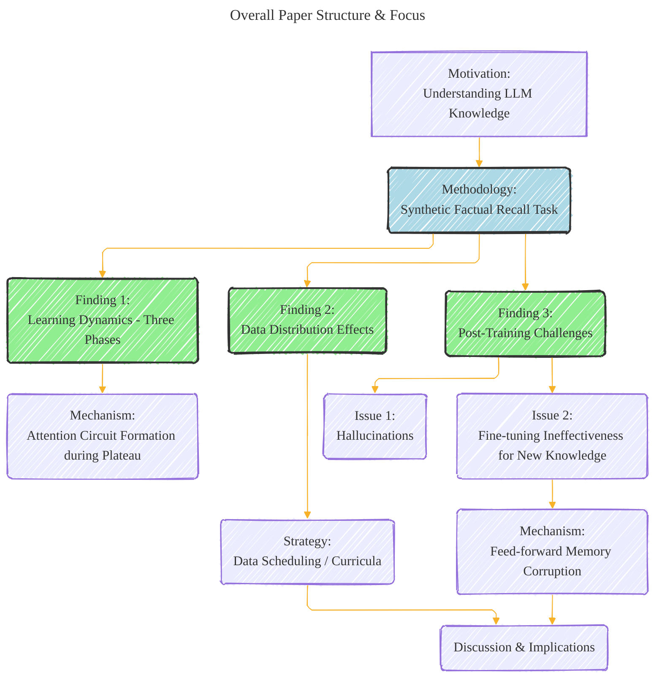
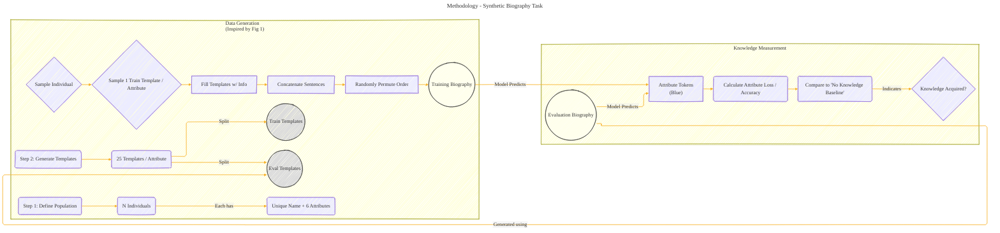
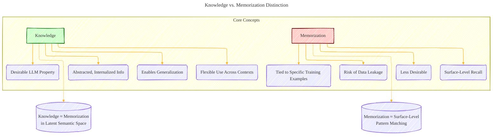
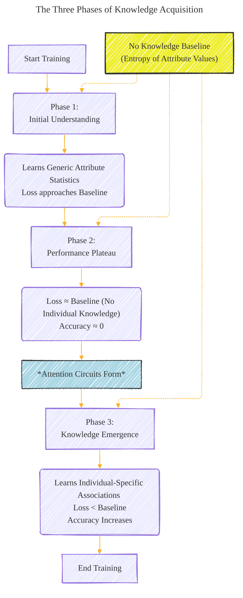

# How do language models learn facts? Dynamics, curricula and hallucinations
> **Disclaimer:**
>
> This document contains my personal notes on the topic,
> compiled from publicly available documentation and various cited sources.
> The materials are intended for educational purposes, personal study, and reference.
> The content is dual-licensed:
> 1. **MIT License:** Applies to all code implementations (Swift, Mermaid, and other programming languages).
> 2. **Creative Commons Attribution 4.0 International License (CC BY 4.0):** Applies to all non-code content, including text, explanations, diagrams, and illustrations.
---

## A Diagrammatic Guide 

The diagrams below capture the core findings, mechanisms, and experimental approaches described in the paper summary, using Mermaid syntax to visualize the relationships and processes.

### Diagram 1: Overall Paper Structure & Focus

This diagram provides a high-level overview of the paper's flow and main investigation areas.

---

### Diagram 2: Methodology - Synthetic Biography Task

This diagram outlines the process for generating the synthetic data and measuring knowledge.

---

### Diagram 3: Knowledge vs. Memorization Distinction

This diagram contrasts the key concepts of knowledge and memorization as defined in the paper.

----

### Diagram 4: The Three Phases of Knowledge Acquisition

This diagram illustrates the sequential learning phases observed in the experiments.

----

### Diagram 5: Attention Circuit Formation During Plateau

This diagram focuses on the mechanistic explanation for the plateau phase.

----

### Diagram 6: Data Distribution Effects and Trade-off

This diagram shows how data imbalance impacts learning dynamics and the resulting trade-off.

----

### Diagram 7: Post-Training: Hallucinations & Fine-tuning Issues

This diagram illustrates the challenges encountered when trying to update knowledge post-training.

---
**Licenses:**

- **MIT License:**   - Full text in [LICENSE](LICENSE) file.
- **Creative Commons Attribution 4.0 International:**  - Legal details in [LICENSE-CC-BY](LICENSE-CC-BY) and at [Creative Commons official site](http://creativecommons.org/licenses/by/4.0/).

---