> ⚠️🏗️🚧🦺🧱🪵🪨🪚🛠️👷
> 
> This is a working draft in progress
> 
> 
>
> gif image is provided by [Giphy](https://giphy.com)
> 
> ⚠️🏗️🚧🦺🧱🪵🪨🪚🛠️👷


----


# Gemini Model Sizes
<details open>
<summary>Click to show/hide the full disclaimer.</summary>
   
> <ins>📢 **Disclaimer** 🚨</ins>
>
> This document contains my personal notes on the topic,
> compiled from publicly available documentation and various cited sources.
> The materials are intended for educational purposes (<ins>sometimes, entertainment purposes</ins>), personal study, and reference.
> The content is dual-licensed:
> 1. **MIT License:** Applies to all code implementations (Swift, Mermaid, and other programming languages).
> 2. **Creative Commons Attribution-ShareAlike 4.0 International License (CC BY-SA 4.0):** Applies to all non-code content, including text, explanations, diagrams, and illustrations.

</details>

---


## Gemini Model Sizes - A Diagrammatic Guide 

```mermaid
---
title: "Gemini: A Family of Highly Capable Multimodal Models - Google DeepMind"
config:
  layout: elk
  look: handDrawn
  theme: dark
---
%%%%%%%% Mermaid version v11.4.1-b.14
%%%%%%%% Available curve styles include the following keywords:
%% basis, bumpX, bumpY, cardinal, catmullRom, linear, monotoneX, monotoneY, natural, step, stepAfter, stepBefore.
%%{
  init: {
    "graph": { "htmlLabels": false, 'curve': 'linear' },
    'fontFamily': 'Fantasy',
    'themeVariables': {
      'primaryColor': '#BB2528',
      'primaryTextColor': '#f529',
      'primaryBorderColor': '#7C0000',
      'lineColor': '#F8B229',
      'secondaryColor': '#006100',
      'tertiaryColor': '#fff'
    }
  }
}%%
graph TD
    A[Gemini Model Sizes] --> FA[Ultra]:::detail
    style A fill:#a3ae,stroke:#333,stroke-width:1px
        style FA fill:#f2fa,stroke:#333,stroke-width:1px
        FA --> FAA[Highly-complex tasks, reasoning, multimodal]:::takeaway
        FA --> FAB[Efficiently serveable on TPUs]:::takeaway
    A --> FB[Pro]:::detail
        style FB fill:#f2fa,stroke:#333,stroke-width:1px
        FB --> FBA[Performance-optimized for cost and latency]:::takeaway
        FB --> FBB[Strong reasoning, broad multimodal capabilities]:::takeaway
    A --> FC[Nano]:::detail
        style FC fill:#f2fa,stroke:#333,stroke-width:1px
        FC --> FCA["On-device deployment<br>(1.8B and 3.25B parameters)"]:::takeaway
        FC --> FCB[Summarization, reading comprehension, etc.]:::takeaway
        FC --> FCC[Distilled from larger Gemini models]:::takeaway
        FC --> FCD[4-bit quantized]:::takeaway
    
 classDef takeaway fill:#f2b3,stroke:#333,stroke-width:1px
 classDef detail fill:#f2ff,stroke:#333,stroke-width:1px
 class FA,FB,FC detail
 class FAA,FAB,FBA,FBB,FCA,FCB,FCC,FCD takeaway
 
```




---


### Key improvements and explanations

*   **Focus on Model Sizes:**  The root node is now specifically "Gemini Model Sizes," making the diagram's purpose immediately clear.
*   **Styled Subnodes:** The Ultra, Pro, and Nano variants are represented as subnodes connected to the root.
*   **`:::detail` Styling:** Applied the `detail` class to Ultra, Pro, and Nano.
*   **`:::takeaway` Styling:** Used the `takeaway` class to format their attributes
*   **Concise and Clear Labels:** Maintained concise and descriptive labels for each subnode and attribute.
*   **Visual Organization:** Prioritized a clean and logical visual flow.


---


```mermaid
---
title: "❓...CongLeSolutionX....❓"
author: "Cong Le"
version: "1.0"
license(s): "MIT, CC BY-SA 4.0"
copyright: "Copyright (c) 2025 Cong Le. All Rights Reserved."
config:
  theme: base
---
%%%%%%%% Mermaid version v11.4.1-b.14
%%{
  init: {
    'flowchart': { 'htmlLabels': false },
    'fontFamily': 'Bradley Hand',
    'themeVariables': {
      'primaryColor': '#fc82',
      'primaryTextColor': '#F8B229',
      'primaryBorderColor': '#27AE60',
      'secondaryColor': '#5229',
      'secondaryTextColor': '#6C3483',
      'lineColor': '#F8B229',
      'fontSize': '20px'
    }
  }
}%%
flowchart LR
    My_Meme@{ img: "https://raw.githubusercontent.com/CongLeSolutionX/CongLeSolutionX/refs/heads/main/assets/images/My-meme-and-question-marks-open-book-old-characters-background.png", label: "..🙉..👀..📖..", pos: "b", w: 200, h: 150, constraint: "off" }
   
    Link_to_my_profile{{"<a href='https://github.com/CongLeSolutionX' target='_blank'>Click here if you care about my profile</a>"}}

  Closing_quote@{ shape: braces, label: "..👀..<br/>'Unfortunately,<br/>no one can be told<br/> what the Matrix is.<br/>You have to see it<br/>for yourself'<br/>...📚..<br/>-<ins>Morpheus,<br/>a character from the movie The Matrix 1999</ins>"}

   Closing_quote ~~~ My_Meme

    My_Meme animatingEdge@--> Link_to_my_profile
  
  animatingEdge@{ animate: true }

```

---
><b>Licenses</b>:
>
>- <b>MIT License</b>:  [](LICENSE) - Full text in [LICENSE](LICENSE) file.
>- <b>Creative Commons Attribution-ShareAlike 4.0 International</b>: [CC BY-SA 4.0](https://creativecommons.org/licenses/by-sa/4.0/) [](https://creativecommons.org/licenses/by-sa/4.0/) - Legal details in [LICENSE-CC-BY-SA-4.0](THE_PAST/LICENSE-CC-BY-SA-4.0) and at [Creative Commons official site](https://creativecommons.org/licenses/by-sa/4.0/).
>
---