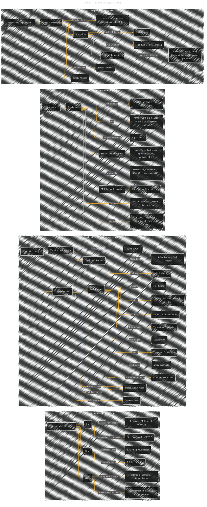

> ⚠️🏗️🚧🦺🧱🪵🪨🪚🛠️👷
> 
> This is a working draft in progress
> 
> 
>
> gif image is provided by [Giphy](https://giphy.com)
> 
> ⚠️🏗️🚧🦺🧱🪵🪨🪚🛠️👷


----


# Gemini: A Family of Highly Capable Multimodal Models
<details open>
<summary>Click to show/hide the full disclaimer.</summary>
   
> <ins>📢 **Disclaimer** 🚨</ins>
>
> This document contains my personal notes on the topic,
> compiled from publicly available documentation and various cited sources.
> The materials are intended for educational purposes (<ins>sometimes, entertainment purposes</ins>), personal study, and reference.
> The content is dual-licensed:
> 1. **MIT License:** Applies to all code implementations (Swift, Mermaid, and other programming languages).
> 2. **Creative Commons Attribution-ShareAlike 4.0 International License (CC BY-SA 4.0):** Applies to all non-code content, including text, explanations, diagrams, and illustrations.

</details>

---


## Gemini Paper Overview


The Gemini report describes a new family of multimodal models, Gemini, with capabilities across various modalities (text, images, audio, video).  Here's a breakdown of the key concepts, organized for easier analysis, using a structure similar to the previous response's Mermaid diagrams:


### I. Model Architecture and Training

* **Model Family (Sizes):** Gemini comes in three sizes: Ultra (complex tasks), Pro (general performance), and Nano (on-device).  Each is optimized for specific computational constraints and use cases.
* **Multimodal Training:** Models are trained jointly on text, images, audio, and video data, aiming for strong generalist capabilities and in-depth understanding across modalities.
* **Post-Training:**  Models undergo post-training to enhance quality, target capabilities (e.g., coding, multilingual), and ensure safety. This includes variants like Gemini Apps (for conversational use) and Gemini API models (for general development).
* **Training Data:** The pre-training dataset is multimodal and multilingual, using data from web documents, books, code, images, audio, and video.  Methods for tokenization and data quality/safety filtering are described.  The training process stages data quality and relevance during training.
* **Training Infrastructure:**  Gemini utilizes Google's TPUv4 and TPUv5e accelerators, leveraging distributed systems (Pathways, JAX) for large-scale training.  Innovations in training algorithms and hardware configuration address challenges like "Silent Data Corruption (SDC)" to enable stable training at scale.

---


### II. Model Evaluation and Performance

* **Comprehensive Benchmarks:** Models are evaluated on a wide range of internal and external benchmarks covering language, coding, reasoning, and multimodal tasks.  Specific benchmarks are detailed for different capabilities (e.g., MMLU for reasoning, GSM8K for math, HellaSwag for commonsense).
* **State-of-the-Art Performance:** Gemini Ultra significantly advances the state of the art in multiple benchmarks, including achieving human-expert performance on MMLU and other tasks in text, image, video, and audio. Results demonstrate improvements over previous models like PaLM 2 and other leading LLMs across various modalities.
* **Multilingual Capabilities:** Models demonstrate strong performance on multilingual tasks, including machine translation (WMT 23), summarization (XLSum, WikiLingua), and math problem solving (MGSM).
* **Long Context:** Models handle significantly longer sequences of input tokens (32K) effectively, demonstrated via retrieval tasks and NLL plots.
* **Factuality and Safety:** Post-training includes adaptations focused on factuality, accuracy, attribution, and response quality (hedging). Evaluation includes human annotation and automated analysis.  Adversarial testing techniques (red teaming) are also employed.
* **Complex Reasoning and Tool Use:** Models can be integrated with external tools and demonstrate strong reasoning capabilities, as illustrated by AlphaCode 2's success in competitive programming.
* **Multimodal Reasoning:**  Models can understand and reason over interleaved sequences of text, image, video, and audio data, as showcased in qualitative examples.

---

### III. Responsible Deployment

* **Impact Assessment:**  The report emphasizes a structured approach to responsible deployment, including model and product-level impact assessments, safety policies, and mitigations to address various potential harms (e.g., hate speech, misinformation, bias).
* **Safety Evaluations:**  Evaluation processes cover content safety, child safety, dangerous capabilities (like cybersecurity threats), and representational harms (bias detection).  Methods are detailed for both internal and external evaluations, and for both model and product-level assessments.

---


### IV.  Qualitative Examples

* **Figures and Tables:**  The report utilizes numerous figures and tables to illustrate model capabilities on various tasks, providing concrete examples of multimodal reasoning, code generation, and problem solving.


---

## Gemini - A Diagrammatic Guide 




---

### Explanation of Diagram Structure

* **Subgraphs:** The diagrams are organized into logical groups (Gemini Model Overview, Model Training, Evaluation, Responsible Deployment).
* **Nodes:** Each node represents a key concept or component.  Nodes are labeled to be clear about the concept.
* **Edges:** Directed edges illustrate the relationships between concepts.  For example, an edge from "Model Training" to "Multimodal Data" indicates that training is done on multimodal data.
* **Relationships:** The diagram shows how various parts of the Gemini system interact and influence each other.


---


```mermaid
---
title: "❓...CongLeSolutionX....❓"
author: "Cong Le"
version: "1.0"
license(s): "MIT, CC BY-SA 4.0"
copyright: "Copyright (c) 2025 Cong Le. All Rights Reserved."
config:
  theme: base
---
%%%%%%%% Mermaid version v11.4.1-b.14
%%{
  init: {
    'flowchart': { 'htmlLabels': false },
    'fontFamily': 'Bradley Hand',
    'themeVariables': {
      'primaryColor': '#fc82',
      'primaryTextColor': '#F8B229',
      'primaryBorderColor': '#27AE60',
      'secondaryColor': '#5229',
      'secondaryTextColor': '#6C3483',
      'lineColor': '#F8B229',
      'fontSize': '20px'
    }
  }
}%%
flowchart LR
    My_Meme@{ img: "https://raw.githubusercontent.com/CongLeSolutionX/CongLeSolutionX/refs/heads/main/assets/images/My-meme-and-question-marks-open-book-old-characters-background.png", label: "..🙉..👀..📖..", pos: "b", w: 200, h: 150, constraint: "off" }
   
    Link_to_my_profile{{"<a href='https://github.com/CongLeSolutionX' target='_blank'>Click here if you care about my profile</a>"}}

  Closing_quote@{ shape: braces, label: "..👀..<br/>'Unfortunately,<br/>no one can be told<br/> what the Matrix is.<br/>You have to see it<br/>for yourself'<br/>...📚..<br/>-<ins>Morpheus,<br/>a character from the movie The Matrix 1999</ins>"}

   Closing_quote ~~~ My_Meme

    My_Meme animatingEdge@--> Link_to_my_profile
  
  animatingEdge@{ animate: true }

```

---
><b>Licenses</b>:
>
>- <b>MIT License</b>:  [](LICENSE) - Full text in [LICENSE](LICENSE) file.
>- <b>Creative Commons Attribution-ShareAlike 4.0 International</b>: [CC BY-SA 4.0](https://creativecommons.org/licenses/by-sa/4.0/) [](https://creativecommons.org/licenses/by-sa/4.0/) - Legal details in [LICENSE-CC-BY-SA-4.0](THE_PAST/LICENSE-CC-BY-SA-4.0) and at [Creative Commons official site](https://creativecommons.org/licenses/by-sa/4.0/).
>
---