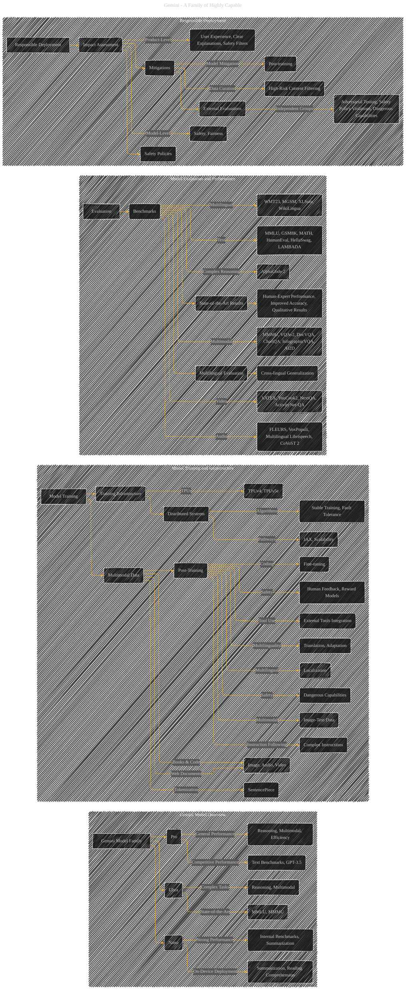

# Gemini: A Family of Highly Capable
> **Disclaimer:**
>
> This document contains my personal notes on the topic,
> compiled from publicly available documentation and various cited sources.
> The materials are intended for educational purposes, personal study, and reference.
> The content is dual-licensed:
> 1. **MIT License:** Applies to all code implementations (Swift, Mermaid, and other programming languages).
> 2. **Creative Commons Attribution 4.0 International License (CC BY 4.0):** Applies to all non-code content, including text, explanations, diagrams, and illustrations.
---

## Gemini - A Diagrammatic Guide 

---

### Explanation of Diagram Structure

* **Subgraphs:** The diagrams are organized into logical groups (Gemini Model Overview, Model Training, Evaluation, Responsible Deployment).
* **Nodes:** Each node represents a key concept or component.  Nodes are labeled to be clear about the concept.
* **Edges:** Directed edges illustrate the relationships between concepts.  For example, an edge from "Model Training" to "Multimodal Data" indicates that training is done on multimodal data.
* **Relationships:** The diagram shows how various parts of the Gemini system interact and influence each other.

---
**Licenses:**

- **MIT License:**   - Full text in [LICENSE](LICENSE) file.
- **Creative Commons Attribution 4.0 International:**  - Legal details in [LICENSE-CC-BY](LICENSE-CC-BY) and at [Creative Commons official site](http://creativecommons.org/licenses/by/4.0/).

---