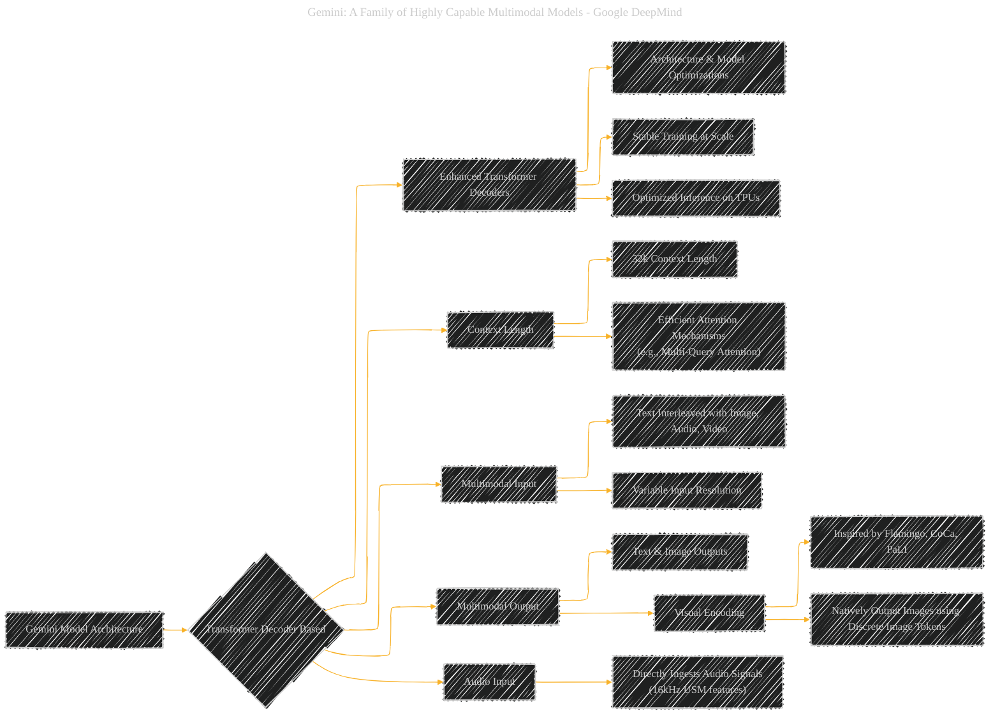
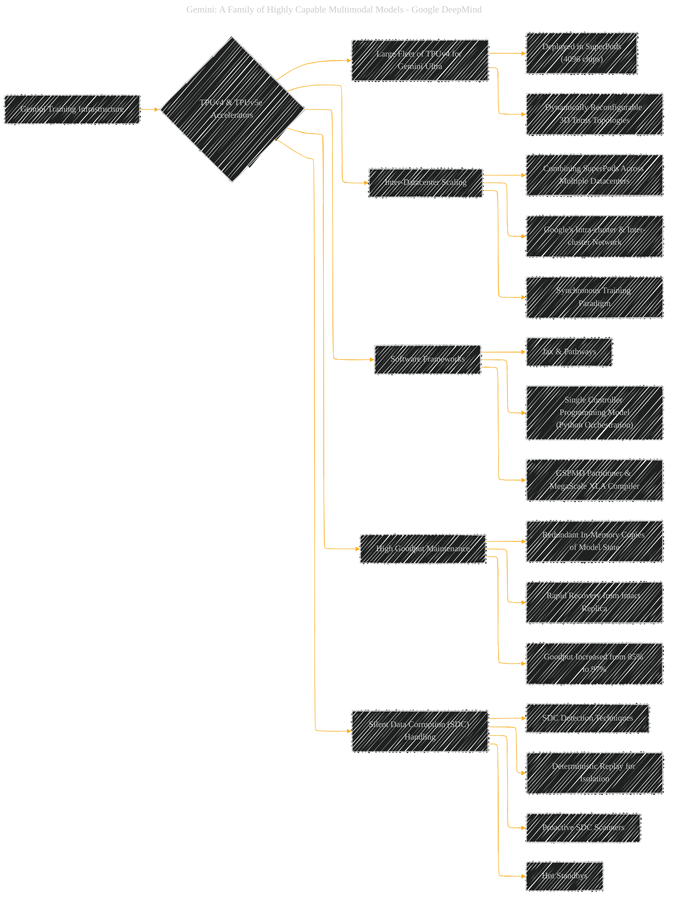
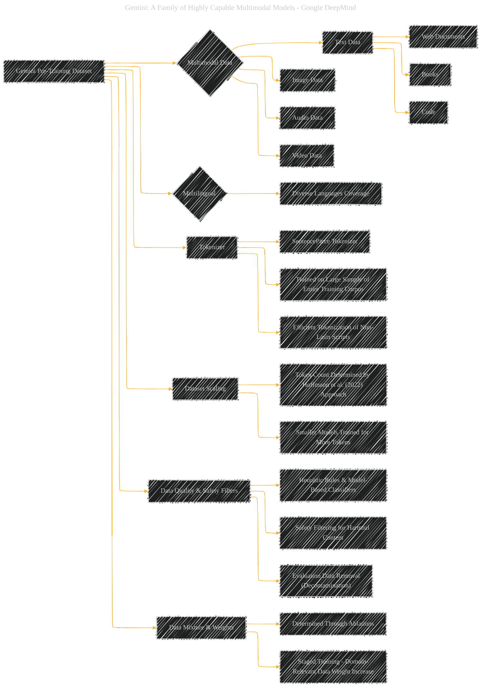
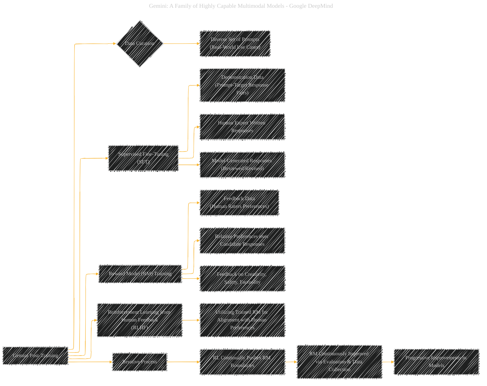

# Gemini: A Family of Highly Capable Multimodal Models
> **Disclaimer:**
>
> This document contains my personal notes on the topic,
> compiled from publicly available documentation and various cited sources.
> The materials are intended for educational purposes, personal study, and reference.
> The content is dual-licensed:
> 1. **MIT License:** Applies to all code implementations (Swift, Mermaid, and other programming languages).
> 2. **Creative Commons Attribution 4.0 International License (CC BY 4.0):** Applies to all non-code content, including text, explanations, diagrams, and illustrations.
---


## Gemini Paper Overview - A Diagrammatic Guide


### 1. Gemini Model Family: An Overview

```mermaid
---
title: "Gemini: A Family of Highly Capable Multimodal Models - Google DeepMind"
config:
  layout: elk
  look: handDrawn
  theme: dark
---
%%%%%%%% Mermaid version v11.4.1-b.14
%%%%%%%% Available curve styles include the following keywords:
%% basis, bumpX, bumpY, cardinal, catmullRom, linear, monotoneX, monotoneY, natural, step, stepAfter, stepBefore.
%%{
  init: {
    "mindmap": { "htmlLabels": false },
    'fontFamily': 'Fantasy',
    'themeVariables': {
      'primaryColor': '#BB2528',
      'primaryTextColor': '#f529',
      'primaryBorderColor': '#7C0000',
      'lineColor': '#F8B229',
      'secondaryColor': '#006100',
      'tertiaryColor': '#fff'
    }
  }
}%%
mindmap
  root((Gemini Model Family))
    concept(Sizes)
      Ultra(Ultra)
        attributes(Most Capable)
        attributes(State-of-the-Art Performance)
        attributes(Complex Reasoning)
        attributes(Multimodal Tasks)
      Pro(Pro)
        attributes(Performance Optimized)
        attributes(Cost-Effective)
        attributes(Scalable Deployment)
        attributes(Strong Reasoning)
      Nano(Nano)
        attributes(On-Device Efficiency)
        attributes(Two Versions: Nano-1, Nano-2)
        attributes(Distilled from Larger Models)
        attributes(4-bit Quantized)
    application(Applications)
      ComplexTasks(Highly Complex Tasks)
        area(Gemini Ultra Target)
      ScaledDeployment(Scaled Deployment)
        area(Gemini Pro Target)
      OnDevice(On-Device)
        area(Gemini Nano Target)
    capabilities(Key Capabilities)
      Multimodal(Multimodal Understanding)
        aspect(Image, Audio, Video, Text)
      Reasoning(Advanced Reasoning)
        aspect(Mathematical, Logical)
      Language(Language Proficiency)
        aspect(Multilingual)
        
```


## Description
This mind map provides a high-level overview of the Gemini model family, outlining the three distinct sizes - Ultra, Pro, and Nano. It highlights the key characteristics and target applications for each size, emphasizing the range from high-performance complex tasks to efficient on-device applications. The diagram also points to the core capabilities that define the Gemini family, such as multimodal understanding and advanced reasoning.

----

### 2. Gemini Model Architecture: Core Components




#### Description
This flowchart illustrates the core architectural elements of Gemini models. Starting from the Transformer decoder base, it details enhancements for stability and efficiency, key features like 32k context length and multimodal input/output handling. It also emphasizes the visual and audio encoding inspired by prior Google research and the model's native image output capabilities.

---

### 3. Gemini Training Infrastructure: Scaling and Reliability



#### Description
This diagram outlines the infrastructure used to train Gemini models, focusing on the TPU accelerators, inter-datacenter scaling, and software frameworks like Jax and Pathways. A key highlight is the infrastructure's emphasis on maintaining high goodput and addressing challenges like Silent Data Corruption (SDC) to ensure training reliability at unprecedented scales.

----

### 4. Gemini Pre-Training Dataset: Multimodal and Multilingual




#### Description
This flowchart details the composition of the Gemini pre-training dataset. It emphasizes the multimodal and multilingual nature of the data, including web documents, books, code, images, audio, and video. The diagram also covers key aspects like tokenization using SentencePiece, dataset scaling strategies, and the application of quality and safety filters to curate the training data effectively.

-----

### 5. Gemini Post-Training Process: Refining and Aligning Models




#### Description
This flowchart elucidates the Gemini post-training process, which is crucial for refining pre-trained models. It breaks down the process into key stages: data curation, Supervised Fine-Tuning (SFT), Reward Model (RM) training, and Reinforcement Learning from Human Feedback (RLHF). The diagram highlights the iterative nature of RLHF and its role in aligning model outputs with human preferences across various criteria like safety and factuality.

-----

### 6. Gemini Responsible Deployment Framework: A Multi-faceted Approach


#### Description
This comprehensive mind map illustrates Gemini's responsible deployment framework. It is structured around key pillars: Impact Assessment (at both model and product levels), Safety Policies (defining guidelines and priorities), Mitigations (data curation and model-level techniques), and Safety Evaluations (encompassing development, assurance, external, and red teaming approaches). This diagram emphasizes the multi-layered strategy for identifying, measuring, and managing potential societal impacts of Gemini models.


---
**Licenses:**

- **MIT License:**  [](LICENSE) - Full text in [LICENSE](LICENSE) file.
- **Creative Commons Attribution 4.0 International:** [](LICENSE-CC-BY) - Legal details in [LICENSE-CC-BY](LICENSE-CC-BY) and at [Creative Commons official site](http://creativecommons.org/licenses/by/4.0/).

---