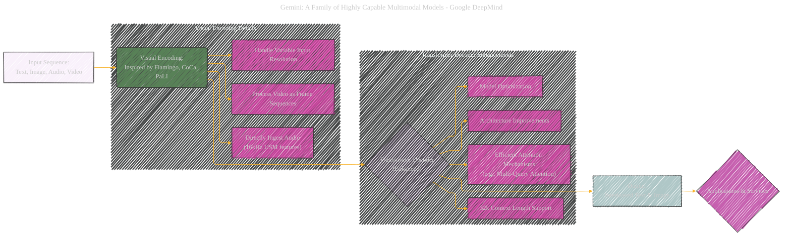

> ⚠️🏗️🚧🦺🧱🪵🪨🪚🛠️👷
> 
> This is a working draft in progress
> 
> 
>
> gif image is provided by [Giphy](https://giphy.com)
> 
> ⚠️🏗️🚧🦺🧱🪵🪨🪚🛠️👷


----


# Gemini: A Family of Highly Capable Multimodal Models
<details open>
<summary>Click to show/hide the full disclaimer.</summary>
   
> <ins>📢 **Disclaimer** 🚨</ins>
>
> This document contains my personal notes on the topic,
> compiled from publicly available documentation and various cited sources.
> The materials are intended for educational purposes (<ins>sometimes, entertainment purposes</ins>), personal study, and reference.
> The content is dual-licensed:
> 1. **MIT License:** Applies to all code implementations (Swift, Mermaid, and other programming languages).
> 2. **Creative Commons Attribution-ShareAlike 4.0 International License (CC BY-SA 4.0):** Applies to all non-code content, including text, explanations, diagrams, and illustrations.

</details>

---


## Gemini Paper Overview - A Diagrammatic Guide


Below are a series of diagrams illustrating the core aspects of the Gemini model family, as described in the research paper.

---

### 1. Gemini Model Family Overview

This diagram provides a high-level overview of the Gemini model family and its key characteristics.


---

### 2. Gemini Model Architecture

This flowchart illustrates the Gemini model architecture, highlighting the key components and data flow.



---

### 3. Training Infrastructure for Gemini Ultra

This diagram illustrates the infrastructure used for training Gemini Ultra, emphasizing the scale and innovations for high goodput.

```mermaid
---
title: "Gemini: A Family of Highly Capable Multimodal Models - Google DeepMind"
config:
  layout: elk
  look: handDrawn
  theme: dark
---
%%%%%%%% Mermaid version v11.4.1-b.14
%%%%%%%% Available curve styles include the following keywords:
%% basis, bumpX, bumpY, cardinal, catmullRom, linear, monotoneX, monotoneY, natural, step, stepAfter, stepBefore.
%%{
  init: {
    "flowchart": { "htmlLabels": false, 'curve': 'linear' },
    'fontFamily': 'Fantasy',
    'themeVariables': {
      'primaryColor': '#BB2528',
      'primaryTextColor': '#f529',
      'primaryBorderColor': '#7C0000',
      'lineColor': '#F8B229',
      'secondaryColor': '#006100',
      'tertiaryColor': '#fff'
    }
  }
}%%
flowchart LR
    A["TPUv4 SuperPods<br>(4096 chips)"] --> B{Inter-chip Interconnect}
    B --> C{"Multi-Datacenter SuperPods<br>(Google's Network)"}
    C --> D[Synchronous Training Paradigm]
    D --> E{Jax & Pathways 'Single Controller' Programming Model}
    E --> F[GSPMD Partitioner & MegaScale XLA Compiler]
    F --> G[Redundant In-Memory Model State Copies]
    G --> H[Rapid Recovery from Hardware Failures]
    H --> I["Increased Goodput<br>(97%)"]
    I --> J["Silent Data Corruption (SDC) Detection & Mitigation"]
    J --> K[Stable & Scalable Training]

    style A fill:#a3b1,stroke:#333,stroke-width:1px
    style B fill:#5881,stroke:#333,stroke-width:1px
    style C fill:#a3b1,stroke:#333,stroke-width:1px
    style D fill:#5881,stroke:#333,stroke-width:1px
    style E fill:#a3b1,stroke:#333,stroke-width:1px
    style F fill:#5881,stroke:#333,stroke-width:1px
    style G fill:#a3b1,stroke:#333,stroke-width:1px
    style H fill:#5881,stroke:#333,stroke-width:1px
    style I fill:#a3b1,stroke:#333,stroke-width:1px
    style J fill:#5881,stroke:#333,stroke-width:1px
    style K fill:#a3b1,stroke:#333,stroke-width:1px

    subgraph TPUv4_SuperPod_Details["TPUv4 SuperPod Details"]
        A --> A1[4x4x4 chip cubes]
        A --> A2[Dynamically Reconfigurable 3D Torus Topologies]
        A --> A3[Hot Standbys & Rolling Maintenance]
    end
    style A1 fill:#d4ac,stroke:#333,stroke-width:1px
    style A2 fill:#d4ac,stroke:#333,stroke-width:1px
    style A3 fill:#d4ac,stroke:#333,stroke-width:1px

```




---

### 4. Pre-training Dataset Composition

This mindmap breaks down the composition of the pre-training dataset used for Gemini models.


---

### 5. Post-Training Process

This flowchart illustrates the multi-stage post-training process used for Gemini models.


---

### 6. Responsible Deployment Strategy

This mindmap visualizes the multi-faceted strategy for responsible deployment of Gemini models.


---

### 7. Conclusion: Key Takeaways

This diagram summarizes the main conclusions and future directions highlighted in the Gemini paper.


---


```mermaid
---
title: "❓...CongLeSolutionX....❓"
author: "Cong Le"
version: "1.0"
license(s): "MIT, CC BY-SA 4.0"
copyright: "Copyright (c) 2025 Cong Le. All Rights Reserved."
config:
  theme: base
---
%%%%%%%% Mermaid version v11.4.1-b.14
%%{
  init: {
    'flowchart': { 'htmlLabels': false },
    'fontFamily': 'Bradley Hand',
    'themeVariables': {
      'primaryColor': '#fc82',
      'primaryTextColor': '#F8B229',
      'primaryBorderColor': '#27AE60',
      'secondaryColor': '#5229',
      'secondaryTextColor': '#6C3483',
      'lineColor': '#F8B229',
      'fontSize': '20px'
    }
  }
}%%
flowchart LR
    My_Meme@{ img: "https://raw.githubusercontent.com/CongLeSolutionX/CongLeSolutionX/refs/heads/main/assets/images/My-meme-and-question-marks-open-book-old-characters-background.png", label: "..🙉..👀..📖..", pos: "b", w: 200, h: 150, constraint: "off" }
   
    Link_to_my_profile{{"<a href='https://github.com/CongLeSolutionX' target='_blank'>Click here if you care about my profile</a>"}}

  Closing_quote@{ shape: braces, label: "..👀..<br/>'Unfortunately,<br/>no one can be told<br/> what the Matrix is.<br/>You have to see it<br/>for yourself'<br/>...📚..<br/>-<ins>Morpheus,<br/>a character from the movie The Matrix 1999</ins>"}

   Closing_quote ~~~ My_Meme

    My_Meme animatingEdge@--> Link_to_my_profile
  
  animatingEdge@{ animate: true }

```

---
><b>Licenses</b>:
>
>- <b>MIT License</b>:  [](LICENSE) - Full text in [LICENSE](LICENSE) file.
>- <b>Creative Commons Attribution-ShareAlike 4.0 International</b>: [CC BY-SA 4.0](https://creativecommons.org/licenses/by-sa/4.0/) [](https://creativecommons.org/licenses/by-sa/4.0/) - Legal details in [LICENSE-CC-BY-SA-4.0](THE_PAST/LICENSE-CC-BY-SA-4.0) and at [Creative Commons official site](https://creativecommons.org/licenses/by-sa/4.0/).
>
---