# Gemini: A Family of Highly Capable Multimodal Models
> **Disclaimer:**
>
> This document contains my personal notes on the topic,
> compiled from publicly available documentation and various cited sources.
> The materials are intended for educational purposes, personal study, and reference.
> The content is dual-licensed:
> 1. **MIT License:** Applies to all code implementations (Swift, Mermaid, and other programming languages).
> 2. **Creative Commons Attribution 4.0 International License (CC BY 4.0):** Applies to all non-code content, including text, explanations, diagrams, and illustrations.
---

## Gemini Paper Overview - A Diagrammatic Guide

```mermaid
---
title: "Gemini: A Family of Highly Capable Multimodal Models - Google DeepMind"
config:
  layout: elk
  look: handDrawn
  theme: dark
---
%%%%%%%% Mermaid version v11.4.1-b.14
%%%%%%%% Available curve styles include the following keywords:
%% basis, bumpX, bumpY, cardinal, catmullRom, linear, monotoneX, monotoneY, natural, step, stepAfter, stepBefore.
%%{
  init: {
    "graph": { "htmlLabels": false, 'curve': 'linear' },
    'fontFamily': 'Fantasy',
    'themeVariables': {
      'primaryColor': '#BB2528',
      'primaryTextColor': '#f529',
      'primaryBorderColor': '#7C0000',
      'lineColor': '#F8B229',
      'secondaryColor': '#006100',
      'tertiaryColor': '#fff'
    }
  }
}%%
graph LR
    A[Gemini Multimodal Models] --> B{Architecture}
    B --> C[Transformer Decoders]:::detail
    C --> CA[Improvements for stable training and optimized inference]
    C --> CB["Efficient attention mechanisms<br>(e.g., multi-query attention)"]
    C --> CC[Trained to support 32k context length]

    A --> D{Training}
    D --> DA[Joint Training]:::detail
    DA --> DAA[Image, audio, video, and text data]
    DA --> DAB[Strong generalist capabilities]
    DA --> DAC[Cutting-edge understanding and reasoning]
    D --> DB[Training Infrastructure]:::detail
    DB --> DBA[TPUv5e and TPUv4 accelerators]
    DB --> DBB[Multiple datacenters]
    DB --> DBC[Redundant in-memory model state for rapid recovery]
    D --> DC[Pre-Training Dataset]:::detail
    DC --> DCA[Web documents, books, code, images, audio, and video]
    DC --> DCB[SentencePiece tokenizer]
    DC --> DCC["Quality and safety filters<br>(heuristic and model-based)"]
    DC --> DCD[Staged training with domain-relevant data weighting]

    A --> E{Post-Training}
    E --> EA[Purpose]:::detail
    EA --> EAA[Improve overall quality]
    EA --> EAB["Enhance target capabilities<br>(coding, multilingual)"]
    EA --> EAC[Ensure alignment and safety]
    E --> EB[Gemini Apps Models]:::detail
    EB --> EBA["Chat-focused<br>(Gemini, Gemini Advanced)"]
    EB --> EBB["Tools via Gemini Extensions<br>(Workspace, Maps, etc.)"]
    E --> EC[Gemini API Models]:::detail
    EC --> ECA["Developer-focused<br>(Google AI Studio, Cloud Vertex AI)"]
    EC --> ECB[Support conversational and non-conversational use cases]
    E --> ED[Post-Training Methods]:::detail
    ED --> EDA["Prompt Data Collection (diverse, real-world use cases)"]
    ED --> EDB["Supervised Fine-Tuning (SFT) on demonstration data"]
    ED --> EDC["Reward Model (RM) Training on feedback data"]
    ED --> EDD["Reinforcement Learning from Human Feedback (RLHF) with RM"]
    
        A --> F{Model Sizes}
    F --> FA[Ultra]:::detail
        FA --> FAA[Highly-complex tasks, reasoning, multimodal]
        FA --> FAB[Efficiently serveable on TPUs]
    F --> FB[Pro]:::detail
        FB --> FBA[Performance-optimized for cost and latency]
        FB --> FBB[Strong reasoning, broad multimodal capabilities]
    F --> FC[Nano]:::detail
        FC --> FCA["On-device deployment<br>(1.8B and 3.25B parameters)"]
        FC --> FCB[Summarization, reading comprehension, etc.]
        FC --> FCC[Distilled from larger Gemini models]
        FC --> FCD[4-bit quantized]
    
    A --> G{Evaluation}
        G --> GA[Text]:::detail
        GA --> GAA["Academic Benchmarks<br>(MMLU, GSM8K, etc.)"]
        GA --> GAB["New held-out datasets<br>(Natural2Code, etc.)"]
        GA --> GAC["Complex Prompts<br>(per-instruction and full-response accuracy)"]
        GA --> GAD["Factuality<br>(inaccuracy rate, attribution, hedging)"]
    G --> GB[Multimodal]:::detail
        GB --> GBA["Image Understanding<br>(MMMU, TextVQA, etc.)"]
        GB --> GBB["Video Understanding<br>(VATEX, NextQA, etc.)"]
    G --> GC["Audio Understanding<br>(FLEURS, VoxPopuli, etc.)"]
    G --> GD[Dangerous Capabilities]:::detail
        GD --> GDA[Offensive Cybersecurity, Persuasion & Deception, etc.]
        GD --> GDB[Evaluated through adversary simulations and structured red teaming]
    G --> GE[Responsible Deployment]:::detail
        GE --> GEA["Impact Assessments<br>(model-level and product-level)"]
        GE --> GEB["Safety Policies (child safety, hate speech, etc.)"]
        GE --> GEC["Mitigations<br>(data curation, model mitigation)"]

    A --> H{Key Findings}
        H --> HA[Gemini Ultra achieves state-of-the-art on 30 of 32 benchmarks]
        H --> HB[First model to achieve human-expert performance on MMLU]
        H --> HC[Demonstrates strong crossmodal reasoning capabilities]
        H --> HD[Efficiency improvements with Gemini Nano for on-device tasks]

classDef detail fill:#cc24,stroke:#333,stroke-width:2px

```

---

### Explanation of the Diagram Structure and Adaptation

*   **Root Node:** The central concept is "Gemini Multimodal Models."
*   **Key Sections as Subgraphs:** The main aspects of the Gemini models are structured as subgraphs (e.g., "Architecture," "Training," "Post-Training," "Evaluation").
*   **Details Within Subgraphs:** Each subgraph is then further broken down into more specific nodes, providing details about that aspect of the model.
*   **Key Attributes as Leaf Nodes:** Attributes are represented by leaf nodes at the ends of the branches, such as "Efficient attention mechanisms" under "Architecture" or "Web documents, books, code" under "Training Data."
*   **Equations and Metrics:** The equations or specific benchmark metrics are included in the nodes where they're most relevant (e.g., the MMLU score under "Evaluation" -> "Text").
*   **Annotations:** Annotations are used to provide extra context or notes on specific components of the model. These are included in the node details (":::detail").

---
**Licenses:**

- **MIT License:**   - Full text in [LICENSE](LICENSE) file.
- **Creative Commons Attribution 4.0 International:**  - Legal details in [LICENSE-CC-BY](LICENSE-CC-BY) and at [Creative Commons official site](http://creativecommons.org/licenses/by/4.0/).

---