# Post-Training Methods
> **Disclaimer:**
>
> This document contains my personal notes on the topic,
> compiled from publicly available documentation and various cited sources.
> The materials are intended for educational purposes, personal study, and reference.
> The content is dual-licensed:
> 1. **MIT License:** Applies to all code implementations (Swift, Mermaid, and other programming languages).
> 2. **Creative Commons Attribution 4.0 International License (CC BY 4.0):** Applies to all non-code content, including text, explanations, diagrams, and illustrations.
---

## Post-Training Methods - A Diagrammatic Guide 

```mermaid
---
title: "Gemini: A Family of Highly Capable Multimodal Models - Google DeepMind"
config:
  layout: elk
  look: handDrawn
  theme: dark
---
%%%%%%%% Mermaid version v11.4.1-b.14
%%%%%%%% Available curve styles include the following keywords:
%% basis, bumpX, bumpY, cardinal, catmullRom, linear, monotoneX, monotoneY, natural, step, stepAfter, stepBefore.
%%{
  init: {
    "graph": { "htmlLabels": false, 'curve': 'linear' },
    'fontFamily': 'Fantasy',
    'themeVariables': {
      'primaryColor': '#BB2528',
      'primaryTextColor': '#f529',
      'primaryBorderColor': '#7C0000',
      'lineColor': '#F8B229',
      'secondaryColor': '#006100',
      'tertiaryColor': '#fff'
    }
  }
}%%
graph LR
    A[Post-Training Methods] --> B{Overview};
    style A fill:#a3a3,stroke:#333,stroke-width:1px;
    B --> BA[Purpose]:::detail;
    style BA fill:#a2fa,stroke:#333,stroke-width:1px;
    BA --> BAA[Improve overall quality]:::takeaway;
    BA --> BAB["Enhance target capabilities (coding, multilingual)"]:::takeaway;
    BA --> BAC[Ensure alignment and safety]:::takeaway;
    B --> BB[Data Curation]:::detail;
    style BB fill:#a2fa,stroke:#333,stroke-width:1px;
    BB --> BBA[Careful data collection for all stages]:::takeaway;
    BB --> BBB[Diverse prompts representative of real-world use cases]:::takeaway;
    
    A --> C{Post-Training Stages};
    style C fill:#a3a3,stroke:#333,stroke-width:1px;
    C --> CA[Prompt Data Collection]:::detail;
    style CA fill:#a2da,stroke:#333,stroke-width:1px;
    CA --> CAA["User input to the model (recent input + previous interactions)"]:::takeaway;
    CA --> CAB[Datasets of target prompts for demonstration and feedback]:::takeaway;
    CA --> CAC[Cover diverse use cases, single-turn and multi-turn formats]:::takeaway;
    CA --> CAD[Vendor-created data, third-party licensed sources, and synthetic approaches]:::takeaway;
    
    C --> CB["Supervised Fine-Tuning (SFT)"]:::detail;
    style CB fill:#a2da,stroke:#333,stroke-width:1px;
    CB --> CBA[Trains the model to output desired target response for a prompt]:::takeaway;
    CB --> CBB["Demonstration Data (expert-written, model-generated and reviewed)"]:::takeaway;
    CB --> CBC[Data analysis tools & heuristics for high data diversity]:::takeaway;

    C --> CC["Reward Model (RM) Training"]:::detail;
    style CC fill:#a2da,stroke:#333,stroke-width:1px;
    CC --> CCA["Feedback Data (human ratings of relative preferences and individual responses)"]:::takeaway;
    CC --> CCB[Collect feedback across creativity, safety, factuality, etc.]:::takeaway;
    CC --> CCC[Prompt selection and sampling strategy are key for effective feedback data]:::takeaway;
    CC --> CCD[Train RMs to output rewards aligned with human preferences]:::takeaway;

    C --> CD["Reinforcement Learning from Human Feedback (RLHF)"]:::detail;
    style CD fill:#a2da,stroke:#333,stroke-width:1px;
    CD --> CDA[Iterative process where RL pushes RM boundaries]:::takeaway;
    CD --> CDB[RM continuously improved through evaluation and data collection]:::takeaway;
    CD --> CDC[Progressive improvements in alignment with human preferences]:::takeaway;

    A --> D{Additional Considerations};
    style D fill:#a3ae,stroke:#333,stroke-width:1px;
    D --> DA[Harm-Inducing Queries]:::detail;
        style DA fill:#f2aa,stroke:#333,stroke-width:1px;
        DA --> DAA["Enumerated approximately 20 harm types (hate speech, etc.)"]:::takeaway;
        DA --> DAB[Diverse use cases];
        DA --> DAC[Combination of policy experts, prompted LLMs, and automated red teaming to generate queries];
    D --> DB[Safety Policy Concepts]:::detail;
    style DB fill:#f2aa,stroke:#333,stroke-width:1px;
        DB --> DBA[Chain-of-thought recipes based on safety policies];
        DB --> DBB[Models operate in space of safety policy concepts rather than harm examples];
    D --> DC[Multimodal Safety SFT Datasets]:::detail;
        style DC fill:#f2aa,stroke:#333,stroke-width:1px;
        DC --> DCA[Specifically address harm-inducing queries containing text and images];

    classDef takeaway fill:#f2b3,stroke:#333,stroke-width:1px;
    classDef detail fill:#f2f3,stroke:#333,stroke-width:1px;
    class B,C,D,BA,BB,CA,CB,CC,CD,DA,DB,DC detail;
    class BAA,BAB,BAC,BBA,BBB,CAA,CAB,CAC,CAD,CBA,CBB,CBC,CCA,CCB,CCC,CCD,CDA,CDB,CDC,DAA,DAB,DAC,DBA,DBB,DCA takeaway
    
```

---

### Key Improvements and Explanations

*   **Centralized Structure:** "Post-Training Methods" is the main node, and everything branches from it.
*   **Clear Stages:** The core post-training methods (Prompt Data Collection, SFT, RM Training, RLHF) are clearly identified as stages, with their specific characteristics.
*   **Concise Labels:** I shortened labels where possible to keep the diagram readable while maintaining the key information.
*   **Focus on Key Takeaways:**  Used CSS classes to highlight key takeaways from each stage.
*   **Emphasis on Human Input:** The diagram visually highlights the importance of human input (expert-written responses, human ratings) in both SFT and RLHF.
*   **Additional Considerations for Safety:**  A separate section is added for safety-specific aspects, including harm-inducing queries, and the data/model mitigations.
*   **Conciseness:** Avoided unnecessary nesting to keep the overall structure clear and focused.

---
**Licenses:**

- **MIT License:**   - Full text in [LICENSE](LICENSE) file.
- **Creative Commons Attribution 4.0 International:**  - Legal details in [LICENSE-CC-BY](LICENSE-CC-BY) and at [Creative Commons official site](http://creativecommons.org/licenses/by/4.0/).

---