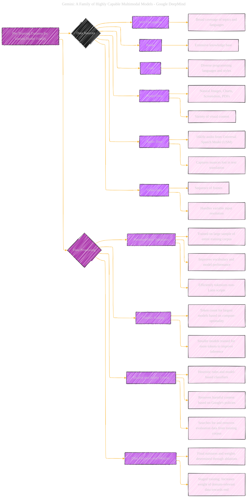

# Pre-Training Datasets for Gemini Model Family
> **Disclaimer:**
>
> This document contains my personal notes on the topic,
> compiled from publicly available documentation and various cited sources.
> The materials are intended for educational purposes, personal study, and reference.
> The content is dual-licensed:
> 1. **MIT License:** Applies to all code implementations (Swift, Mermaid, and other programming languages).
> 2. **Creative Commons Attribution 4.0 International License (CC BY 4.0):** Applies to all non-code content, including text, explanations, diagrams, and illustrations.
---

## Pre-Training Datasets for Gemini Model Family - A Diagrammatic Guide 

---

### Key points

*   **Data Sources:** The model is trained on a diverse set of data, visualized as branches stemming from the root node.
*   **Data Processing:** Steps involved in preparing the data for training, such as tokenization and filtering, are detailed to provide a complete picture.
*   **Emphasis on Filtering:** Data curation and quality control are highlighted with a dedicated branch and specific steps.
*   **Takeaways:** Key properties and benefits of each data component are marked as "takeaway," drawing attention to the most important information.

---
**Licenses:**

- **MIT License:**   - Full text in [LICENSE](LICENSE) file.
- **Creative Commons Attribution 4.0 International:**  - Legal details in [LICENSE-CC-BY](LICENSE-CC-BY) and at [Creative Commons official site](http://creativecommons.org/licenses/by/4.0/).

---