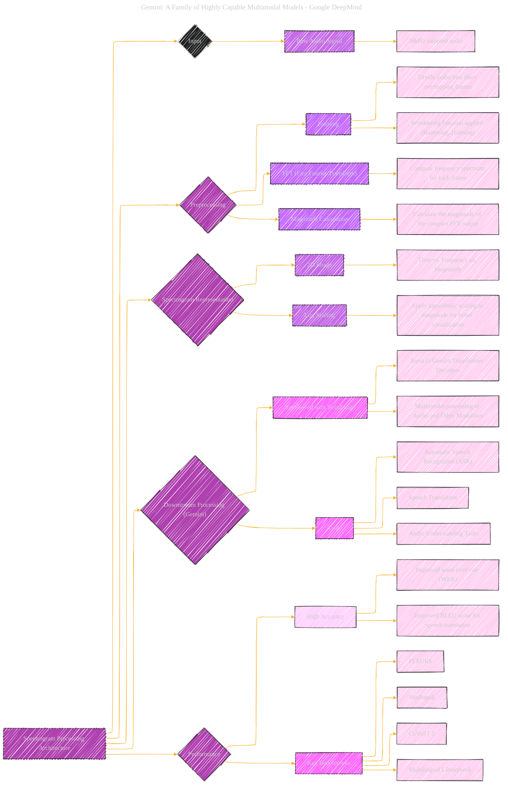

> ⚠️🏗️🚧🦺🧱🪵🪨🪚🛠️👷
> 
> This is a working draft in progress
> 
> 
>
> gif image is provided by [Giphy](https://giphy.com)
> 
> ⚠️🏗️🚧🦺🧱🪵🪨🪚🛠️👷


----


# Spectrogram Architecture - Synthetic Info
<details open>
<summary>Click to show/hide the full disclaimer.</summary>
   
> <ins>📢 **Disclaimer** 🚨</ins>
>
> This document contains my personal notes on the topic,
> compiled from publicly available documentation and various cited sources.
> The materials are intended for educational purposes (<ins>sometimes, entertainment purposes</ins>), personal study, and reference.
> The content is dual-licensed:
> 1. **MIT License:** Applies to all code implementations (Swift, Mermaid, and other programming languages).
> 2. **Creative Commons Attribution-ShareAlike 4.0 International License (CC BY-SA 4.0):** Applies to all non-code content, including text, explanations, diagrams, and illustrations.

</details>

---


## Spectrogram Architecture - A Diagrammatic Guide 


There is no specific information about "Spectrogram Architecture" within the provided Gemini technical report. The document describes the general architecture of the Gemini models, training infrastructure, and data used, but doesn't go into specific detail about spectrograms or their architectural implementation. 

I can, however, synthesize information from the general document structure with a conceptual `Spectrogram Architecture` diagram as an example of how this approach might be used if such information *were* present in the document. I will make some educated guesses about what might be included.



---

### Explanation of the (Synthesized) Diagram

1.  **Root Node:** "Spectrogram Processing Architecture" represents the overall system.
2.  **Input:** Specifies the raw audio signal as the input to the architecture. Highlights that the audio signal is sampled to 16kHz.
3.  **Preprocessing:** Breaks down the preprocessing stages into:
    *   **Framing:** Details the division of the audio signal into short overlapping frames.
    *   **FFT:** Explains the use of the Fast Fourier Transform to compute the frequency spectrum.
    *   **Magnitude Calculation:** Clarifies the computation of the magnitude of the FFT output.
4.  **Spectrogram Representation:** Describes how the processed audio is represented as a 2D image, detailing the time, frequency, and magnitude axes and the use of log scaling.
5.  **Downstream Processing (Gemini):** Shows how the Spectrogram is input to the Gemini model:
    *   **Interleaved with Text/Image:** Indicates how spectrograms are combined with other modalities for processing.
    *   **Tasks:** Lists example tasks like ASR and Speech Translation.
6.  **Performance:** Highlights metrics and key benchmarks:
    *   **High Accuracy:** Highlights how it improved the word error rate, and improved the BLEU score.
    *   **Key Benchmarks:** Lists example benchmarks.
7.  **Styling:** Uses similar CSS styling for a consistent look and feel.
8.  **Note:** I've included a prominent note that this is a *synthesized* architecture based on the general understanding of spectrogram processing and related Gemini capabilities and not directly described in the document.


---

```mermaid
---
title: "❓...CongLeSolutionX....❓"
author: "Cong Le"
version: "1.0"
license(s): "MIT, CC BY-SA 4.0"
copyright: "Copyright (c) 2025 Cong Le. All Rights Reserved."
config:
  theme: base
---
%%%%%%%% Mermaid version v11.4.1-b.14
%%{
  init: {
    'flowchart': { 'htmlLabels': false },
    'fontFamily': 'Bradley Hand',
    'themeVariables': {
      'primaryColor': '#fc82',
      'primaryTextColor': '#F8B229',
      'primaryBorderColor': '#27AE60',
      'secondaryColor': '#5229',
      'secondaryTextColor': '#6C3483',
      'lineColor': '#F8B229',
      'fontSize': '20px'
    }
  }
}%%
flowchart LR
    My_Meme@{ img: "https://raw.githubusercontent.com/CongLeSolutionX/CongLeSolutionX/refs/heads/main/assets/images/My-meme-and-question-marks-open-book-old-characters-background.png", label: "..🙉..👀..📖..", pos: "b", w: 200, h: 150, constraint: "off" }
   
    Link_to_my_profile{{"<a href='https://github.com/CongLeSolutionX' target='_blank'>Click here if you care about my profile</a>"}}

  Closing_quote@{ shape: braces, label: "..👀..<br/>'Unfortunately,<br/>no one can be told<br/> what the Matrix is.<br/>You have to see it<br/>for yourself'<br/>...📚..<br/>-<ins>Morpheus,<br/>a character from the movie The Matrix 1999</ins>"}

   Closing_quote ~~~ My_Meme

    My_Meme animatingEdge@--> Link_to_my_profile
  
  animatingEdge@{ animate: true }

```

---
><b>Licenses</b>:
>
>- <b>MIT License</b>:  [](LICENSE) - Full text in [LICENSE](LICENSE) file.
>- <b>Creative Commons Attribution-ShareAlike 4.0 International</b>: [CC BY-SA 4.0](https://creativecommons.org/licenses/by-sa/4.0/) [](https://creativecommons.org/licenses/by-sa/4.0/) - Legal details in [LICENSE-CC-BY-SA-4.0](THE_PAST/LICENSE-CC-BY-SA-4.0) and at [Creative Commons official site](https://creativecommons.org/licenses/by-sa/4.0/).
>
---