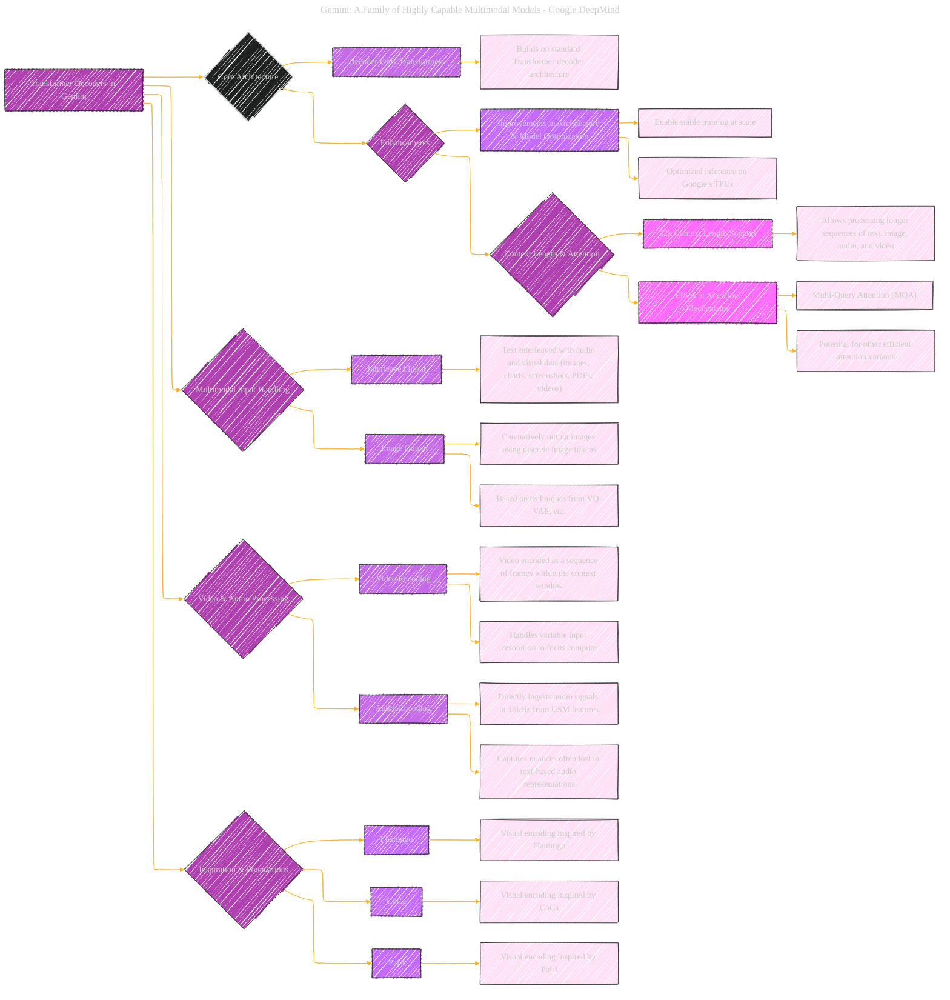

> ⚠️🏗️🚧🦺🧱🪵🪨🪚🛠️👷
> 
> This is a working draft in progress
> 
> 
>
> gif image is provided by [Giphy](https://giphy.com)
> 
> ⚠️🏗️🚧🦺🧱🪵🪨🪚🛠️👷

----

# Transformer Decoder Details in Gemini family

Click to show/hide the full disclaimer.

   
> <ins>📢 **Disclaimer** 🚨</ins>
>
> This document contains my personal notes on the topic,
> compiled from publicly available documentation and various cited sources.
> The materials are intended for educational purposes (<ins>sometimes, entertainment purposes</ins>), personal study, and reference.
> The content is dual-licensed:
> 1. **MIT License:** Applies to all code implementations (Swift, Mermaid, and other programming languages).
> 2. **Creative Commons Attribution-ShareAlike 4.0 International License (CC BY-SA 4.0):** Applies to all non-code content, including text, explanations, diagrams, and illustrations.

---

## Transformer Decoder Details in Gemini family - A Diagrammatic Guide 

---

### Key elements

*   **Root Node:** "Transformer Decoders in Gemini"
*   **Core Architecture:** Highlights the foundational use of Transformer decoders.
*   **Enhancements:** Details improvements made to the architecture for training stability and optimized inference.
*   **Context Length & Attention:** Focuses on the 32k context length and efficient attention mechanisms.
*   **Multimodal Input Handling:**  Details how the models handle various input modalities.
*   **Video & Audio Processing:** Details how the models encode videos and audio to ingest and process.
*   **Inspiration & Foundations:** Acknowledges inspiration from previous works (Flamingo, CoCa, PaLI).
*   **Styling:** Used `fill` and `stroke` to visually distinguish nodes and relationships, making the diagram easy to read and digest.

---
**Licenses:**

- **MIT License:**   - Full text in [LICENSE](LICENSE) file.
- **Creative Commons Attribution 4.0 International:**  - Legal details in [LICENSE-CC-BY](LICENSE-CC-BY) and at [Creative Commons official site](http://creativecommons.org/licenses/by/4.0/).

---
