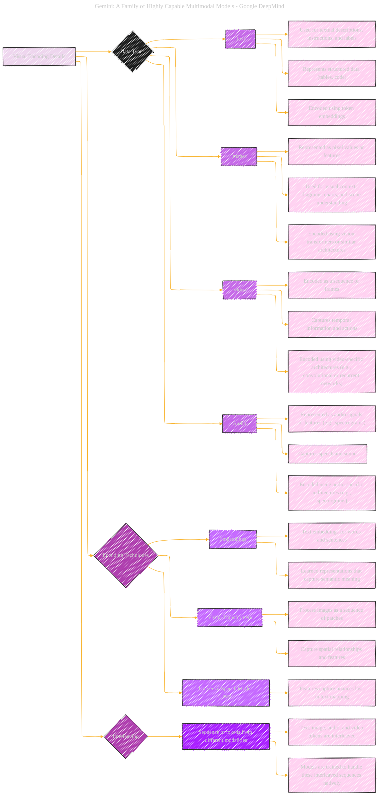

# Visual Encoding Details

Click to show/hide the full disclaimer.

   
> <ins>📢 **Disclaimer** 🚨</ins>
>
> This document contains my personal notes on the topic,
> compiled from publicly available documentation and various cited sources.
> The materials are intended for educational purposes (<ins>sometimes, entertainment purposes</ins>), personal study, and reference.
> The content is dual-licensed:
> 1. **MIT License:** Applies to all code implementations (Swift, Mermaid, and other programming languages).
> 2. **Creative Commons Attribution-ShareAlike 4.0 International License (CC BY-SA 4.0):** Applies to all non-code content, including text, explanations, diagrams, and illustrations.

---

## Visual Encoding Details - A Diagrammatic Guide 

---

### Key improvements and explanations

*   **Focus on Visual Encoding:** The diagram now specifically addresses how the different modalities (text, image, video, audio) are encoded into a format that the Gemini model can process.
*   **Data Types and Encoding Techniques:** The diagram details both the data types used and the specific encoding techniques (embeddings, transformers, etc.).
*   **Takeaways:** Clearly identifies what makes each encoding technique significant.
*   **Interleaving**: The diagram shows how the models are designed to handle interleaved modalities
*   **Specific Technologies Mentioned:**  The diagram explicitly mentions the techniques used by the models, including Vision Transformers and Universal Speech Model (USM) features.
*   **Code Structure:**  The Mermaid code is well-structured and easy to read.
*   **Clear Visuals:** It uses color and shapes to distinguish between categories and highlight important information.

---
**Licenses:**

- **MIT License:**   - Full text in [LICENSE](LICENSE) file.
- **Creative Commons Attribution 4.0 International:**  - Legal details in [LICENSE-CC-BY](LICENSE-CC-BY) and at [Creative Commons official site](http://creativecommons.org/licenses/by/4.0/).

---