# Highly accurate protein structure prediction with AlphaFold
> **Disclaimer:**
>
> This document contains my personal notes on the topic,
> compiled from publicly available documentation and various cited sources.
> The materials are intended for educational purposes, personal study, and reference.
> The content is dual-licensed:
> 1. **MIT License:** Applies to all code implementations (Swift, Mermaid, and other programming languages).
> 2. **Creative Commons Attribution 4.0 International License (CC BY 4.0):** Applies to all non-code content, including text, explanations, diagrams, and illustrations.
---

## AlphaFold Model Paper Overview - A Diagrammatic Guide 

```mermaid
---
title: "Highly accurate protein structure prediction with AlphaFold"
config:
  layout: elk
  look: handDrawn
  theme: dark
---
%%%%%%%% Mermaid version v11.4.1-b.14
%%%%%%%% Available curve styles include the following keywords:
%% basis, bumpX, bumpY, cardinal, catmullRom, linear, monotoneX, monotoneY, natural, step, stepAfter, stepBefore.
%%{
  init: {
    "graph": { "htmlLabels": false, 'curve': 'linear' },
    'fontFamily': 'Fantasy',
    'themeVariables': {
      'primaryColor': '#BB2528',
      'primaryTextColor': '#f529',
      'primaryBorderColor': '#7C0000',
      'lineColor': '#F8B229',
      'secondaryColor': '#006100',
      'tertiaryColor': '#fff'
    }
  }
}%%
graph LR
    A[AlphaFold Architecture] --> B{Core Components}
    B --> C[Evoformer]:::detail

    C --> CA["Processes Inputs:<br>MSAs & Pairwise Features"]
    CA --> CA1["Purpose:<br> To produce a refined MSA representation and residue pair representation"]
    C --> CB["Iterative Refinement"]
    CB --> CB1["Mechanism:<br> Exchanges information within the MSA and pair representations"]
    CB --> CB2["Impact:<br> Direct Reasoning about Spatial and Evolutionary Relationships"]
    C --> CC["Key Innovations"]:::detail

    CC --> CC1[Outer Product Mean]
    CC --> CC2[Triangle Multiplicative Update]
    CC --> CC3[Axial Attention Variant]

    B --> D["Structure Module"]:::detail
    D --> DA["Operates on:<br> Concrete 3D Backbone Structure"]
    DA --> DA1["Inputs:<br> Pair representation & Single representation from Evoformer"]
    D --> DB[Explicit 3D Structure]
    DB --> DB1["Representation:<br> Rotations and Translations for each residue<br> (global rigid body frames)"]
    DB --> DB2["Purpose:<br> Prioritize orientation of protein backbone"]
    D --> DC[Key Innovations]:::detail
    DC --> DC1[Breaking the chain structure]
    DC --> DC2[Equivariant Transformer]
    DC --> DC3[FAPE Loss Term]

    A --> E{Training}
    E --> F[Data]:::detail
    F --> FA["Labeled Data<br>(PDB)"]
    F --> FB["Unlabeled Data (Uniclust30):<br> Used for self-distillation"]
    E --> G[Self-Distillation]:::detail
    G --> GA["Mechanism:<br> Trained network predicts structure of Uniclust30 sequences"]
    G --> GB["Impact:<br> Improves accuracy"]
    E --> H[Masked MSA Loss]:::detail
    H --> HA["Objective:<br> Predict masked elements of MSA sequences<br>(BERT-style)"]
    H --> HB["Encourages:<br> Learning phylogenetic and covariation relationships"]
    E --> I[Loss Functions]:::detail
    
    I --> IA["Frame Aligned Point Error<br>(FAPE)"]
    IA --> IA1["Compares predicted and true atom positions under different alignments"]
    IA --> IA2["Creates Bias:<br> For Atoms to be correct relative to local frame"]
    
    
    I --> IB[Auxiliary Losses]
    IB --> IB1["Distogram prediction (binned distance distribution) with cross-entropy loss"]
    IB --> IB2[Per-residue lDDT-Cα prediction]
    IB --> IB3[Side-chain loss and Structure violation loss]

    A --> J{Inference}
    J --> K["Ensemble of Models"]:::detail
    K --> KA["Use multiple trained models with different random seeds"]
    K --> KB["Select Best:<br> Use predicted confidence score to select best model per target"]
    J --> L[Efficiency]:::detail
    L --> LA["Times:<br> ~1 GPU minute for 384 residues"]
    L --> LB["Faster Implementation:<br> XLA Compiler"]

    A --> M{"Evaluation"}
    M --> N["Metrics"]:::detail
    N --> NA["lDDT-Cα:<br> Backbone Accuracy"]
    N --> NB["GDT:<br> Domain Accuracy<br>(CASP)"]
    N --> NC["TM-score:<br> Global Superposition"]
    N --> ND["r.m.s.d.95: Cα r.m.s.d. at 95% Coverage - Robust to Crystal Artifacts"]

    A --> O{Limitations}
    O --> P[MSA Depth]:::detail
    P --> PA["Accuracy Decreases:<br> Below ~30 sequences in MSA"]
    P --> PB["Plateau:<br> Little Gain Beyond ~100 Sequences"]
    O --> Q["Inter-Chain Contacts"]:::detail
    Q --> QA["Weaker for proteins with few intra-chain contacts compared to hetero-contacts"]
    Q --> QB["High-Accuracy:<br> Homomers, even intertwined chains"]

    A --> R{Underpinning Principles}
    R --> S[Inductive Bias]:::detail
    S --> SA[Physical & Geometric: Build components that learn from PDB data]
    S --> SB[Minimal Handcrafted Features]
    S --> SC[Handle Missing Physical Context]
    S --> SD[Trained to produce the most likely protein structure to appear in the PDB]
    
```

----

### Key improvements in the extracted structure

*   **Core Components:** Focuses on the core architectural elements of AlphaFold.
*   **Key Innovations:** Highlights the specific innovations within the Evoformer and structure modules.
*   **Training Details:** Provides a good overview of the training data and procedures.
*   **Evaluation Metrics:** Lists the key metrics used to assess AlphaFold's performance.
*   **Limitations:** Acknowledges limitations related to MSA depth and inter-chain contacts.
*    **Conciseness:** Improves overall conciseness and readability.

---
**Licenses:**

- **MIT License:**   - Full text in [LICENSE](LICENSE) file.
- **Creative Commons Attribution 4.0 International:**  - Legal details in [LICENSE-CC-BY](LICENSE-CC-BY) and at [Creative Commons official site](http://creativecommons.org/licenses/by/4.0/).

---