# Highly accurate protein structure prediction with AlphaFold - Supplementary information
> **Disclaimer:**
>
> This document contains my personal notes on the topic,
> compiled from publicly available documentation and various cited sources.
> The materials are intended for educational purposes, personal study, and reference.
> The content is dual-licensed:
> 1. **MIT License:** Applies to all code implementations (Swift, Mermaid, and other programming languages).
> 2. **Creative Commons Attribution 4.0 International License (CC BY 4.0):** Applies to all non-code content, including text, explanations, diagrams, and illustrations.
---

## Supplementary information for AlphaFold Model - A Diagrammatic Guide 

```mermaid
---
title: "The AlphaFold supplementary information"
config:
  layout: elk
  look: handDrawn
  theme: dark
---
%%%%%%%% Mermaid version v11.4.1-b.14
%%%%%%%% Available curve styles include the following keywords:
%% basis, bumpX, bumpY, cardinal, catmullRom, linear, monotoneX, monotoneY, natural, step, stepAfter, stepBefore.
%%{
  init: {
    "graph": { "htmlLabels": false, 'curve': 'linear' },
    'fontFamily': 'Fantasy',
    'themeVariables': {
      'primaryColor': '#BB2528',
      'primaryTextColor': '#f529',
      'primaryBorderColor': '#7C0000',
      'lineColor': '#F8B229',
      'secondaryColor': '#006100',
      'tertiaryColor': '#fff'
    }
  }
}%%
graph LR
    A["AlphaFold Architecture"] --> B{"Data Pipeline"}
    B --> C["Parsing"]
    C --> CA["Input Files<br>(mmCIF/FASTA)"]
    C --> CB["Metadata Extraction"]
    B --> D["Genetic Search"]
    D --> DA["JackHMMER<br>(MGnify, UniRef90)"]
    D --> DB["HHBlits<br>(Uniclust30 + BFD)"]
    B --> E["Template Search"]
    E --> EA["HHSearch<br>(PDB70)"]
    E --> EB["Filtering<br>(Release Date, Size, Identity)"]
    B --> F["Self-Distillation Dataset"]
    F --> FA["Unlabeled Protein Sequences<br>(Uniclust30)"]
    F --> FB["Undistilled Model Prediction"]
    F --> FC["KL Divergence based Confidence Metric"]
    B --> G["Featurization and Model Inputs"]
    G --> GA["Target Features<br>(aatype, residue_index)"]
    G --> GB["MSA Features<br>(cluster_msa, cluster_has_deletion, etc.)"]
    G --> GC["Extra MSA Features<br>(extra_msa, extra_msa_has_deletion, etc.)"]
    G --> GD["Template Features<br>(template_pair_feat, template_angle_feat)"]

    A --> H{"Evoformer Blocks<br>(Nblock=48)"}
    H --> I["MSA Stack"]
    I --> IA["MSA Row-wise Gated Self-Attention with Pair Bias"]
    I --> IB["MSA Column-wise Gated Self-Attention"]
    I --> IC["MSA Transition"]
    H --> J["Pair Stack"]
    J --> JA["Outer Product Mean"]
    J --> JB["Triangular Multiplicative Update<br>(Outgoing/Incoming)"]
    J --> JC["Triangular Self-Attention<br>(Starting/Ending Node)"]
    J --> JD["Pair Transition"]
    H --> K["Single Representation<br>(si)"]

    A --> L{"Structure Module"}
    L --> M["Backbone Update"]
    M --> MA["Invariant Point Attention<br>(IPA)"]
    M --> MB["Linear Prediction of Quaternion & Translation"]
    L --> N["Side Chain Torsion Angle Prediction"]
    N --> NA["Linear Prediction of Torsion Angles"]
    L --> O["Compute All Atom Coordinates"]
    O --> OA["Idealized Bond Lengths & Angles"]
    O --> OB["Torsion Angles"]
    L --> P["Amber Relaxation"]
    P --> PA["Restrained Energy Minimization"]

    A --> Q{"Loss Functions & Auxiliary Heads"}
    Q --> R["Frame Aligned Point Error<br>(FAPE)"]
    R --> RA["Distance between Predicted & True Atom Coordinates"]
    R --> RB["Robust L2 Norm"]
    Q --> S["Side Chain & Backbone Torsion Angle Loss"]
    S --> SA["L2 Loss on Predicted Angles"]
    S --> SB["Angle Norm Loss"]
    Q --> T["Distogram Prediction"]
    T --> TA["Cross-Entropy Loss"]
    Q --> U["Masked MSA Prediction"]
    U --> UA["Cross-Entropy Loss"]
    Q --> V["Experimentally Resolved Prediction"]
    V --> VA["Binary Cross-Entropy Loss"]
    Q --> W["Structural Violations"]
    W --> WA["Bond Length Violation Loss"]
    W --> WB["Bond Angle Violation Loss"]
    W --> WC["Clash Loss"]

    A --> X{"Training Details"}
    X --> Y["Two Stages<br>(Initial Training & Fine-Tuning)"]
    Y --> YA["Learning Rate Schedule<br>(Warmup & Decay)"]
    X --> Z["MSA Resampling & Ensembling"]
    Z --> ZA["Multiple Passes with Differently Sampled MSAs"]
    
    style A fill:#a2aa,stroke:#333,stroke-width:1px
    style B fill:#f2aa,stroke:#333,stroke-width:1px
    style H fill:#a2fa,stroke:#333,stroke-width:1px
    style L fill:#f2bf,stroke:#333,stroke-width:1px
    style Q fill:#a3ae,stroke:#333,stroke-width:1px
    style X fill:#f2fa,stroke:#333,stroke-width:1px

```

----

### Explanation of the Diagram

*   **Core Components:**  The AlphaFold architecture is broken down into its major blocks: Data Pipeline, Evoformer Blocks, Structure Module, Loss Functions, and Training Details.
*   **Data Flow:** Directed arrows illustrate the flow of information between these components.  For example, the Data Pipeline feeds into the Evoformer, which then passes information to the Structure Module.
*   **Details:** Each major component is further expanded to reveal key sub-components, algorithms, and features.  For example, the Data Pipeline includes Parsing, Genetic Search, and Template Search, each with their specific inputs and methods.
*   **Algorithm References:** Key algorithms are included within the appropriate sections, referencing their Algorithm numbers from the original document for easy lookup.  For example, Invariant Point Attention (IPA) references Algorithm 22.
*   **Loss Functions:** The various loss functions are included with their corresponding targets (e.g., Frame Aligned Point Error (FAPE) and Side Chain Torsion Angle Loss).
*   **Training Procedure:**  The two-stage training process (Initial Training and Fine-Tuning) is clearly shown.
*   **Visual Clarity:** The visual style of the diagram enhances readability, and the use of color-coding helps to distinguish the major sections of the architecture.
*   **Style:** Each subgraph is styled with a specific color for clear distinction.

---
**Licenses:**

- **MIT License:**   - Full text in [LICENSE](LICENSE) file.
- **Creative Commons Attribution 4.0 International:**  - Legal details in [LICENSE-CC-BY](LICENSE-CC-BY) and at [Creative Commons official site](http://creativecommons.org/licenses/by/4.0/).

---