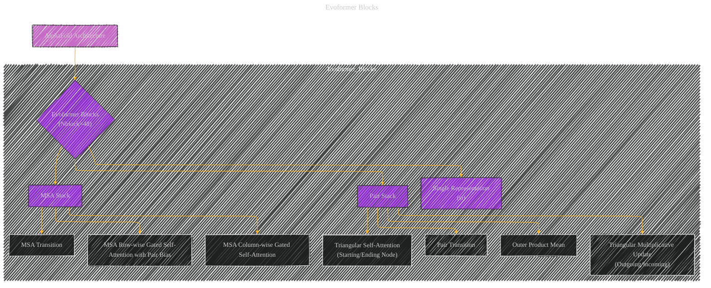
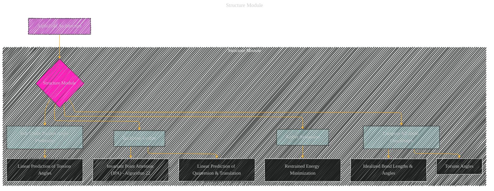
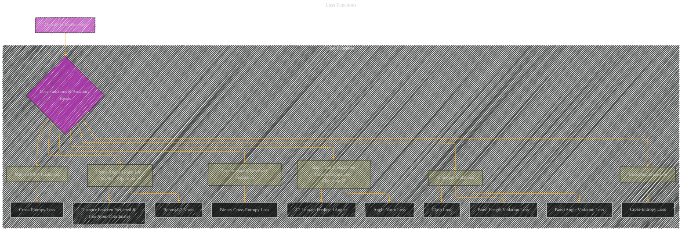
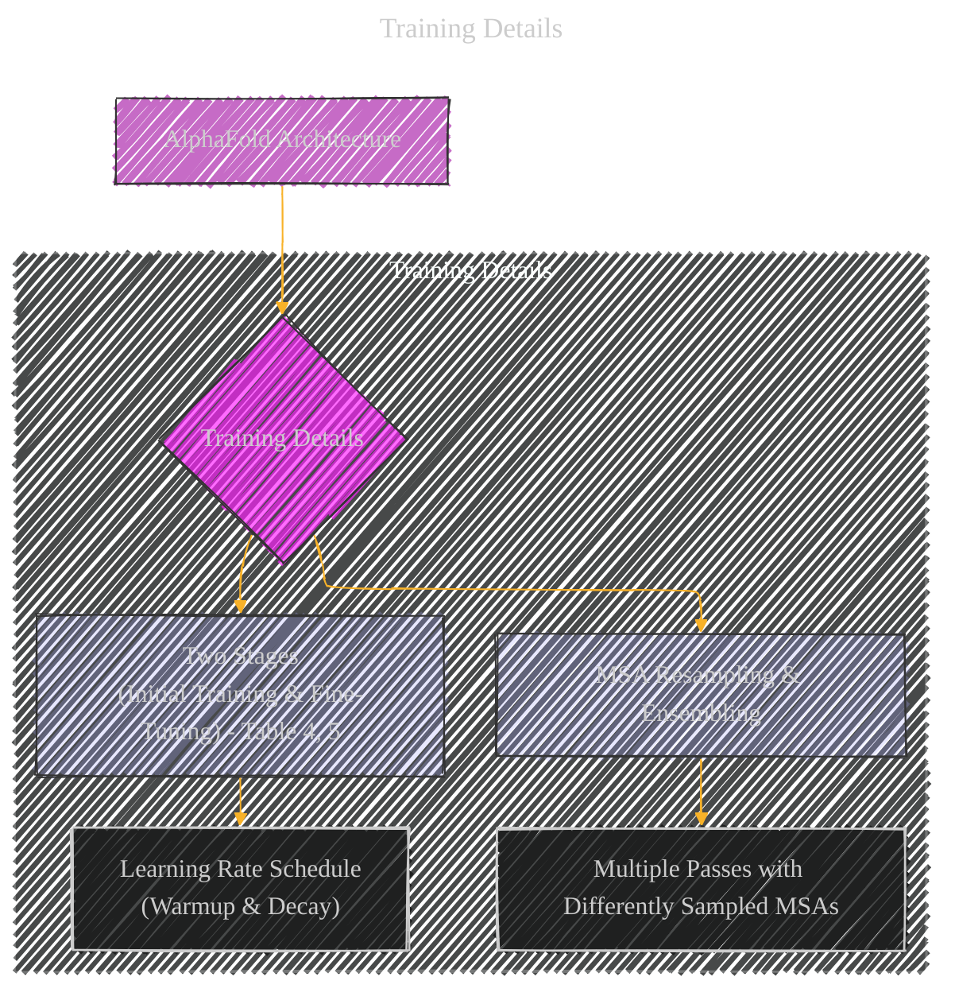

# Highly accurate protein structure prediction with AlphaFold - Supplementary information
> **Disclaimer:**
>
> This document contains my personal notes on the topic,
> compiled from publicly available documentation and various cited sources.
> The materials are intended for educational purposes, personal study, and reference.
> The content is dual-licensed:
> 1. **MIT License:** Applies to all code implementations (Swift, Mermaid, and other programming languages).
> 2. **Creative Commons Attribution 4.0 International License (CC BY 4.0):** Applies to all non-code content, including text, explanations, diagrams, and illustrations.
---

## Supplementary information for AlphaFold Model - A Diagrammatic Guide 

### Data Pipeline

```mermaid
---
title: "Data Pipeline"
config:
  layout: elk
  look: handDrawn
  theme: dark
---
%%%%%%%% Mermaid version v11.4.1-b.14
%%%%%%%% Available curve styles include the following keywords:
%% basis, bumpX, bumpY, cardinal, catmullRom, linear, monotoneX, monotoneY, natural, step, stepAfter, stepBefore.
%%{
  init: {
    "graph": { "htmlLabels": false, 'curve': 'linear' },
    'fontFamily': 'Fantasy',
    'themeVariables': {
      'primaryColor': '#BB2528',
      'primaryTextColor': '#f529',
      'primaryBorderColor': '#7C0000',
      'lineColor': '#F8B229',
      'secondaryColor': '#006100',
      'tertiaryColor': '#fff'
    }
  }
}%%
graph TD
    A[AlphaFold Architecture] --> B{Data Pipeline}
    style A fill:#a2aa,stroke:#333,stroke-width:1px
    style B fill:#f2aa,stroke:#333,stroke-width:1px

    subgraph Data_Pipeline["Data Pipeline"]
        B --> C[Parsing]
        style C fill:#ff43,stroke:#333,stroke-width:1px
        C --> CA["Input Files<br>(mmCIF/FASTA)"]
        C --> CB[Metadata Extraction]

        B --> D[Genetic Search]
        style D fill:#ff43,stroke:#333,stroke-width:1px
        D --> DA["JackHMMER<br>(MGnify, UniRef90)"]
        D --> DB["HHBlits<br>(Uniclust30 + BFD)"]

        B --> E[Template Search]
         style E fill:#ff43,stroke:#333,stroke-width:1px
        E --> EA["HHSearch<br>(PDB70)"]
        E --> EB["Filtering<br>(Release Date, Size, Identity)"]

        B --> F[Self-Distillation Dataset]
         style F fill:#ff43,stroke:#333,stroke-width:1px
        F --> FA["Unlabeled Protein Sequences<br>(Uniclust30)"]
        F --> FB[Undistilled Model Prediction]
        F --> FC[KL Divergence based Confidence Metric]

        B --> G[Featurization and Model Inputs]
        style G fill:#ff43,stroke:#333,stroke-width:1px
        G --> GA["Target Features<br>(aatype, residue_index)"]
        G --> GB["MSA Features<br>(cluster_msa, cluster_has_deletion, etc.)"]
        G --> GC["Extra MSA Features<br>(extra_msa, extra_msa_has_deletion, etc.)"]
        G --> GD["Template Features<br>(template_pair_feat, template_angle_feat)"]
    end
    
```

**Explanation of Diagram 1 (Data Pipeline):**

*   **Purpose:** To visually represent the data ingestion and preparation steps in AlphaFold.
*   **Nodes:** Each step (Parsing, Genetic Search, etc.) is represented as a node.
*   **Arrows:** Arrows indicate the sequence of operations.
*   **Subgraphs:** The `Data_Pipeline` subgraph groups the data preparation steps.
*   **Style:** Subgraphs are color-coded for easier understanding.

---

### Evoformer Blocks

**Explanation of Diagram 2 (Evoformer Blocks):**

*   **Purpose:** To illustrate the core processing unit of AlphaFold, the Evoformer.
*   **Nodes:** The MSA Stack and Pair Stack are highlighted.
*   **Arrows:** Shows the cyclical and interconnected processing within the Evoformer.
*    **Style:** Subgraphs are color-coded for easier understanding.

----

### Structure Module

**Explanation of Diagram 3 (Structure Module):**

*   **Purpose:** Visualizes the steps taken within the Structure Module to generate the 3D coordinates.
*   **Nodes:** Key steps like Backbone Update, Side Chain Prediction, and Coordinate Computation are represented.
*   **Arrows:** Indicates the sequence of operations to arrive at the final structure.
*   **Style:** Subgraphs are color-coded for easier understanding.

---

### Loss Functions

**Explanation of Diagram 4 (Loss Functions):**

*   **Purpose:** Depicts the different loss functions used to train AlphaFold.
*   **Nodes:** Each loss function (FAPE, Torsion Angle Loss, etc.) is a node.
*   **Arrows:** Shows the components that contribute to each loss calculation.
*   **Style:** Subgraphs are color-coded for easier understanding.

---

### Training Details

**Explanation of Diagram 5 (Training Details):**

*   **Purpose:** Summarizes the key aspects of the training process.
*   **Nodes:** Highlights the two-stage training and the importance of MSA resampling.
*   **Arrows:** Shows how these contribute to the final model.
*   **Style:** Subgraphs are color-coded for easier understanding.

---
**Licenses:**

- **MIT License:**   - Full text in [LICENSE](LICENSE) file.
- **Creative Commons Attribution 4.0 International:**  - Legal details in [LICENSE-CC-BY](LICENSE-CC-BY) and at [Creative Commons official site](http://creativecommons.org/licenses/by/4.0/).

---