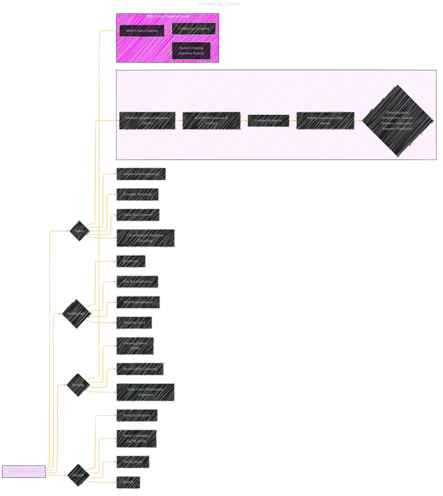

# Protein complex prediction with AlphaFold-Multimer
> **Disclaimer:**
>
> This document contains my personal notes on the topic,
> compiled from publicly available documentation and various cited sources.
> The materials are intended for educational purposes, personal study, and reference.
> The content is dual-licensed:
> 1. **MIT License:** Applies to all code implementations (Swift, Mermaid, and other programming languages).
> 2. **Creative Commons Attribution 4.0 International License (CC BY 4.0):** Applies to all non-code content, including text, explanations, diagrams, and illustrations.
---

## AlphaFold-Multimer - A Diagrammatic Guide 

Based on the provided bioRxiv preprint on "Protein complex prediction with AlphaFold-Multimer," here's how we can extract key concepts and organize them using the graphical model structure:

**I. Core Model: AlphaFold-Multimer as a Probabilistic System**

*   **Node:** AlphaFold-Multimer (AF-M)
    *   **Description:** A deep learning model for predicting the structure of protein complexes.
    *   **Type:** Probabilistic model (generates a distribution of possible structures).

**II. Inputs to AlphaFold-Multimer (Directed Edges to AF-M Node):**

*   **A. Sequence Information:**
    *   **Node:** Amino Acid Sequence(s)
        *   **Description:** The primary sequence of the protein chains.
        *   **Source:** Input data.
    *   **Node:** Multiple Sequence Alignment (MSA)
        *   **Description:** Evolutionary information from related protein sequences.
        *   **Generation Process:** JackHMMER searches against UniProt database, grouped by species, and paired using heuristics (genetic distance for prokaryotes, sequence similarity for eukaryotes).
        *   **Details:** MSA pairing (explicit aligned sequences) enhances contact prediction
*   **B. Structural Information:**
    *   **Node:** Template Structures
        *   **Description:** Homologous protein structures from the Protein Data Bank (PDB).
        *   **Source:** PDB structures released before a specific cutoff date (2018-04-30).
        *   **Search:**  HMMER hmmsearch.
*   **C. Chain Stoichiometry:**
    *   **Node:** Stoichiometry
        *   **Description:** The number of each unique chain type in the complex (e.g., A2B2).
        *   **Handling:**  Modified losses and scoring functions account for permutation symmetry among identical chains (Greedy heuristic).
*   **D. Positional Encoding:**
    *   **Node:** Chain Relative Positional Encoding
        *   **Description:** Integer indicating the chain number. Also includes "same_entity" feature (chains with identical sequences) and "relative_chain" encoding (relative chain index between chains of identical sequence).
        *   **Encoding:** Added to initial pair representation, including: `asym_id` , `entity_id`, and `sym_id`.

**III. AlphaFold-Multimer Architecture (Internal Nodes & Processes):**

*   **A. Neural Network:**
    *   **Node:** Evoformer
        *   **Description:** The core part of the neural network that processes MSA and pairwise relations.
    *   **Node:** Pair Representation
        *   **Description:** Encodes the relative positions of amino acids in the chain.
        *   **Processes:**
            *   Mixing and processing by neural network modules.
            *   Outer product mean moved to the start of Evoformer block.
    *   **Node:** MSA Representation
        *   **Description:** Neural representation of the multiple sequence alignment.
    *   **Node:** Template Stack
        *   **Modification:** Attention and triangular multiplicative update layers order swapped. Template embeddings are averaged.
*   **B. Training Adaptations:**
    *   **Node:** Multi-Chain Cropping
        *   **Description:**  A procedure to select subsets of residues for training, balancing chain coverage, crop diversity, interface, and non-interface regions.
        *   **Methods:** Sequence space contiguous cropping and coordinate space interface-biased spatial cropping.
    *   **Node:** Mixed FAPE Clamping
        *   **Description:**  Applies different FAPE losses to intra-chain and inter-chain residue pairs.
        *   **Details:** Intra-chain: Clamped at 10 Å. Inter-chain: Unclamped.
    *   **Node:** Symmetry Handling
        *    **Details:** Permutation of identical chains is performed to match the ground truth, using a greedy heuristic for efficiency.
*   **C. Training Regime:**
    *   **Node:** Training Dataset
        *   **Source:** PDB structures with a maximum release date of 2018-04-30.
        *   **Sampling:** Chains are sampled in inverse proportion to cluster size.
        *   **Chain Clusters:** 40% identity clusterings of the Protein Data Bank with MMSeqs2.
    *   **Node:** Training Parameters
        *   **Details:** Random crop to 384 residues, trained to convergence (10M samples, 2 weeks) on 128 TPUv3 cores (batch size 1 per core).
        *   **Learning Rate:** Halved after initial convergence.
        *   **Fine-Tuning:** Two stages: (1) pLDDT heads switched on, (2) violation losses enabled.

**IV. Outputs and Evaluation (Directed Edges from AF-M Node):**

*   **Node:** Predicted Structure
        *   **Description:** 3D coordinates of the protein complex.
*   **Node:** Model Confidence Metrics
        *   **Predicted TM-score (pTM):** Intrinsic model accuracy estimate (overall structure).
        *   **Interface pTM (ipTM):**  A modified pTM focusing on the accuracy of interfaces between chains ( weighted with pTM for model confidence = 0.8 · ipTM + 0.2 · pTM)
*   **Node:** DockQ Score
        *   **Description:** Measures the quality of the interface (range [0, 1]).
        *   **Thresholds:** Incorrect (< 0.23), Acceptable (0.23-0.49), Medium (0.49-0.80), High (> 0.8).
*   **Node:** RMSD
        *   **Description:** Root Mean Square Deviation, measuring the difference between the predicted and ground truth structures

**V. Comparisons (Additional Nodes Connected to Outputs):**

*   **Node:** AlphaFold-Linker
    *   **Description:** AlphaFold with a linker segment inserted between chains.
*   **Node:** AlphaFold-Gap (ColabFold)
    *   **Description:** AlphaFold with a gap in the residue index between chains.
*   **Node:** ClusPro (and Refined Versions)
    *   **Description:** A docking algorithm combined with AlphaFold.

**VI. Datasets (Nodes and Their Characteristics):**

*   **Node:** Benchmark 2
    *   **Description:** 17 heterodimers from PDB (post-training cutoff, no homologous complexes).
*   **Node:** Recent-PDB-Multimers
    *   **Description:** 4,433 recent protein complexes from PDB (homology-reduced).
    *   **Filtering:**  Chain pairs with < 40% template identity.
    *   **Split:** homomeric and heteromeric

**VII. Performance Metrics:**

*   **Average DockQ Score:** Higher score indicates better performance.
*   **Proportion of Targets Above DockQ Cutoff:** Indicates success rate at different quality levels.
*   **GDT (Global Distance Test) and lDDT (Local Distance Difference Test) scores:** Measure the accuracy of the chain predictions

**Mermaid Diagram Structure (Applying the Template):**

You would create individual diagrams (or a series of linked diagrams) for different aspects of the paper. Here's an example focused on the core model architecture and training data. The full set of diagrams would be much more extensive, covering the additional points above.

**Explanation:**

1.  **AlphaFold-Multimer Node:** Central node representing the core concept.
2.  **Inputs Node:** Groups the various input features the model uses.
3.  **Architecture Node:** Details the main components of the neural network.
4.  **Training Node:** Describes how the model was trained and the data used.
5.  **Outputs Node:** Lists the final products and the metrics used to assess them.
6.  **Subgraphs:** Deeper dives on specific aspects (MSA Details, Cropping Details).

This example is just a starting point. You would create additional diagrams for things like the model comparison with other methods, detailed steps of permutation alignment, the definition of various scores like DockQ, and so on.  The key is to break down the information into manageable, visually coherent pieces.

---
**Licenses:**

- **MIT License:**   - Full text in [LICENSE](LICENSE) file.
- **Creative Commons Attribution 4.0 International:**  - Legal details in [LICENSE-CC-BY](LICENSE-CC-BY) and at [Creative Commons official site](http://creativecommons.org/licenses/by/4.0/).

---