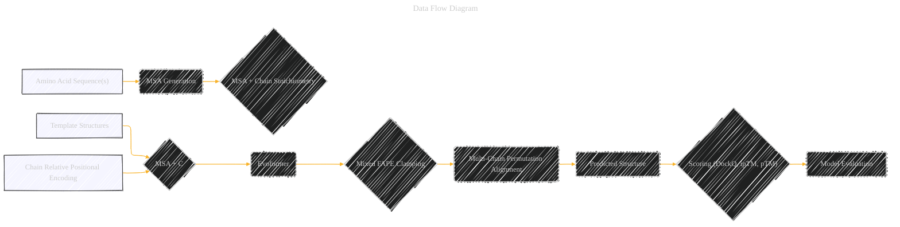
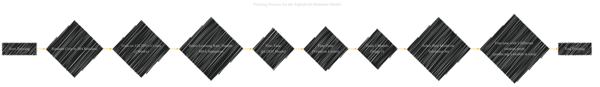
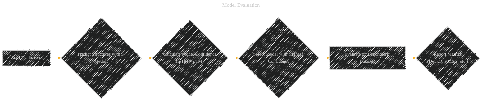
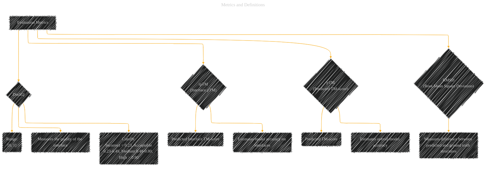

# Protein complex prediction with AlphaFold-Multimer
> **Disclaimer:**
>
> This document contains my personal notes on the topic,
> compiled from publicly available documentation and various cited sources.
> The materials are intended for educational purposes, personal study, and reference.
> The content is dual-licensed:
> 1. **MIT License:** Applies to all code implementations (Swift, Mermaid, and other programming languages).
> 2. **Creative Commons Attribution 4.0 International License (CC BY 4.0):** Applies to all non-code content, including text, explanations, diagrams, and illustrations.
---

## AlphaFold-Multimer - A Diagrammatic Guide 

### 1. High-Level Model Overview (Mind Map)

This will provide a bird's-eye view of AlphaFold-Multimer and its components.

**Explanation:**

*   **Root:** The central node, "AlphaFold-Multimer".
*   **Branches:**  The main categories: Inputs, Architecture, Training, Outputs, Comparisons.
*   **Sub-branches:** More detailed components within each category.
*   **Style:** A mind map is good for outlining relationships in a non-linear way.

---

### 2. Data Flow Diagram (Directed Graph)

This diagram visualizes the flow of data and processes within the AlphaFold-Multimer system.

**Explanation:**

*   **Nodes:** Processes or data stores (MSA generation, Evoformer, datasets, etc.).
*   **Edges:** Represent the flow of information between components.
*   **Style:** Directed graph emphasizes the sequence of steps.

----

### 3. Training Process (Flowchart)

Illustrates the key steps in training the AlphaFold-Multimer model.

**Explanation:**

*   **Nodes:** Steps in the training process.
*   **Edges:**  Flow of execution.
*   **Style:**  Flowchart provides a sequential view of the training procedure.

---

### 4. Model Evaluation (Decision Tree/Flowchart)

Illustrates the steps in model evaluation and selection.

**Explanation:**

*   **Nodes:** Steps in the model evaluation process.
*   **Edges:**  Flow of execution.
*   **Diamond Node:** represents a selection or decision.
*   **Style:** A flowchart provides a sequential view of the evaluation and selection procedure.

-----

### 5. Components and processes (Diagram)

Illustrates key process and components

**Explanation:**

*   **Nodes:** Processes or data stores (MSA generation, Evoformer, datasets, etc.).
*   **Edges:** Represent the flow of information between components.
*   **Style:** Directed graph emphasizes the relationships between the main concepts.

----

### 6. Metrics and Definitions (Table)

Provides a structured overview of the evaluation metrics used.

**Explanation:**

*   **Nodes:** Represent each metric.
*   **Edges:** Connect metrics to their descriptions and properties.
*   **Style:** A structured graph provides a clear summary of metrics.

---
**Licenses:**

- **MIT License:**   - Full text in [LICENSE](LICENSE) file.
- **Creative Commons Attribution 4.0 International:**  - Legal details in [LICENSE-CC-BY](LICENSE-CC-BY) and at [Creative Commons official site](http://creativecommons.org/licenses/by/4.0/).

---