# Accurate structure prediction of biomolecular interactions with AlphaFold 3
> **Disclaimer:**
>
> This document contains my personal notes on the topic,
> compiled from publicly available documentation and various cited sources.
> The materials are intended for educational purposes, personal study, and reference.
> The content is dual-licensed:
> 1. **MIT License:** Applies to all code implementations (Swift, Mermaid, and other programming languages).
> 2. **Creative Commons Attribution 4.0 International License (CC BY 4.0):** Applies to all non-code content, including text, explanations, diagrams, and illustrations.
---

## AlphaFold 3 Paper Overview - A Diagrammatic Guide 

```mermaid
---
title: "AlphaFold 3 (AF3) Model"
config:
  layout: elk
  look: handDrawn
  theme: dark
---
%%%%%%%% Mermaid version v11.4.1-b.14
%%%%%%%% Available curve styles include the following keywords:
%% basis, bumpX, bumpY, cardinal, catmullRom, linear, monotoneX, monotoneY, natural, step, stepAfter, stepBefore.
%%{
  init: {
    "graph": { "htmlLabels": false, 'curve': 'linear' },
    'fontFamily': 'Fantasy',
    'themeVariables': {
      'primaryColor': '#BB2528',
      'primaryTextColor': '#f529',
      'primaryBorderColor': '#7C0000',
      'lineColor': '#F8B229',
      'secondaryColor': '#006100',
      'tertiaryColor': '#fff'
    }
  }
}%%
graph LR
    A["AlphaFold 3 (AF3) Model"] --> B(Architecture and Training)

    B --> C["Evolution of AF2 Architecture"]:::detail
    C --> CA["Accommodating more general chemical structures"]
    C --> CB["Improving data efficiency of learning"]
    C --> CC["Replaces Evoformer with Pairformer (MSA processing reduced from 4 to 3 blocks)"]
    C --> CD["Diffusion module operates directly on atom coordinates"]
    C --> CE["Omits rotational frames/equivariant processing"]
    C --> CF["Cross-distillation:<br>Mimics disorder by training with AF-Multimer structures"]

    B --> D["Training Regime"]:::detail
    D --> DA["No structural data after 30 Sept 2021"]
    D --> DB["Mini-batch of 256 input data samples"]
    D --> DC["Initial training uses 12,288 diffusion samples<br>(256x48)"]
    D --> DD["Fine-tuning uses 8,192 diffusion samples<br>(256x32)"]
    D --> DE["Three-stage training<br>Crop sizes of 384, 640, 768 tokens"]
    D --> DF["Loss function:<br>Includes pLDDT, PAE, PDE metrics and other regularization methods"]
    D --> DG[Early stopping used]

    A --> E[Inference and Prediction]:::detail
    E --> EA[Predicts joint structure of complexes]
    E --> EB["Biomolecules included:<br>proteins, nucleic acids, small molecules, ions, modified residues"]
    E --> EC[Improved accuracy vs. specialized tools]
    E --> ED["Sampling with multiple random seeds<br>(typically 5, up to 1000 for antibodies)"]
    E --> EE[Replaced specialized torsion angles]
    E --> EF[Includes prediction of atom-level and pairwise errors]

    A --> F[Performance and Evaluation]:::detail
    F --> FA["Metrics:<br>DockQ, LDDT, pocket-aligned r.m.s.d."]
    F --> FB[Interface accuracy measured with iLDDT]
    F --> FC["Uses a recent PDB evaluation set<br>(released between May 2022 and Jan 2023)"]
    F --> FD["Low homology filtering applied to the evaluation set"]
    F --> FE["Performance depends on MSA depth<br>(for proteins)"]
    F --> FF["Uses PoseBusters Benchmark"]
    F --> FG["Uses CASP15 RNA targets"]

    A --> G[Model Limitations]:::detail
    G --> GA["Stereochemical violations<br>(chirality, atom clashes)"]
    G --> GB["Hallucinations<br>(spurious structural order in disordered regions)"]
    G --> GC[Predicts mostly static structures, doesn't capture dynamics fully]
    G --> GD[Conformational state may not always be correct.]
    G --> GE["High accuracy can still be challenging for certain targets"]
    
    A --> H[Key Components & Techniques]:::detail
    H --> HA[Diffusion Module]:::detail
    HA --> HAA[Operates directly on raw atom coordinates]
    HA --> HAB[Denoising to produce final structure]
    
    H --> HB[Pairformer Module]:::detail
    HB --> HBA[Pair representation]
    HB --> HBB[Single representation]
    HB --> HBC[Replaces Evoformer]
    
    H --> HC["MSAs (Multiple Sequence Alignments)"]:::detail
    HC --> HCA[Reduces the amount of MSA processing]
    
    H --> HD[Cross Distillation]:::detail
    HD --> HDA[Using AF-Multimer structures to enrich disorder]
    
    H --> HE[Confidence Measures]:::detail
    HE --> HEA[Predicts Atom level and pairwise errors]

    A --> I{"Data and Code Availability"}
    I --> IA["Data:<br> Freely available from public sources (PDB, UniRef, etc.)"]
    I --> IB["Code:<br> Available as a non-commercial server only"]
    I --> IC["Algorithms:<br> Described in pseudocode in Supplementary Information"]
    
    style A fill:#a2da,stroke:#333,stroke-width:1px
    style B fill:#a2fa,stroke:#333,stroke-width:1px
    style C fill:#a2fa,stroke:#333,stroke-width:1px
    style D fill:#a2fa,stroke:#333,stroke-width:1px
    style E fill:#a2fa,stroke:#333,stroke-width:1px
    style F fill:#a2fa,stroke:#333,stroke-width:1px
    style G fill:#f2da,stroke:#333,stroke-width:1px
    style H fill:#f2bf,stroke:#333,stroke-width:1px
    style I fill:#f2aa,stroke:#333,stroke-width:1px
    
```

----

### Explanation of Nodes and Connections

* **Root Node (A):** AlphaFold 3 (AF3) Model
* **Architecture and Training (B):** This branch details how AF3 is structured and trained.
    - **Evolution of AF2 Architecture (C):** Highlights the key architectural changes made from AlphaFold 2
    - **Training Regime (D):** Specifies how the training data is used and the various training stages.
* **Inference and Prediction (E):** The properties and capabilities of AlphaFold 3 to predict the structure of biomolecules.
* **Performance and Evaluation (F):** Outlines how the model was evaluated.
* **Model Limitations (G):**  Critical analysis of weaknesses and failure modes.
* **Key Components & Techniques (H):** Detailed description of the specific components of the new model and architecture.
* **Data and Code Availability (I):** Addresses the resources and accessibility of the research.

---
**Licenses:**

- **MIT License:**   - Full text in [LICENSE](LICENSE) file.
- **Creative Commons Attribution 4.0 International:**  - Legal details in [LICENSE-CC-BY](LICENSE-CC-BY) and at [Creative Commons official site](http://creativecommons.org/licenses/by/4.0/).

---