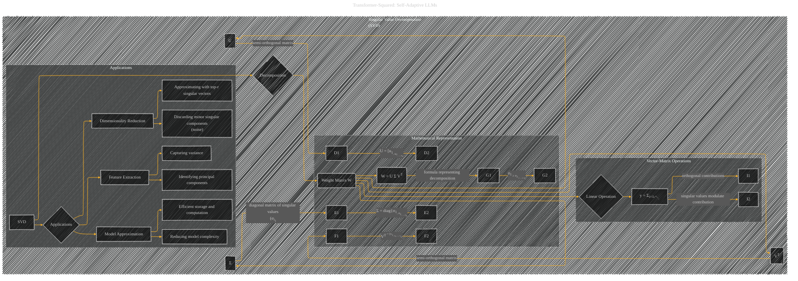

# Singular Value Decomposition (SVD)
> **Disclaimer:**
>
> This document contains my personal notes on the topic,
> compiled from publicly available documentation and various cited sources.
> The materials are intended for educational purposes, personal study, and reference.
> The content is dual-licensed:
> 1. **MIT License:** Applies to all code implementations (Swift, Mermaid, and other programming languages).
> 2. **Creative Commons Attribution 4.0 International License (CC BY 4.0):** Applies to all non-code content, including text, explanations, diagrams, and illustrations.
---

## Singular Value Decomposition - A Diagrammatic Guide 

----

### Explanation of the Diagram

The diagram uses a hierarchical structure to illustrate the key components and applications of Singular Value Decomposition (SVD) within the context of large language model (LLM) fine-tuning.

* **Weight Matrix (W):** The diagram starts with the weight matrix (W) of a neural network layer as the central object. SVD decomposes this matrix.
* **SVD Decomposition:**  The core of the diagram visually represents the decomposition of the weight matrix (W) into three components:  U, Σ, and VT.  Key attributes (e.g., semi-orthogonal matrices, diagonal matrix of singular values) are explicitly labeled to highlight their mathematical characteristics.
* **Mathematical Representation:**  This subgraph further clarifies the mathematical form of the decomposition.  It shows how the weight matrix is expressed as the product of U, Σ, and VT. The crucial ordering of singular values (σi) is also noted, emphasizing the inherent ordering and importance of these values.
* **Vector-Matrix Operations:**  This subgraph emphasizes that applying the weight matrix to an input vector (x) can be decomposed into a sum of independent terms. This emphasizes the orthogonal contributions of each singular component and the modulating role of singular values.
* **Applications:** This subgraph highlights the practical applications of SVD in LLM fine-tuning, especially focusing on dimensionality reduction, feature extraction, and model approximation.  It clarifies how discarding minor components, approximating with the top singular vectors, and capturing variance are crucial aspects.

This structured diagram effectively encapsulates the core concepts of SVD and its applicability to large language models, as discussed in the original text. Note that this diagram is an *abstract* representation; further details can be added with specific mathematical equations or references to the original text.

---
**Licenses:**

- **MIT License:**   - Full text in [LICENSE](LICENSE) file.
- **Creative Commons Attribution 4.0 International:**  - Legal details in [LICENSE-CC-BY](LICENSE-CC-BY) and at [Creative Commons official site](http://creativecommons.org/licenses/by/4.0/).

---