# Transformer Architecture Drafts
> **Disclaimer:**
>
> This document contains my personal notes on the topic,
> compiled from publicly available documentation and various cited sources.
> The materials are intended for educational purposes, personal study, and reference.
> The content is dual-licensed:
> 1. **MIT License:** Applies to all code implementations (Swift, Mermaid, and other programming languages).
> 2. **Creative Commons Attribution 4.0 International License (CC BY 4.0):** Applies to all non-code content, including text, explanations, diagrams, and illustrations.
---

## Transformer Architecture - A Draft Comprehensive Diagram

```mermaid
---
title: Optimized Transformer Architecture Diagram
config:
  layout: elk
  look: handDrawn
  theme: dark
---
%%{
  init: {
    'fontFamily': 'verdana',
    'themeVariables': {
      'primaryColor': '#007acc',
      'primaryTextColor': '#fff',
      'primaryBorderColor': '#005a9e',
      'lineColor': '#f90',
      'secondaryColor': '#e8f3fb',
      'tertiaryColor': '#fff'
    }
  }
}%%
graph LR
    %% Input & Embedding
    A["Input Sequence<br>(x₁, …, xₙ)"]
    B["Input Embeddings<br>Embed(xᵢ)"]
    A --> B
    C["Positional Encoding<br>
    PE(pos,2i)=sin(pos/10000^(2i/d_model))<br>
    PE(pos,2i+1)=cos(pos/10000^(2i/d_model))"]
    
    B --> C

    %% Encoder Stack
    D["Encoder Stack<br>(N layers)"]
    C --> D

    subgraph ENC["Encoder Layer<br>(for each layer)"]
        direction LR
        E["Multi-Head Self-Attention<br>
        headᵢ = Attention(QWᵢᴾ, KWᵢᴷ, VWᵢⱽ)<br>
        MultiHead(Q,K,V)=Concat(head₁,…,headₕ)Wᵒ"]

        F["Add & Norm<br>LayerNorm(x + Sublayer(x))"]
        G["Feed-Forward Network <br> FFN(x)= max(0, xW₁+b₁)W₂+b₂"]
        E --> F
        F --> G
        G --> F
    end
    D --> ENC

    %% Encoder Output for Decoder Attention
    H["Encoder Output<br>(z₁,…,zₙ)"]
    ENC --> H

    %% Decoder Stack
    I["Decoder Stack<br>(N layers)"]

    %% later in each decoder layer
    H --> J["Encoder-Decoder Attention"]

    K["Target Sequence (shifted)<br>(y₁, …, yₘ₋₁)"]
    L["Target Embeddings<br>Embed(yᵢ)"]
    K --> L
    M["Positional Encoding<br>(same PE formulas)"]
    L --> M
    M --> I

    subgraph DEC["Decoder Layer<br>(for each layer)"]
        direction LR
        N["Masked Self-Attention<br>(prevent future info)"]
        O["Add & Norm<br>(LayerNorm(x + Sublayer(x)))"]
        P["Encoder-Decoder Attention<br>Attention(Q, K, V)<br>where Q from decoder, K,V from Encoder"]
        Q[Add & Norm]
        R["Feed-Forward Network <br> FFN(x)= max(0, xW₁+b₁)W₂+b₂"]
        
        N --> O
        O --> P
        P --> Q
        Q --> R
        R --> Q
    end
    I --> DEC

    %% Decoder Final Output
    S["Decoder Output<br>(d_model-dim vector)"]
    DEC --> S
    T[Linear Projection]
    S --> T
    U["Softmax<br>softmax(zᵢ)=e^(zᵢ)/Σⱼ e^(zⱼ)"]
    T --> U
    V["Output Sequence<br>(y₁, …, yₘ)"]
    U --> V

    %% Scaled Dot-Product Attention (detailed in a separate subgraph)
    subgraph SDPA["Scaled Dot-Product Attention"]
        direction TB
        W[Input: Q, K, V]
        X[Compute similarity:<br>QKᵀ]
        Y[Scale by 1/√dₖ]
        Z["Softmax<br>softmax(QKᵀ/√dₖ)"]
        AA[Output: ZV]
        W --> X
        X --> Y
        Y --> Z
        Z --> AA
    end

    %% Link multi-head attention blocks to SDPA - illustrative arrow
    %% E ---| "uses SDPA" | SDPA
    %% N ---| "uses SDPA" | SDPA
    %% P ---| "uses SDPA" | SDPA
   
```

----

### Explanation

1. **Input & Embedding:**  
   • The model begins by converting the input sequence (x₁,…,xₙ) into embeddings.  
   • Positional encodings are added using the sinusoidal formulas:
   
     • PE(pos,2i)= sin(pos/10000^(2i/d_model))  
     • PE(pos,2i+1)= cos(pos/10000^(2i/d_model))
     
2. **Encoder:**  
   • A stack of N encoder layers processes the input.  
   • Each layer uses multi-head self-attention:
     
     • headᵢ = Attention(QWᵢᴾ, KWᵢᴷ, VWᵢⱽ)  
     • MultiHead(Q, K, V) = Concat(head₁,…,headₕ)Wᵒ  
   • Residual connections and layer normalization are applied (Add & Norm).  
   • A position-wise feed-forward network (FFN) processes the outputs.

3. **Decoder:**  
   • The decoder stack (also N layers) begins from the shifted target embeddings with added positional encodings.  
   • Each decoder layer has:
     
     • Masked self-attention (to avoid using future information).  
     • Encoder-decoder attention so the decoder can attend to encoder outputs.
     • Residual connections and layer normalization.
     • A feed-forward network, with similar operations to the encoder.

4. **Output Projection:**  
   • The final decoder output is passed through a linear layer and softmax function to produce output token probabilities.  
   • The softmax function is defined as softmax(zᵢ)= e^(zᵢ)/Σⱼ e^(zⱼ).

5. **Scaled Dot-Product Attention:**  
   • This key module computes attention as:  
     • Attention(Q, K, V) = softmax(QKᵀ/√dₖ) V  
   • A separate subgraph (SDPA) illustrates this process.

This optimized diagram integrates the main stages of the Transformer and the associated equations, providing a clear visual summary of the model’s architecture and key operations.

---
**Licenses:**

- **MIT License:**   - Full text in [LICENSE](LICENSE) file.
- **Creative Commons Attribution 4.0 International:**  - Legal details in [LICENSE-CC-BY](LICENSE-CC-BY) and at [Creative Commons official site](http://creativecommons.org/licenses/by/4.0/).

---