# Transformer Architecture Drafts
> **Disclaimer:**
>
> This document contains my personal notes on the topic,
> compiled from publicly available documentation and various cited sources.
> The materials are intended for educational purposes, personal study, and reference.
> The content is dual-licensed:
> 1. **MIT License:** Applies to all code implementations (Swift, Mermaid, and other programming languages).
> 2. **Creative Commons Attribution 4.0 International License (CC BY 4.0):** Applies to all non-code content, including text, explanations, diagrams, and illustrations.
---

## Transformer Architecture - A Draft Comprehensive Diagram

```mermaid
---
title: Optimized Transformer Architecture
config:
  layout: elk
  look: handDrawn
  theme: default
---
%%{
  init: {
    'fontFamily': 'verdana',
    'themeVariables': {
      'primaryColor': '#007acc',
      'primaryTextColor': '#fff',
      'primaryBorderColor': '#005a9e',
      'lineColor': '#f90',
      'secondaryColor': '#e8f3fb',
      'tertiaryColor': '#fff'
    }
  }
}%%
graph LR
    subgraph Transformer_Architecture["Transformer Architecture"]
    style Transformer_Architecture fill:#e8f3fb,stroke:#005a9e,stroke-width:2px

        A["Input Sequence<br>(x<sub>1</sub>, ..., x<sub>n</sub>)"] --> B["Input Embeddings<br>(Embedding(x<sub>i</sub>))"]
        B --> C["Positional Encoding<br>(PE<sub>pos,2i</sub> = sin(pos/10000<sup>2i/d<sub>model</sub></sup>)<br>PE<sub>pos,2i+1</sub> = cos(pos/10000<sup>2i/d<sub>model</sub></sup>))"]
        C --> D["Encoder (N=6 Layers)"]

        subgraph Encoder_Layer["Encoder Layer"]
        style Encoder_Layer fill:#d8e8ff,stroke:#005a9e,stroke-width:2px
            E["Multi-Head Self-Attention<br>(Q, K, V)"] --> F["Add & Norm<br>(LayerNorm(x + Sublayer(x)))"]
            F --> G["Position-wise FFN<br>(FFN(x) = max(0, xW<sub>1</sub> + b<sub>1</sub>)W<sub>2</sub> + b<sub>2</sub>)"]
            G --> H["Add & Norm<br>(LayerNorm(x + Sublayer(x)))"]
        end
        
        D -->|Repeat N Times| D

        D --> I["Decoder (N=6 Layers)"]

        subgraph Decoder_Layer["Decoder Layer"]
        style Decoder_Layer fill:#d8e8ff,stroke:#005a9e,stroke-width:2px
            J["Masked Multi-Head Self-Attention<br>(Q, K, V)"] --> K["Add & Norm<br>(LayerNorm(x + Sublayer(x)))"]
            K --> L["Encoder-Decoder Attention<br>(Q from Decoder, K, V from Encoder)"]
            L --> M["Add & Norm<br>(LayerNorm(x + Sublayer(x)))"]
            M --> N["Position-wise FFN<br>(FFN(x) = max(0, xW<sub>1</sub> + b<sub>1</sub>)W<sub>2</sub> + b<sub>2</sub>)"]
            N --> O["Add & Norm<br>(LayerNorm(x + Sublayer(x)))"]
        end
        
        I -->|Repeat N Times| I
        
        I --> P["Linear Layer"]
        P --> Q["Softmax<br>(softmax(z<sub>i</sub>) = e<sup>z<sub>i</sub></sup> / Σe<sup>z<sub>j</sub></sup>)"]
        Q --> R["Output Sequence<br>(y<sub>1</sub>, ..., y<sub>m</sub>)"]

        A --> S["Target Sequence<br>(y<sub>1</sub>, ..., y<sub>m-1</sub>)"]
        S --> T["Target Embeddings<br>(Embedding(y<sub>i</sub>))"]
        T --> U["Positional Encoding<br>(PE<sub>pos,2i</sub>, PE<sub>pos,2i+1</sub>)"]
        U --> J
    end

    subgraph Attention_Details["Attention Mechanisms"]
    style Attention_Details fill:#c8e6c9,stroke:#43a047,stroke-width:2px
        V["Scaled Dot-Product Attention"] --> W("Compute: QK<sup>T</sup>/√d<sub>k</sub>")
        W --> X("Apply Softmax")
        X --> Y("Weighted Sum with V")
    end
    
    E -- "Q, K, V from Encoder" --> V
    J -- "Masked Q, K, V from Decoder" --> V
    L -- "Q from Decoder, K, V from Encoder" --> V

```

----

### Explanation and Optimization:

1. **Overall Structure:** 
   - The diagram is now structured to provide a clearer view of the entire process flow. The arrows indicate the sequential steps from input to output.

2. **Encoder and Decoder Layers:**
   - **Encoder Layers:** Clearly shows repeated `N` times with components: Multi-Head Self-Attention, Add & Norm, and Position-wise FFN.
   - **Decoder Layers:** Also repeated `N` times with the addition of Masked Multi-Head Self-Attention and Encoder-Decoder Attention.

3. **Attention Mechanisms:**
   - Clearly separated into a subgraph with detailed steps for Scaled Dot-Product Attention including computation of `QK^T/√d_k`, application of softmax, and weighted sum with V.

4. **Flow Arrows:** 
   - Arrows clearly indicate the flow of data and operations between components, making the logical structure of the Transformer evident.

5. **Mathematical Equations:** 
   - Incorporated into the node labels to explain the computations occurring at each step (e.g., positional encoding formulas, FFN equations).

6. **Repetition of Layers:** 
   - `|Repeat N Times|` clearly denotes that encoder and decoder layers are repeated six times in the architecture.

This optimized diagram uses Mermaid's capabilities to strategically illustrate each step and component within the Transformer architecture while maintaining clarity and connection between elements. It effectively visualizes the relationships and processes within the model.

---
**Licenses:**

- **MIT License:**   - Full text in [LICENSE](LICENSE) file.
- **Creative Commons Attribution 4.0 International:**  - Legal details in [LICENSE-CC-BY](LICENSE-CC-BY) and at [Creative Commons official site](http://creativecommons.org/licenses/by/4.0/).

---