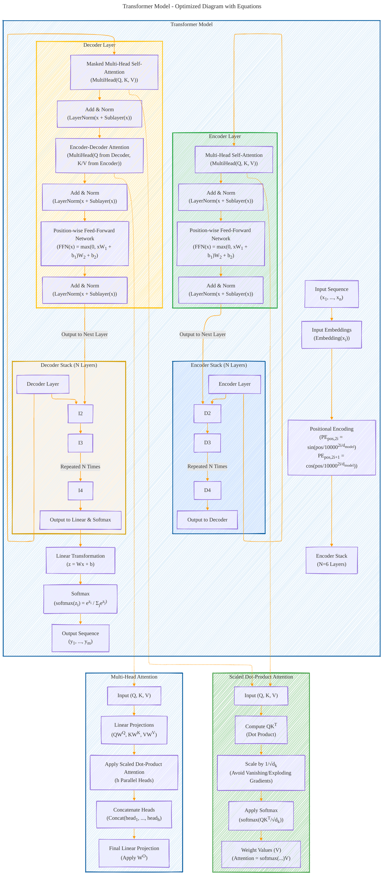

# Transformer Architecture Drafts
> **Disclaimer:**
>
> This document contains my personal notes on the topic,
> compiled from publicly available documentation and various cited sources.
> The materials are intended for educational purposes, personal study, and reference.
> The content is dual-licensed:
> 1. **MIT License:** Applies to all code implementations (Swift, Mermaid, and other programming languages).
> 2. **Creative Commons Attribution 4.0 International License (CC BY 4.0):** Applies to all non-code content, including text, explanations, diagrams, and illustrations.
---

## Transformer Architecture - A Draft Comprehensive Diagram

----

### Optimized Diagram Explanation

This optimized Mermaid diagram strategically organizes all components of the Transformer model while ensuring the connections between components are clearly represented. It also includes mathematical equations where appropriate for a detailed understanding.

---

### Key Features and Structure:

#### **Main Architecture:**
1. **Input Sequence:**
   - The sequence (e.g., words or tokens) is passed through an embedding layer (`Embedding(x_i)`), followed by positional encoding to add order information.
   - Formula for Positional Encoding is displayed:
     - \( PE_{pos, 2i} = \sin\left(\frac{pos}{10000^{\frac{2i}{d_{model}}}}\right) \)
     - \( PE_{pos, 2i+1} = \cos\left(\frac{pos}{10000^{\frac{2i}{d_{model}}}}\right) \)

2. **Encoder Stack:**
   - Consists of **N layers**, where each layer contains:
     - **Multi-Head Self-Attention:** Captures relationships within the input sequence.
     - **Position-wise Feed-Forward Network (FFN):** Applies transformations independently at each position.
     - Residual connections and layer normalization ensure stable training.

3. **Decoder Stack:**
   - Mirrors the encoder stack but includes additional **Masked Multi-Head Attention** and **Encoder-Decoder Attention** to process the target sequence and leverage encoder outputs.
   - Masking ensures that predictions depend only on past tokens.

4. **Output Embeddings and Softmax:**
   - Outputs from the final decoder layer pass through a linear layer and a softmax function:
     - \( softmax(z_i) = \frac{e^{z_i}}{\sum_j e^{z_j}} \)
   - Produces probabilities over the vocabulary for generating the output sequence.

---

#### **Attention Mechanisms:**
1. **Scaled Dot-Product Attention:**
   - Core attention operation:
     - \( \text{Attention}(Q, K, V) = \text{softmax}\left(\frac{QK^T}{\sqrt{d_k}}\right)V \)
   - Steps:
     - Compute dot product \( QK^T \).
     - Scale by \( \frac{1}{\sqrt{d_k}} \).
     - Apply softmax for normalization.
     - Weight values \( V \) by attention scores.

2. **Multi-Head Attention:**
   - Extends scaled dot-product attention:
     - Projects \( Q, K, V \) into multiple subspaces using learnable weight matrices \( W^Q, W^K, W^V \).
     - Computes attention independently in parallel across heads.
     - Concatenates results and applies a final projection \( W^O \).

---

### Strategic Optimizations:
1. **Hierarchical Organization:** Clearly separates components into `Encoder`, `Decoder`, `Scaled Dot-Product Attention`, and `Multi-Head Attention`.
2. **Equations Integrated into Components:** Key equations (e.g., attention mechanism, FFN transformations) are embedded directly within the relevant sections.
3. **Connections Between Components:** Arrows show data flow explicitly between encoder-decoder stacks and the attention mechanisms.
4. **Subgraph Modularity:** Each component is isolated in its subgraph (e.g., `Encoder Layer`, `Decoder Layer`, `Scaled Dot-Product Attention`) for better readability.

---

This diagram is designed to provide a complete and interconnected view of the Transformer model while remaining modular for individual focus on components like attention mechanisms or specific layers in the architecture. The mathematical precision adds depth for advanced readers or practitioners.

---
**Licenses:**

- **MIT License:**   - Full text in [LICENSE](LICENSE) file.
- **Creative Commons Attribution 4.0 International:**  - Legal details in [LICENSE-CC-BY](LICENSE-CC-BY) and at [Creative Commons official site](http://creativecommons.org/licenses/by/4.0/).

---