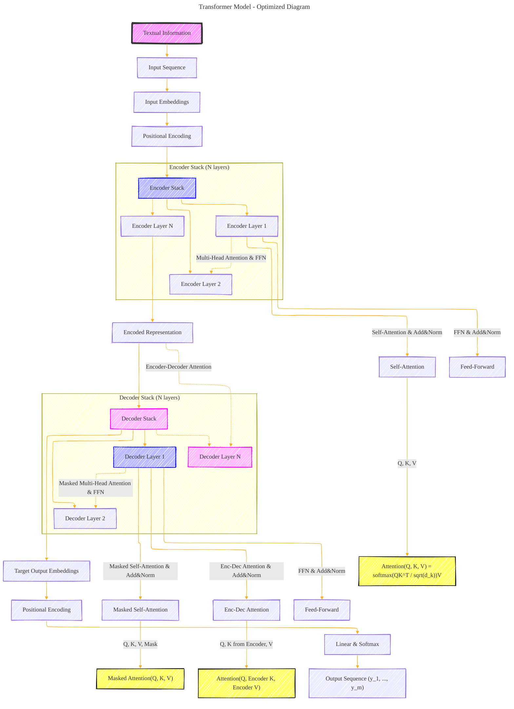

# Transformer Architecture Drafts
> **Disclaimer:**
>
> This document contains my personal notes on the topic,
> compiled from publicly available documentation and various cited sources.
> The materials are intended for educational purposes, personal study, and reference.
> The content is dual-licensed:
> 1. **MIT License:** Applies to all code implementations (Swift, Mermaid, and other programming languages).
> 2. **Creative Commons Attribution 4.0 International License (CC BY 4.0):** Applies to all non-code content, including text, explanations, diagrams, and illustrations.
---

## Transformer Architecture - A Draft Comprehensive Diagram

---

### Key Aspects and Strategic Optimizations:

- **Hierarchical Structure:** The architecture is divided into two main subgraphs: Encoder Stack and Decoder Stack, with further breakdowns into individual layers. This visual hierarchy enhances understanding.
  
- **Sequential Flow:** Arrows clearly indicate the sequential flow of information through the model, from input to output.

- **Encoder and Decoder Layers:** Distinct sections for Encoder and Decoder layers elucidate their roles and internal components. 

- **Attention Mechanisms:** Key equations for the attention mechanisms (Self-Attention in the encoder, Masked Self-Attention, and Encoder-Decoder Attention in the decoder) are depicted right where they are applied to emphasize their importance.

- **Equations:** Specific attention mechanism equations are presented next to their respective processes. This highlights the Transformer's core mathematical operations without cluttering the overall architecture flow.

- **Component Connections:** The diagram ensures all components are properly connected, illustrating dependencies between layers and between the encoder and decoder stacks.

- **Visual Design:** The use of color coding (optional in Mermaid but described here for context) differentiates between encoder-related components, decoder-related components, and equations. This visual differentiation aids in quickly grasitating the distinct parts of the model.

### Conclusion:

This optimized Mermaid diagram of the Transformer model strategically arranges components to emphasize clarity and connectivity. It highlights the model's architecture and core mathematical principles underlying its operation, providing a comprehensive yet understandable overview of the Transformer mechanism.

---
**Licenses:**

- **MIT License:**   - Full text in [LICENSE](LICENSE) file.
- **Creative Commons Attribution 4.0 International:**  - Legal details in [LICENSE-CC-BY](LICENSE-CC-BY) and at [Creative Commons official site](http://creativecommons.org/licenses/by/4.0/).

---