# Transformer Architecture Drafts
> **Disclaimer:**
>
> This document contains my personal notes on the topic,
> compiled from publicly available documentation and various cited sources.
> The materials are intended for educational purposes, personal study, and reference.
> The content is dual-licensed:
> 1. **MIT License:** Applies to all code implementations (Swift, Mermaid, and other programming languages).
> 2. **Creative Commons Attribution 4.0 International License (CC BY 4.0):** Applies to all non-code content, including text, explanations, diagrams, and illustrations.
---

## Transformer Architecture - A Draft Comprehensive Diagram

```mermaid
---
title: Optimized Transformer Architecture
config:
  layout: elk
  theme: forest
---
%%{
  init: {
    'fontFamily': 'Source Code Pro, monospace',
    'fontSize': 14,
    'themeVariables': {
      'primaryColor': '#f0f0f0',
      'primaryTextColor': '#333',
      'primaryBorderColor': '#666',
      'lineColor': '#f90',
      'secondaryColor': '#e0f7fa',
      'tertiaryColor': '#fff0e0'
    }
  }
}%%
graph LR
    subgraph Transformer["Transformer"]
        style Transformer fill:#f0f0f0,stroke:#666,stroke-width:1px

        A["Input<br>(x<sub>1</sub>, ..., x<sub>n</sub>)"] -- Embed --> B["Input Embeddings"]
        B -- "+ PE" --> C["Positional<br>Encoding<br>(PE<sub>pos,2i</sub> = sin(pos/10000<sup>2i/d<sub>model</sub></sup>)<br>PE<sub>pos,2i+1</sub> = cos(pos/10000<sup>2i/d<sub>model</sub></sup>))"]
        C --> D["Encoder (N=6)"]

        subgraph Encoder["Encoder"]
            style Encoder fill:#e0f7fa,stroke:#00897b,stroke-width:1px
            D --> E1["Layer 1"]
            E1 --> E2["Layer 2"]
            E2 --> E3["..."]
            E3 --> E6["Layer N"]

            subgraph EncoderLayer["Encoder Layer"]
                style EncoderLayer fill:#fff0e0,stroke:#e65100,stroke-width:1px
                EL_in([Input]) --> EL_MHSA["Multi-Head<br>Self-Attention<br>(MultiHead(Q,K,V))"]
                EL_MHSA -->|Add & Norm| EL_FFN["Position-wise<br>FFN<br>(FFN(x))"]
                EL_FFN -->|Add & Norm| EL_out([Output])

                %% Residual Connections
                EL_in -->|Skip Connection| EL_FFN
                EL_MHSA -->|Skip Connection| EL_out

                %% Equations inside Nodes
                EL_MHSA -- "MultiHead(Q,K,V) = <br>Concat(head<sub>1</sub>, ..., head<sub>h</sub>)W<sup>O</sup><br>head<sub>i</sub> = Attention(QW<sub>i</sub><sup>Q</sup>, KW<sub>i</sub><sup>K</sup>, VW<sub>i</sub><sup>V</sup>)" --> EL_MHSA_eq
                EL_FFN -- "FFN(x) = max(0, xW<sub>1</sub> + b<sub>1</sub>)W<sub>2</sub> + b<sub>2</sub>" --> EL_FFN_eq
            end
            
            E1 -- ".Input"--> EL_in
            E6 -- ".Output"--> EL_out
        end

        D --> F["Decoder (N=6)"]

        subgraph Decoder["Decoder"]
            style Decoder fill:#e0f7fa,stroke:#00897b,stroke-width:1px
            F --> G1["Layer 1"]
            G1 --> G2["Layer 2"]
            G2 --> G3["..."]
            G3 --> G6["Layer N"]

            subgraph DecoderLayer["Decoder Layer"]
                style DecoderLayer fill:#fff0e0,stroke:#e65100,stroke-width:1px
                DL_in([Input]) --> DL_MMHSA["Masked<br>Multi-Head<br>Self-Attention"]
                DL_MMHSA -->|Add & Norm| DL_EDAtt["Encoder-Decoder<br>Attention"]
                DL_EDAtt -->|Add & Norm| DL_FFN["Position-wise<br>FFN"]
                DL_FFN -->|Add & Norm| DL_out([Output])

                %% Residual Connections
                DL_in -->|Skip Connection| DL_EDAtt
                DL_MMHSA -->|Skip Connection| DL_FFN
                DL_EDAtt -->|Skip Connection| DL_out

                %% Equations (Optional - for brevity, could link to separate diagram)
                DL_MMHSA -- "MultiHead(Q,K,V)" --> DL_MMHSA_eq
                DL_EDAtt -- "MultiHead(Q,K,V)" --> DL_EDAtt_eq
                DL_FFN -- "FFN(x)" --> DL_FFN_eq
            end
          G1 -- ".Input"--> DL_in
          G6 -- ".Output"--> DL_out
          E6 -- "Encoder Output" --> DL_EDAtt
        end

        F --> H["Linear"]
        H --> I["Softmax<br>(softmax(z<sub>i</sub>) = e<sup>z<sub>i</sub></sup> / Σ<sub>j</sub>e<sup>z<sub>j</sub></sup>)"]
        I --> J["Output<br>(y<sub>1</sub>, ..., y<sub>m</sub>)"]

        K["Target Sequence<br>(y<sub>1</sub>, ..., y<sub>m-1</sub>)"] -- Embed --> L["Target Embeddings"]
        L -- "+ PE" --> M["Positional<br>Encoding"]
        M --> G1
    end

    subgraph ScaledDotProductAttention["Scaled Dot-Product Attention"]
        style ScaledDotProductAttention fill:#f5f5dc,stroke:#827717,stroke-width:1px
        SDPA_in([Q, K, V]) --> SDPA_SDP["Scaled Dot-Product<br>(QK<sup>T</sup> / √d<sub>k</sub>)"]
        SDPA_SDP --> SDPA_Softmax["Softmax"]
        SDPA_Softmax --> SDPA_out("[Output]")

        %% Value Matrix Multiplication
        SDPA_in --> SDPA_out 

        %% Equation
        SDPA_out -- "Attention(Q, K, V) = <br>softmax(QK<sup>T</sup> / √d<sub>k</sub>)V" --> SDPA_eq
    end
    
    EL_MHSA -- "Q, K, V" --> SDPA_in
    DL_MMHSA -- "Q, K, V" --> SDPA_in
    DL_EDAtt -- "Q, K, V" --> SDPA_in

```

---

### Key Improvements and Optimizations

*   **Clearer Subgraphs:**  The diagram is now more strictly organized into `Transformer`, `Encoder`, `Decoder`, and `ScaledDotProductAttention` subgraphs.  Each subgraph has a distinct fill color for better visual separation.
*   **Layer Numbering:** Encoder and Decoder layers are explicitly numbered (E1, E2, ..., E6 and G1, G2, ..., G6) to show the stacked nature.  Ellipses (...) indicate the intermediate layers.
*   **Input/Output Labels:**  Inputs and Outputs for Encoder and Decoder layers are clearly marked using parentheses `([Input])` and `([Output])`.
*   **Residual Connections:**  Skip connections (residual connections) are now explicitly drawn with distinct arrows, showing how the input is added to the output of each sub-layer *before* layer normalization.
*   **Add & Norm:**  The "Add & Norm" operation is integrated directly into the flow, making it clearer that layer normalization happens *after* the residual addition.
*   **Equations within Nodes:** The key equations for Multi-Head Attention, FFN, and Softmax are now *inside* the corresponding nodes, directly linking the visual representation with the mathematical formula.
*   **Scaled Dot-Product Attention Subgraph:** This subgraph is now more concise and clearly shows the input (Q, K, V), the scaled dot-product operation, the softmax, and the final output.  The equation is also included.
*   **Font and Styling:**
    *   A monospace font (`Source Code Pro`) is used for better readability of equations and code-like elements.
    *   Font size is increased for improved legibility.
    *   Colors are adjusted for better contrast and visual appeal.
* **Connections between Encoder and Decoder:** The flow of the encoder output to the Decoder's Encoder-Decoder attention layers is clearly demonstrated.
* **Target Sequence:** The Target Sequence and its embeddings/positional encoding are now included, showing how the decoder receives its input.
* **Brevity of Equations:** Added abbreviation to the equation.

This optimized Mermaid diagram provides a much more precise and informative representation of the Transformer architecture, incorporating best practices for clarity, visual hierarchy, and mathematical accuracy.  It's significantly easier to understand the flow of data, the operations performed in each component, and the relationships between different parts of the model.

---
**Licenses:**

- **MIT License:**   - Full text in [LICENSE](LICENSE) file.
- **Creative Commons Attribution 4.0 International:**  - Legal details in [LICENSE-CC-BY](LICENSE-CC-BY) and at [Creative Commons official site](http://creativecommons.org/licenses/by/4.0/).

---