# Transformer Architecture Drafts
> **Disclaimer:**
>
> This document contains my personal notes on the topic,
> compiled from publicly available documentation and various cited sources.
> The materials are intended for educational purposes, personal study, and reference.
> The content is dual-licensed:
> 1. **MIT License:** Applies to all code implementations (Swift, Mermaid, and other programming languages).
> 2. **Creative Commons Attribution 4.0 International License (CC BY 4.0):** Applies to all non-code content, including text, explanations, diagrams, and illustrations.
---

## Transformer Architecture - A Draft Comprehensive Diagram

```mermaid
---
title: Optimized Transformer Architecture with Equations
config:
  layout: elk
  look: handDrawn
  theme: dark
---
%%{
  init: {
    'fontFamily': 'verdana',
    'themeVariables': {
      'primaryColor': '#007acc',
      'primaryTextColor': '#fff',
      'primaryBorderColor': '#005a9e',
      'lineColor': '#f90',
      'secondaryColor': '#e8f3fb',
      'tertiaryColor': '#fff'
    }
  }
}%%
graph TD
    %% Input and Embedding
    subgraph INPUT["Input and Preprocessing"]
    style INPUT fill:#2cc2,stroke:#333,stroke-width:2px
        A1["Input Sequence<br>(x₁, …, xₙ)"]
        A2["Input Embeddings<br>(E(xᵢ))"]
        A3["Positional Encoding<br>PE(pos, 2i)= sin(pos/10000^(2i/dₘ))<br>PE(pos,2i+1)= cos(pos/10000^(2i/dₘ))"]
        A1 --> A2
        A2 --> A3
    end

    %% Encoder Stack
    subgraph ENC_STACK["Encoder Stack<br>(N layers)"]
    style ENC_STACK fill:#cc62,stroke:#333,stroke-width:2px
        direction TB
        E_start["Encoder Input = A3"]
        
        %% Encoder Layer (illustration of one layer)
        subgraph ENC_LAYER["Encoder Layer"]
        style ENC_LAYER fill:#2c62,stroke:#333,stroke-width:2px
            direction TB
            ENC1["Multi-Head Self-Attention<br>MultiHead(Q,K,V)=Concat(head₁,…,headₕ)Wᴼ<br>headᵢ = Attention(QWᑫᵢ, KWᴋᵢ, VWᵥᵢ)"]
            ENC2["Add & Norm:<br>LayerNorm(x + MultiHead)"]
            ENC3["Feed-Forward Network:<br>FFN(x)= max(0, xW₁+b₁)W₂+b₂"]
            ENC4["Add & Norm:<br>LayerNorm(x + FFN)"]
            ENC1 --> ENC2
            ENC2 --> ENC3
            ENC3 --> ENC4
        end
        E_start --> ENC_LAYER
        ENC_LAYER --> ENC_OUT["Encoder Output (z₁,…,zₙ)"]
    end

    %% Decoder Stack
    subgraph DEC_STACK["Decoder Stack<br>(N layers)"]
    style DEC_STACK fill:#c562,stroke:#333,stroke-width:2px
        direction TB
        D_start["Decoder Input:<br>Target Sequence y₁…yₘ₋₁ Embeddings + Positional Encoding"]
        
        %% Decoder Layer (illustration of one layer)
        subgraph DEC_LAYER["Decoder Layer"]
        style DEC_LAYER fill:#c229,stroke:#333,stroke-width:2px
            direction TB
            D1["Masked Multi-Head Self-Attention<br>Mask: prevent attending to future tokens"]
            D2["Add & Norm:<br>LayerNorm(x + Masked MultiHead)"]
            D3["Encoder-Decoder Attention<br>Attention(Q from decoder, K,V from encoder)"]
            D4["Add & Norm:<br>LayerNorm(x + Enc-Dec Attention)"]
            D5["Feed-Forward Network:<br>FFN(x)= max(0, xW₁+b₁)W₂+b₂"]
            D6["Add & Norm:<br>LayerNorm(x + FFN)"]
            D1 --> D2
            D2 --> D3
            D3 --> D4
            D4 --> D5
            D5 --> D6
        end
        D_start --> DEC_LAYER
        DEC_LAYER --> DEC_OUT["Decoder Output"]
    end

    %% Final Projection
    subgraph OUTPUT["Final Projection and Softmax"]
    style OUTPUT fill:#255,stroke:#333,stroke-width:2px
        O1["Linear Projection<br>(z → logits)"]
        O2["Softmax<br>pᵢ = exp(zᵢ)/∑ⱼ exp(zⱼ)"]
        DEC_OUT --> O1
        O1 --> O2
        O2 --> O3["Output Sequence<br>(y₁, …, yₘ)"]
    end

    %% Interconnections between Encoder and Decoder
    ENC_OUT ---|Provides K & V| D3
    %% Connect target embeddings into decoder (within D_start)
    A1 ---|Shifted Right| D_start

    %% Attention Mechanism Detail (Scaled Dot-Product)
    subgraph ATTENTION["Scaled Dot-Product Attention"]
    style ATTENTION fill:#99f5,stroke:#333,stroke-width:2px
        direction LR
        AT1["Inputs: Q, K, V"]
        AT2["Compute Scores: QKᵀ"]
        AT3["Scale: Divide by √dₖ"]
        AT4["Apply Softmax"]
        AT5["Weighted Sum: Softmax(QKᵀ/√dₖ)V"]
        AT1 --> AT2
        AT2 --> AT3
        AT3 --> AT4
        AT4 --> AT5
    end
    %% Link from Multi-Head node to scaled dot-product attention is conceptual 
    ENC1 --- AT1
    D1 --- AT1
    
``` 

### Diagram Explanation

1. **Input and Preprocessing:**
   - The model starts with an input sequence that is embedded into a vector space.
   - Positional encodings are added using sine and cosine functions with the formulas:
     - PE(pos, 2i)= sin(pos/10000^(2i/dₘ))
     - PE(pos, 2i+1)= cos(pos/10000^(2i/dₘ))

2. **Encoder Stack:**
   - The encoder consists of N identical layers.
   - Each Encoder Layer includes:
     - **Multi-Head Self-Attention:** Formulated as  
       MultiHead(Q,K,V)=Concat(head₁,…,headₕ)Wᴼ, where headᵢ = Attention(QWᑫᵢ, KWᴋᵢ, VWᵥᵢ).
     - **Add & Norm:** Residual connection followed by layer normalization.
     - **Feed-Forward Network (FFN):**  
       FFN(x)= max(0, xW₁+b₁)W₂+b₂.
     - A second Add & Norm completes the layer.
   - The output of the encoder is passed as K and V to the decoder.

3. **Decoder Stack:**
   - The decoder also has N identical layers.
   - Each Decoder Layer comprises:
     - **Masked Multi-Head Self-Attention:** Prevents attending to future tokens.
     - **Add & Norm:** Residual connection and normalization.
     - **Encoder-Decoder Attention:** Attends to the encoder output.
     - **Add & Norm.**
     - **Feed-Forward Network:** Same FFN equation as in the encoder.
     - A final Add & Norm produces the decoder output.
     
4. **Final Projection and Softmax:**
   - The decoder output passes through a linear layer to generate logits.
   - A softmax converts logits to a probability distribution over the vocabulary.
   - The final output sequence is produced.

5. **Attention Mechanism Detail:**
   - A separate subgraph details the scaled dot-product attention mechanism:
     - It computes scores using QKᵀ, scales by √dₖ, applies softmax, and computes the weighted sum with V.

6. **Connections:**
   - The encoder and decoder are interconnected through the encoder-decoder attention.
   - The target sequence is shifted right and embedded as input to the decoder.

This fully optimized Mermaid diagram captures all components and equations of the Transformer architecture, with each module properly connecting to one another.

---
**Licenses:**

- **MIT License:**   - Full text in [LICENSE](LICENSE) file.
- **Creative Commons Attribution 4.0 International:**  - Legal details in [LICENSE-CC-BY](LICENSE-CC-BY) and at [Creative Commons official site](http://creativecommons.org/licenses/by/4.0/).

---