# Transformer Architecture Drafts
> **Disclaimer:**
>
> This document contains my personal notes on the topic,
> compiled from publicly available documentation and various cited sources.
> The materials are intended for educational purposes, personal study, and reference.
> The content is dual-licensed:
> 1. **MIT License:** Applies to all code implementations (Swift, Mermaid, and other programming languages).
> 2. **Creative Commons Attribution 4.0 International License (CC BY 4.0):** Applies to all non-code content, including text, explanations, diagrams, and illustrations.
---

## Transformer Architecture - A Draft Comprehensive Diagram

```mermaid
---
title: Optimized Transformer Architecture
config:
  layout: elk
  look: handDrawn
  theme: dark
---
%%{
  init: {
    'fontFamily': 'verdana',
    'themeVariables': {
      'primaryColor': '#BB2528',
      'primaryTextColor': '#f529',
      'primaryBorderColor': '#7C0000',
      'lineColor': '#F8B229',
      'secondaryColor': '#006100',
      'tertiaryColor': '#fff'
    }
  }
}%%
flowchart LR
    %% =============== STYLES ===============
    %% You can adjust colors or shapes as needed
    classDef blockStyle fill:#fb8c,stroke-width:1px,stroke:#444,color:#222
    classDef subGraphStyle fill:#e333,stroke:#333,stroke-width:1px,color:#222
    
    %% =============== NODES & SUBGRAPHS ===============
    
    subgraph Input_Block["Input & Positional Encoding"]
    direction TB
        A1("Input Sequence x₁,...,xₙ"):::blockStyle
        A2("Token Embeddings<br>e(xᵢ) ∈ ℝ^(d_model)"):::blockStyle
        A3("Positional Encoding<br>PE(pos,2i)=sin(pos/10000^(2i/d_model))<br>PE(pos,2i+1)=cos(pos/10000^(2i/d_model))"):::blockStyle
    end
    
    subgraph Encoder_Stack_N_Layers["Encoder Stack (N layers)"]
    direction TB
        EN_in["Sum of Embeddings & Positional Encoding"]:::blockStyle
        subgraph Single_Encoder_Layer["Single Encoder Layer"]
        direction TB
            E1("Multi-Head Self-Attention<br>headᵢ=Attention(QWᵢ^Q, KWᵢ^K, VWᵢ^V)"):::blockStyle
            E2("Add & LayerNorm<br>x + Sublayer(x)"):::blockStyle
            E3("Position-wise FFN<br>FFN(x)=max(0,xW₁+b₁)W₂+b₂"):::blockStyle
            E4("Add & LayerNorm<br>x + Sublayer(x)"):::blockStyle
        end
        EN_out("Encoder Output<br>z₁,...,zₙ"):::blockStyle
    end

    subgraph Decoder_Stack_N_Layers["Decoder Stack (N layers)"]
    direction TB
        D0("Target Sequence y₁,...,yₘ₋₁"):::blockStyle
        D1("Token Embeddings<br>e(yᵢ) ∈ ℝ^(d_model)"):::blockStyle
        D2("Positional Encoding (Same formula)"):::blockStyle
        subgraph Single_Decoder_Layer["Single Decoder Layer"]
        direction TB
            D3("Masked Multi-Head Self-Attention<br>(Prevents future token access)"):::blockStyle
            D4("Add & LayerNorm<br>x + Sublayer(x)"):::blockStyle
            D5("Encoder-Decoder Attention<br>Q from Decoder, K/V from Encoder"):::blockStyle
            D6("Add & LayerNorm<br>x + Sublayer(x)"):::blockStyle
            D7("Position-wise FFN<br>Same FFN formula"):::blockStyle
            D8("Add & LayerNorm<br>x + Sublayer(x)"):::blockStyle
        end
        Dec_out("Decoder Final Output<br>(hidden state)"):::blockStyle
    end
    
    subgraph Output_Block["Output Projection & Softmax"]
    direction TB
        O1("Linear Projection<br>W<sub>o</sub> ∈ ℝ^(d_model×|V|)"):::blockStyle
        O2("Softmax: P(yᵢ) = e^(zᵢ)/Σ(e^(z<sub>j</sub>))"):::blockStyle
        O3("Predicted Tokens<br>yₘ"):::blockStyle
    end
    
    %% =============== CONNECTIONS ===============
    A1 --> A2 --> A3
    A3 --> EN_in
    EN_in --> E1
    E1 --> E2 --> E3 --> E4
    E4 --> EN_out
    
    D0 --> D1 --> D2
    D2 --> D3
    D3 --> D4 --> D5 --> D6 --> D7 --> D8
    D8 --> Dec_out

    %% Connection from Encoder output to Encoder-Decoder Attention
    EN_out -.-> D5  
    
    Dec_out --> O1 --> O2 --> O3
    
    %% Label for Attention Equations
    class Input_Block,Encoder_Block,Decoder_Block,Output_Block,Single_Encoder_Layer,Single_Decoder_Layer subGraphStyle
       
```

---

This Mermaid diagram shows a consolidated view of the Transformer model, highlighting each component and its connections:

• Input tokens (x₁,…,xₙ) proceed through embeddings and positional encodings before entering the stacked encoder layers (N identical layers).  
• Each encoder layer applies multi-head self-attention (with query, key, value all from the encoder), adds the result back to the input (residual), and then uses a position-wise feed-forward network (with another residual).  
• The decoder stack (N layers) receives the target tokens offset by one position, also processed with embeddings and positional encodings.  
• Each decoder layer first applies masked multi-head self-attention, then attends to encoder outputs through encoder-decoder attention, followed by a position-wise feed-forward network.  
• The final decoder output goes through a linear projection and softmax to predict the next token probabilities.  

This layout is intended to show how each step ties together while incorporating the main equations and constraints from the original paper.

---
**Licenses:**

- **MIT License:**   - Full text in [LICENSE](LICENSE) file.
- **Creative Commons Attribution 4.0 International:**  - Legal details in [LICENSE-CC-BY](LICENSE-CC-BY) and at [Creative Commons official site](http://creativecommons.org/licenses/by/4.0/).

---