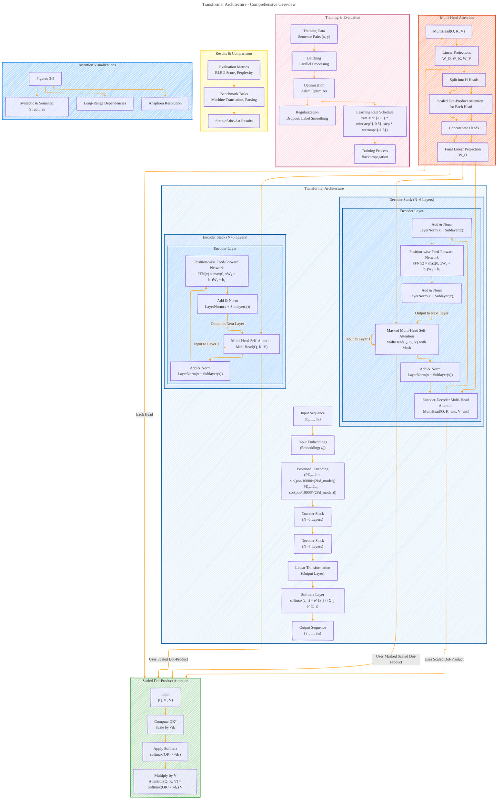

# Transformer Architecture Drafts
> **Disclaimer:**
>
> This document contains my personal notes on the topic,
> compiled from publicly available documentation and various cited sources.
> The materials are intended for educational purposes, personal study, and reference.
> The content is dual-licensed:
> 1. **MIT License:** Applies to all code implementations (Swift, Mermaid, and other programming languages).
> 2. **Creative Commons Attribution 4.0 International License (CC BY 4.0):** Applies to all non-code content, including text, explanations, diagrams, and illustrations.
---

## Transformer Architecture - A Draft Comprehensive Diagram

----

### Explanation and Key Features

This comprehensive Mermaid diagram encapsulates the entire **Transformer Architecture** as presented in the "Attention Is All You Need" paper. Here's a breakdown of its components and their interconnections:

1. **Input Sequence and Embeddings**
   - **Input Sequence (x₁, ..., xₙ):** The raw input tokens.
   - **Input Embeddings:** Transforms input tokens into dense vector representations.
   - **Positional Encoding (PE):** Adds positional information to embeddings using sine and cosine functions to capture the order of tokens.

2. **Encoder Stack (N=6 Layers)**
   - **Encoder Layer:** Each of the six identical layers comprises:
     - **Multi-Head Self-Attention:** Allows the model to focus on different parts of the input sequence simultaneously.
     - **Add & Norm:** Implements residual connections followed by layer normalization.
     - **Position-wise Feed-Forward Network (FFN):** Applies two linear transformations with a ReLU activation in between for non-linear processing.

3. **Decoder Stack (N=6 Layers)**
   - **Decoder Layer:** Each of the six identical layers comprises:
     - **Masked Multi-Head Self-Attention:** Similar to encoder self-attention but masks future tokens to maintain auto-regressive properties.
     - **Add & Norm:** Implements residual connections followed by layer normalization.
     - **Encoder-Decoder Multi-Head Attention:** Allows the decoder to attend to the encoder's output, integrating contextual information.
     - **Position-wise Feed-Forward Network (FFN):** Similar to the encoder's FFN for processing decoded information.

4. **Scaled Dot-Product Attention**
   - **Function:** Computes attention weights using query (Q), key (K), and value (V) matrices.
   - **Equation:**
     $$
     \text{Attention}(Q, K, V) = \text{softmax}\left(\frac{QK^T}{\sqrt{d_k}}\right)V
     $$
   - **Components:**
     - **QKᵀ:** Matrix multiplication of queries and keys.
     - **Scaling Factor (√dₖ):** Prevents gradient issues by scaling the dot products.
     - **Softmax:** Converts scores to probabilities.

5. **Multi-Head Attention**
   - **Function:** Allows the model to attend to information from different representation subspaces.
   - **Equation:**
     $$
     \text{MultiHead}(Q, K, V) = \text{Concat}(\text{head}_1, ..., \text{head}_h)W^O
     $$
     $$
     \text{head}_i = \text{Attention}(QW_i^Q, KW_i^K, VW_i^V)
     $$
   - **Components:**
     - **Linear Projections (W_Q, W_K, W_V):** Project Q, K, V into multiple heads.
     - **Concatenation:** Combine outputs from all heads.
     - **Final Linear Projection (W_O):** Integrates the concatenated heads.

6. **Output Layers**
   - **Linear Transformation:** Maps the decoder's output to the vocabulary size.
   - **Softmax Layer:** Converts the output vectors into probability distributions over the vocabulary.
   - **Output Sequence (y₁, ..., yₘ):** The generated tokens based on probabilities.

7. **Training and Evaluation (Optional)**
   - **Training Data:** Consists of sentence pairs for tasks like machine translation.
   - **Batching:** Groups data for parallel processing.
   - **Optimizer and Learning Rate Schedule:** Utilizes the Adam optimizer with a specific learning rate strategy.
   - **Regularization:** Implements techniques like dropout and label smoothing to prevent overfitting.
   - **Evaluation Metrics:** Includes BLEU scores and perplexity to assess model performance.

8. **Results and Comparisons (Optional)**
   - **Benchmark Tasks:** Applications like machine translation and parsing.
   - **State-of-the-Art Results:** Demonstrates the Transformer's superior performance compared to previous models.

9. **Attention Visualizations (Optional)**
   - **Figures 3-5:** Illustrates how attention heads capture long-range dependencies, resolve anaphora, and understand syntactic and semantic structures.

---

### Mathematical Equations Incorporated

- **Positional Encoding:**
  $$
  \begin{align*}
  PE(pos, 2i) &= \sin\left(\frac{pos}{10000^{2i/d_{model}}}\right) \\
  PE(pos, 2i+1) &= \cos\left(\frac{pos}{10000^{2i/d_{model}}}\right)
  \end{align*}
  $$

- **Scaled Dot-Product Attention:**
  $$
  \text{Attention}(Q, K, V) = \text{softmax}\left(\frac{QK^T}{\sqrt{d_k}}\right)V
  $$

- **Multi-Head Attention:**
  $$
  \text{MultiHead}(Q, K, V) = \text{Concat}(\text{head}_1, ..., \text{head}_h)W^O
  $$
  $$
  \text{head}_i = \text{Attention}(QW_i^Q, KW_i^K, VW_i^V)
  $$

- **Position-wise Feed-Forward Network:**
  $$
  FFN(x) = \text{max}(0, xW_1 + b_1)W_2 + b_2
  $$

- **Softmax Function:**
  $$
  \text{softmax}(z_i) = \frac{e^{z_i}}{\sum_{j} e^{z_j}}
  $$

---

### Optimization and Enhancements

- **Clear Subgraphs:** The diagram uses subgraphs to encapsulate Encoder and Decoder stacks, each containing multiple layers, enhancing readability.
  
- **Hierarchical Structure:** Layers within Encoder and Decoder stacks are clearly delineated, showing the flow from Multi-Head Attention to Feed-Forward Networks with Residual Connections and Layer Normalization.

- **Mathematical Notations:** Key equations are embedded within the relevant components to bridge the conceptual and mathematical understanding.

- **Attention Mechanisms Detailed:** Separate subgraphs for Scaled Dot-Product Attention and Multi-Head Attention provide granular insight into these core components.

- **Connections and Data Flow:** Arrows meticulously trace the data flow from input embeddings through encoder and decoder layers to the final output, ensuring all component interactions are visible.

- **Optional Components:** Sections like Training & Evaluation, Results & Comparisons, and Attention Visualizations are included as optional subgraphs for a more holistic view but can be omitted for simplicity if needed.

This optimized diagram ensures that every critical component and mathematical equation of the Transformer model is represented and interconnected appropriately, providing a clear and comprehensive visual representation of the architecture.

---
**Licenses:**

- **MIT License:**   - Full text in [LICENSE](LICENSE) file.
- **Creative Commons Attribution 4.0 International:**  - Legal details in [LICENSE-CC-BY](LICENSE-CC-BY) and at [Creative Commons official site](http://creativecommons.org/licenses/by/4.0/).

---