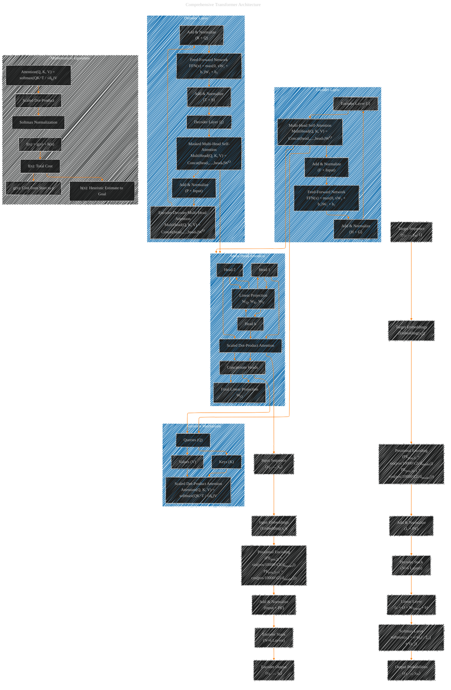

# Transformer Architecture Drafts
> **Disclaimer:**
>
> This document contains my personal notes on the topic,
> compiled from publicly available documentation and various cited sources.
> The materials are intended for educational purposes, personal study, and reference.
> The content is dual-licensed:
> 1. **MIT License:** Applies to all code implementations (Swift, Mermaid, and other programming languages).
> 2. **Creative Commons Attribution 4.0 International License (CC BY 4.0):** Applies to all non-code content, including text, explanations, diagrams, and illustrations.
---

## Transformer Architecture - A Draft Comprehensive Diagram

---

### Explanation of the Comprehensive Transformer Diagram

This Mermaid diagram offers a detailed and optimized visualization of the Transformer architecture as introduced in the "Attention Is All You Need" paper. Below is a breakdown of each component and their interconnections:

#### 1. **Input and Embeddings**
- **Input Sequence (`A`):** The Transformer takes a sequence of tokens `(x₁, ..., xn)` as input.
- **Input Embeddings (`B`):** Each token is converted into a dense vector representation.
- **Positional Encoding (`C`):** Since the Transformer lacks recurrence and convolution, positional encodings are added to inject information about the position of each token in the sequence. This is done using sine and cosine functions of different frequencies:
  - \( PE(pos, 2i) = \sin\left(\frac{pos}{10000^{\frac{2i}{d_{model}}}}\right) \)
  - \( PE(pos, 2i+1) = \cos\left(\frac{pos}{10000^{\frac{2i}{d_{model}}}}\right) \)
- **Add & Normalize (`D`):** The input embeddings and positional encodings are summed and then normalized to stabilize and accelerate training.

#### 2. **Encoder Stack (`E`)**
- **Encoder Layers (`Encoder_Stack`):** The encoder consists of `N=6` identical layers. Each layer performs two main operations:
  - **Multi-Head Self-Attention (`F`):** This mechanism allows the model to focus on different parts of the input sequence simultaneously. It involves:
    - Splitting the inputs into multiple heads.
    - Performing scaled dot-product attention on each head.
    - Concatenating the outputs of all heads.
    - Projecting the concatenated outputs back to the original dimension using a linear transformation.
  - **Add & Normalize (`G`):** A residual connection is added, and the result is normalized.
  - **Feed-Forward Network (`H`):** A fully connected network applied to each position separately and identically:
    - \( FFN(x) = \text{max}(0, xW_1 + b_1)W_2 + b_2 \)
  - **Add & Normalize (`I`):** Another residual connection followed by normalization.

#### 3. **Decoder Stack (`J`)**
- **Decoder Layers (`Decoder_Stack`):** Similarly, the decoder consists of `N=6` identical layers, each performing three main operations:
  - **Masked Multi-Head Self-Attention (`P`):** Prevents attending to future tokens in the sequence, maintaining the auto-regressive property.
  - **Add & Normalize (`Q`):** Residual connection and normalization.
  - **Encoder-Decoder Multi-Head Attention (`R`):** Allows the decoder to attend to the encoder's output, integrating information from the input sequence.
  - **Add & Normalize (`S`):** Residual connection and normalization.
  - **Feed-Forward Network (`T`):** Same as in the encoder.
  - **Add & Normalize (`U`):** Residual connection and normalization.

#### 4. **Output Layers**
- **Linear Layer (`V`):** Transforms the decoder's output representations into logits for each token in the vocabulary.
- **Softmax Layer (`W`):** Converts logits into probabilities:
$$
 \text{softmax}(z_i) = \frac{e^{z_i}}{\sum_j e^{z_j}}
$$
- **Output Sequence (`X`):** The final predicted sequence of tokens `(y₁, ..., ym)`.

#### 5. **Attention Mechanisms Details**
- **Scaled Dot-Product Attention (`Y` to `AO`):** Computes the attention scores by taking the dot product of queries and keys, scaling by the square root of the dimensionality, applying softmax, and weighting the values.
$$
Attention(Q, K, V) = \text{softmax}\left(\frac{QK^T}{\sqrt{d_k}}\right)V
$$
- **Multi-Head Attention (`AC` to `AI`):** Implements multiple parallel attention heads to capture different representation subspaces. Each head performs its own attention, and the results are concatenated and projected back to the model dimension.

#### 6. **Mathematical Equations (`AJ` to `AM`)**
- **Total Cost Function:**
$$
f(n) = g(n) + h(n)
$$
  - \( f(n) \): Estimated total cost.
  - \( g(n) \): Cost from the start node to node \( n \).
  - \( h(n) \): Heuristic estimate from node \( n \) to the goal.

#### 7. **Connections and Data Flow**
- **Encoder to Decoder (`J` to `P`):** The output of the encoder stack feeds into the encoder-decoder attention in each decoder layer.
- **Attention Mechanism Integration (`F`, `P` to `Y`):** The outputs from multi-head attention layers are connected to the detailed attention mechanism subgraphs, ensuring clarity in the flow of queries, keys, and values.

### Key Features and Optimizations

1. **Residual Connections and Layer Normalization:**
   - These are essential for training deep architectures by mitigating vanishing gradients and stabilizing the learning process.

2. **Multi-Head Attention:**
   - Allows the model to jointly attend to information from different representation subspaces at different positions. Each head has its own projection matrices (\( W_Q, W_K, W_V \)).

3. **Feed-Forward Networks:**
   - Positioned identically in both encoder and decoder layers, facilitating parallel processing of each token.

4. **Positional Encoding:**
   - Enables the model to incorporate the order of tokens, crucial for understanding sequential data without relying on recurrence.

5. **Scalability:**
   - The Transformer is highly parallelizable, enabling efficient training on large datasets using modern hardware accelerators.

6. **Mathematical Precision:**
   - Each component's mathematical formulation is included, ensuring a thorough understanding of the operations and their relationships.

This comprehensive diagram, combined with detailed explanations, provides an in-depth understanding of the Transformer's architecture, highlighting the intricate interplay between its components and the underlying mathematical principles that drive its functionality.

---
**Licenses:**

- **MIT License:**   - Full text in [LICENSE](LICENSE) file.
- **Creative Commons Attribution 4.0 International:**  - Legal details in [LICENSE-CC-BY](LICENSE-CC-BY) and at [Creative Commons official site](http://creativecommons.org/licenses/by/4.0/).

---