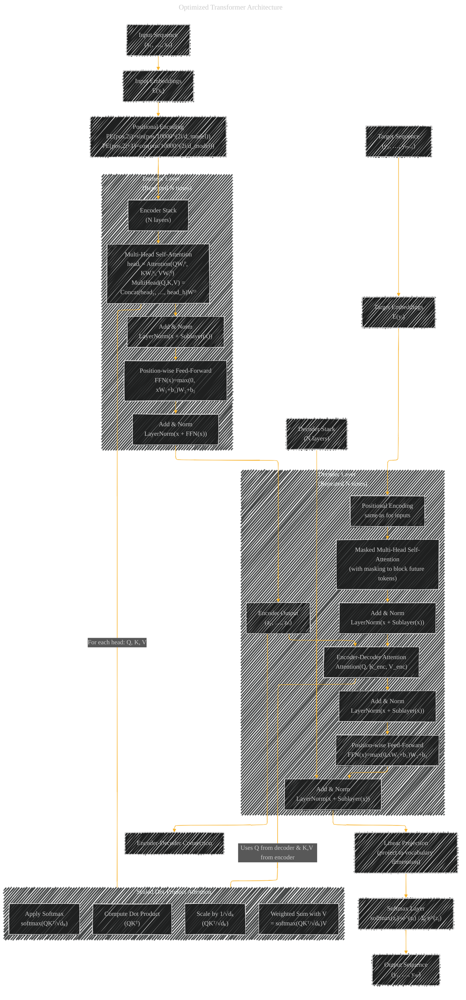

# Transformer Architecture Drafts
> **Disclaimer:**
>
> This document contains my personal notes on the topic,
> compiled from publicly available documentation and various cited sources.
> The materials are intended for educational purposes, personal study, and reference.
> The content is dual-licensed:
> 1. **MIT License:** Applies to all code implementations (Swift, Mermaid, and other programming languages).
> 2. **Creative Commons Attribution 4.0 International License (CC BY 4.0):** Applies to all non-code content, including text, explanations, diagrams, and illustrations.
---

## Transformer Architecture - A Draft Comprehensive Diagram

-----

### Diagram Explanation

1. **Input Processing:**  
   • The input sequence (x₁, …, xₙ) is converted into embeddings E(xᵢ) and added with sinusoidal positional encodings (using the equations shown).

2. **Encoder Stack:**  
   • The encoder consists of N stacked identical layers.  
   • Each layer applies multi-head self-attention (with the multi-head equation shown) and then a residual connection with layer normalization.  
   • A position-wise feed-forward network follows, again with a residual connection.

3. **Encoder Output:**  
   • The final output of the encoder (z₁, …, zₙ) is fed into the decoder’s encoder-decoder attention sub-layer.

4. **Decoder Stack:**  
   • The target sequence (shifted right) is embedded and combined with positional encodings.  
   • Each decoder layer begins with masked multi-head self-attention to prevent information flow from future tokens.  
   • The encoder-decoder attention sub-layer then allows the decoder to attend to the encoder’s output.  
   • A final feed-forward network with residual connection completes each decoder layer.

5. **Output Generation:**  
   • The decoder’s final output is passed through a linear projection and softmax layer to generate a probability distribution over the vocabulary and produce the output sequence.

6. **Scaled Dot-Product Attention (SDPA):**  
   • Shown as a separate subgraph, it details the internal computations used in both self-attention and encoder-decoder attention:
     - Compute QKᵀ, scale by 1/√dₖ, apply softmax, and compute the weighted sum with V.

Every component is connected sequentially to show the full flow from input processing through encoder and decoder layers to the final prediction. This optimized diagram integrates the essential equations and connections to provide a complete view of the Transformer model.

---
**Licenses:**

- **MIT License:**   - Full text in [LICENSE](LICENSE) file.
- **Creative Commons Attribution 4.0 International:**  - Legal details in [LICENSE-CC-BY](LICENSE-CC-BY) and at [Creative Commons official site](http://creativecommons.org/licenses/by/4.0/).

---