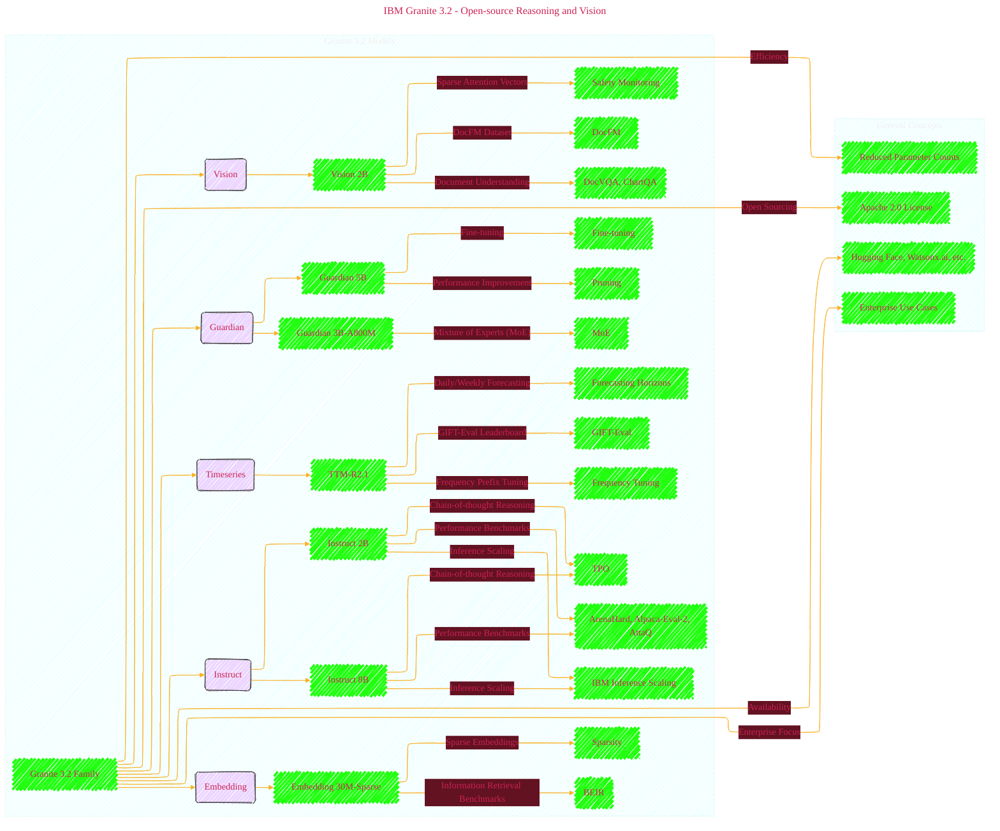

# IBM Granite 3.2 - Open-source Reasoning and Vision
> **Disclaimer:**
>
> This document contains my personal notes on the topic,
> compiled from publicly available documentation and various cited sources.
> The materials are intended for educational purposes, personal study, and reference.
> The content is dual-licensed:
> 1. **MIT License:** Applies to all code implementations (Swift, Mermaid, and other programming languages).
> 2. **Creative Commons Attribution 4.0 International License (CC BY 4.0):** Applies to all non-code content, including text, explanations, diagrams, and illustrations.
---

## IBM Granite 3.2 Models - A Diagrammatic Guide 

---

### Explanation and Improvements

The document describes the Granite 3.2 family of large language models (LLMs) and related models, highlighting key features and improvements.  Here's a breakdown of the main concepts, using the structured approach suggested in the prior response:

**1. Granite 3.2 Instruct:**

* **Concept:** Enhanced reasoning capabilities within the core Instruct models, accessible via a toggle.
* **Key Features:**
    * **Chain-of-thought reasoning:** Experimental capability to follow complex instructions, with an easy on/off switch.
    * **Inference Scaling:**  Combined with IBM's techniques, the 8B Instruct model matches or surpasses reasoning performance of much larger models (e.g., GPT-4o, Claude 3.5).
    * **Performance Preservation:** Reasoning is implemented without sacrificing general performance or safety.
    * **Thought Preference Optimization (TPO):**  A reinforcement learning framework used to improve reasoning without sacrificing other capabilities.
    * **Benchmarks (ArenaHard, Alpaca-Eval-2, AttaQ):**  Used to measure the model's ability to handle complex reasoning and safety.
* **Diagram Elements:** Nodes for 'Granite 3.2 Instruct 8B', 'Granite 3.2 Instruct 2B', 'Chain-of-Thought Prompting', 'Inference Scaling Techniques', 'TPO', 'Performance Benchmarks'. Directed edges would show the relationships and use of the techniques.

**2. Granite Vision 3.2 2B:**

* **Concept:** A multimodal LLM focused on visual document understanding.
* **Key Features:**
    * **Document Understanding:**  Specific focus on processing images of documents, unlike general image-processing models.
    * **DocFM Dataset:**  A custom dataset used for training, designed for document-specific tasks.
    * **Multimodal Retrieval Augmented Generation (RAG):**  Designed for tasks involving both text and image input.
    * **Sparse Attention Vectors:**  A novel technique for safety monitoring during inference by examining attention patterns.
* **Diagram Elements:**  Nodes for 'Granite Vision 3.2 2B', 'DocFM Dataset', 'Document Understanding Tasks' (DocVQA, ChartQA), 'Attention Mechanism'. Directed edges would show data flow and relationships.

**3. Granite Guardian 3.2:**

* **Concept:** Guardrail models to detect risks in prompts and responses.
* **Key Features:**
    * **Verbalized Confidence:**  Provides a level of certainty (High/Low) for detected risks.
    * **Slimmer Models (5B, 3B-A800M):**  Improved efficiency by pruning layers and using a mixture-of-experts approach, with reduced parameter counts.
* **Diagram Elements:**  Nodes for 'Granite Guardian 3.2 5B', 'Granite Guardian 3.2 3B-A800M', 'Safety Monitoring Tasks', 'Verbalized Confidence'.  Directed edges would show the relationships between models, safety concerns, and their outputs.

**4. Granite Timeseries (TTM-R2.1):**

* **Concept:**  Compact time-series models for forecasting.
* **Key Features:**
    * **Daily and Weekly Forecasting:**  Extension of previous TTM models to include longer-term forecasting horizons.
    * **Frequency Prefix Tuning:**  A technique for handling data with different resolutions by adding a prefix token to the input.
    * **GIFT-Eval Leaderboard:** Achieves top performance on a large and comprehensive time series forecasting benchmark.
* **Diagram Elements:**  Nodes for 'Granite-Timeseries-TTM-R2.1', 'GIFT-Eval', 'Frequency Prefix Tuning', 'Forecasting Tasks'. Directed edges would indicate the use of tuning and benchmarks.

**5. Granite Embedding:**

* **Concept:**  A sparse embedding model for efficiency and interpretability.
* **Key Features:**
    * **Sparse Embeddings:** Embeddings that use vocabulary size directly. More interpretable than dense embeddings.
    * **Efficiency and Scalability:** Optimized for diverse resource and latency budgets, especially suited for shorter text.
    * **Benchmarks (BEIR):**  Used to measure performance against similar models.
* **Diagram Elements:**  Nodes for 'Granite-Embedding-Sparse-30M-English', 'Dense Embeddings', 'Sparse Embeddings', 'Information Retrieval Benchmarks'.

**General Concepts (across all models):**

* **Open Sourcing:**  All new models are open-sourced under a permissive Apache 2.0 license.
* **Availability:** Models are available on platforms like Hugging Face, IBM watsonx.ai, and others.
* **Emphasis on Enterprise-Ready Models:**  Focus on practical performance and addressing enterprise-specific use cases.
* **Focus on Efficiency:**  Emphasis on improving model performance while reducing computational costs.

By representing these concepts with appropriate nodes and directed edges in a Mermaid diagram, you can visually illustrate the interrelationships between the different Granite 3.2 models and the key technologies that drive their capabilities.  Remember to focus on the most important connections and relationships.

---
**Licenses:**

- **MIT License:**   - Full text in [LICENSE](LICENSE) file.
- **Creative Commons Attribution 4.0 International:**  - Legal details in [LICENSE-CC-BY](LICENSE-CC-BY) and at [Creative Commons official site](http://creativecommons.org/licenses/by/4.0/).

---