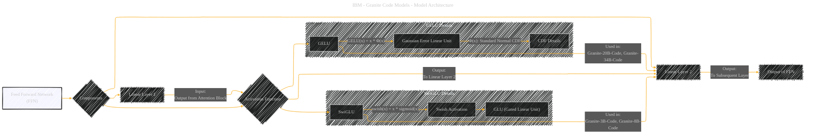

# Feed Forward Network Component within the Transformer Architecture
> **Disclaimer:**
>
> This document contains my personal notes on the topic,
> compiled from publicly available documentation and various cited sources.
> The materials are intended for educational purposes, personal study, and reference.
> The content is dual-licensed:
> 1. **MIT License:** Applies to all code implementations (Swift, Mermaid, and other programming languages).
> 2. **Creative Commons Attribution 4.0 International License (CC BY 4.0):** Applies to all non-code content, including text, explanations, diagrams, and illustrations.
---

## Feed Forward Network - A Diagrammatic Guide 

Key elements:

*   **FFN as the Central Node:** Highlights that we are focusing on this specific part of the Transformer.
*   **Components (Linear Layers, Activation Function):** Sub-nodes that break down the FFN.
*   **Activation Function Variation:** Notes that the activation function differs based on the model size (SwiGLU for smaller, GELU for larger).
*   **Data Flow:** Clear arrows showing how data moves through the FFN.
*   **Annotations (Model Usage):** Specifies which activation function is used in each model.

Here's a semantic breakdown of the diagram:

1.  **Feed Forward Network (FFN):**
    *   This component is the heart of the diagram, representing a key element of the Granite Code Models. It's a distinct processing block within each transformer layer.

2.  **Components:**
    *   These are the building blocks of the FFN. The "Linear Layer 1" applies an affine transformation to the input, and the "Linear Layer 2" maps the result of the activation function back to the expected output dimensions. The activation function introduces non-linearity.

3.  **Activation Functions (SwiGLU, GELU):**
    *   The choice of activation function depends on the model size, with SwiGLU used in smaller models (3B, 8B) and GELU in larger models (20B, 34B). SwiGLU (Swish-Gated Linear Unit) is computationally efficient, while GELU (Gaussian Error Linear Unit) can better capture complex data patterns.
*   **Data Flow:**
    *   Clear arrows indicate the flow of data: from the output of the attention block to the first linear layer, through the activation function, into the second linear layer, and then to the subsequent layer.
*   **Model Usage:**
    *   Labels indicate which activation function is used in each Granite Code Model. This emphasizes the architectural differences.

---
**Licenses:**

- **MIT License:**   - Full text in [LICENSE](LICENSE) file.
- **Creative Commons Attribution 4.0 International:**  - Legal details in [LICENSE-CC-BY](LICENSE-CC-BY) and at [Creative Commons official site](http://creativecommons.org/licenses/by/4.0/).

---