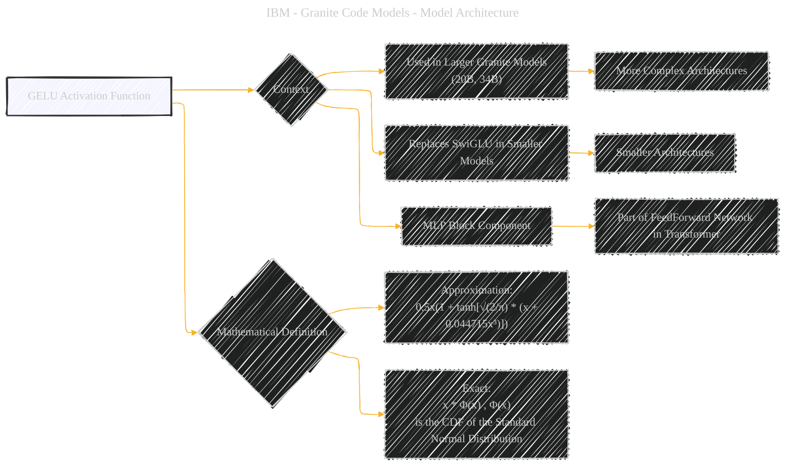

# The GELU (Gaussian Error Linear Units) activation function
> **Disclaimer:**
>
> This document contains my personal notes on the topic,
> compiled from publicly available documentation and various cited sources.
> The materials are intended for educational purposes, personal study, and reference.
> The content is dual-licensed:
> 1. **MIT License:** Applies to all code implementations (Swift, Mermaid, and other programming languages).
> 2. **Creative Commons Attribution 4.0 International License (CC BY 4.0):** Applies to all non-code content, including text, explanations, diagrams, and illustrations.
---

## GELU - A Diagrammatic Guide 

Here's a Mermaid diagram focusing specifically on the GELU (Gaussian Error Linear Units) activation function, based on the information from the original document:

---

### Explanation

*   **Node A ("GELU Activation Function"):** This is the central concept.
*   **Node B ("Context"):** This central node shows the overall purpose of the GELU activation function.
*   **Nodes C & D:** specify the models that the GELU activation function applies to.
*   **Node E:** specifies the component of the larger architecture that the GELU is used for.
*   **Node I:** is the mathematical definition of the function that will be useful. 

---
**Licenses:**

- **MIT License:**   - Full text in [LICENSE](LICENSE) file.
- **Creative Commons Attribution 4.0 International:**  - Legal details in [LICENSE-CC-BY](LICENSE-CC-BY) and at [Creative Commons official site](http://creativecommons.org/licenses/by/4.0/).

---