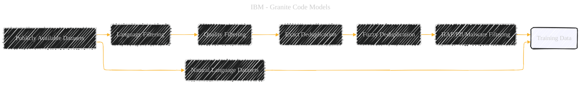

# Granite Code Models: A Family of Open Foundation Models for Code Intelligence
> **Disclaimer:**
>
> This document contains my personal notes on the topic,
> compiled from publicly available documentation and various cited sources.
> The materials are intended for educational purposes, personal study, and reference.
> The content is dual-licensed:
> 1. **MIT License:** Applies to all code implementations (Swift, Mermaid, and other programming languages).
> 2. **Creative Commons Attribution 4.0 International License (CC BY 4.0):** Applies to all non-code content, including text, explanations, diagrams, and illustrations.
---

## Granite Code Models - A Diagrammatic Guide 

Below is a structured extraction of the concepts, framed for visualization as directed or undirected graphs, or factor graphs.

### 1. Training Data Pipeline

**Concept:** The flow of data through the stages of collection, filtering, deduplication, and cleaning. This process can be visualized as a directed acyclic graph (DAG).

**Nodes:**

*   `Publicly Available Datasets`: Starting point (e.g., GitHub Code Clean, StarCoderData).
*   `Language Filtering`: Code filtered by programming language.
*   `Quality Filtering`: Filtered based on code quality metrics (alphabetic characters, XML tags, visible text ratio in HTML, character count).
*   `Exact Deduplication`: Deduplicated using SHA256 hashing.
*   `Fuzzy Deduplication`: Fuzzy deduplication using MinHash and LSH.
*   `HAP/PII/Malware Filtering`: HAP keyword filtering, PII redaction using StarPII, and Malware scanning.
*   `Natural Language Datasets`: External datasets (e.g., StackExchange, Arxiv).
*   `Training Data`: Final output used for model training.

**Edges:**  Directed edges representing the flow of data from one stage to the next.
**Equations (Annotations):** You might add simple counts (e.g., #languages = 116) or filters at each node.

**Mermaid Code Example:**

---

### 2. Model Architecture

**Concept:** The different sizes of Granite Code models and their key architectural components.

**Nodes:**

*   `Granite-3B-Code`: Smallest model (3B parameters).
*   `Granite-8B-Code`: Medium-sized model (8B parameters).
*   `Granite-20B-Code`: Large model (20B parameters).
*   `Granite-34B-Code`: Largest model (34B parameters).
*   `Transformer Decoder`: Base architecture.
*   `RoPE Embedding`: Embedding technique (for smaller models).
*   `Multi-Head Attention (MHA)`: Attention mechanism.
*   `Grouped-Query Attention (GQA)`: Attention mechanism (for medium-sized models).
*   `Multi-Query Attention (MQA)`: Attention mechanism (for larger models).
*   `RMSNorm`: Normalization layer.
*   `LayerNorm`: Normalization layer.
*   `SwiGLU`: Activation function.
*   `GELU`: Activation function.

**Edges:**

*   Edges can indicate hierarchical relationships (e.g., 'Granite-3B-Code' *is a* 'Transformer Decoder').
*   Edges can connect components to models to indicate which techniques are used (e.g., 'Granite-3B-Code' *uses* 'RoPE Embedding').

**Mermaid Code Example:**

---

### 3. Training Process

**Concept:** Two-phase training strategy and data flow.

**Nodes:**

*   `Phase 1`: Code-Only Training
*   `Phase 2`: Code + Language Training
*    `Code Data` : Code Data (3-4 Trillion Tokens)
*    `High-Quality Data` : High-Quality (500 Billion Tokens)
*   `Tokenizer`: Byte Pair Encoding (BPE)
*   `Causal Language Modeling Objective`
*   `Fill-In-The-Middle Objective`
*   `Trained Models`

**Edges:**

*   Directed edges showing the sequence of phases and the flow of data.
*   Edges representing the training objective and Tokenizer used at each stage.

**Mermaid Code Example:**

----

### 4. Instruction Tuning Process

**Concept:** The data sources and techniques used for instruction tuning.

**Nodes:**

*   `CommitPackFT`: Filtered version of CommitPack.
*   `Math Datasets`: MathInstruct, MetaMathQA.
*   `Code Instruction Datasets`:  Glaive-Code-Assistant-v3, Self-OSS-Instruct-SC2, Glaive-Function-Calling-v2, NL2SQL, API calling datasets.
*   `Language Instruction Datasets`: HelpSteer, filtered Platypus.
*   `Instruction Models`
*   `Noise Injection`
*   `FlashAttention 2`
*   `Cosine Scheduler`

**Edges:**

*   Directed edges showing data sources feeding into the instruction tuning process.
*   Edges linking the datasets to instruction models.

**Mermaid Code Example:**

-----

### 5. Evaluation Benchmarks

**Concept:** The different benchmarks used to evaluate the Granite Code Models.

**Nodes:**

*   `HumanEvalSynthesize`: Multilingual code generation.
*   `MultiPL-E`: Multilingual code generation in 18 languages.
*   `MBPP/MBPP+`: Python code generation.
*   `DS1000`: Data science code generation.
*   `RepoBench`: Repository-level code generation.
*   `CrossCodeEval`: Repository-level code generation.
*   `HumanEvalExplain`: Multilingual code explanation.
*   `HumanEvalFix`: Multilingual code fixing.
*   `CodeLingua`: Code translation.
*   `CRUXEval`: Code execution.
*   `MATH`: Math reasoning.
*   `GSM8K`: Math reasoning.
*   `SAT`: Math reasoning.
*   `OCW`: Math reasoning.
*   `BFCL`: Function calling
*   `ReCode`: Model robustness

**Edges:**

*   Edges linking the type of task (e.g. code generation, fixing, explaination) with the different Benchmarks.

**Mermaid Code Example:**

---
**Licenses:**

- **MIT License:**   - Full text in [LICENSE](LICENSE) file.
- **Creative Commons Attribution 4.0 International:**  - Legal details in [LICENSE-CC-BY](LICENSE-CC-BY) and at [Creative Commons official site](http://creativecommons.org/licenses/by/4.0/).

---