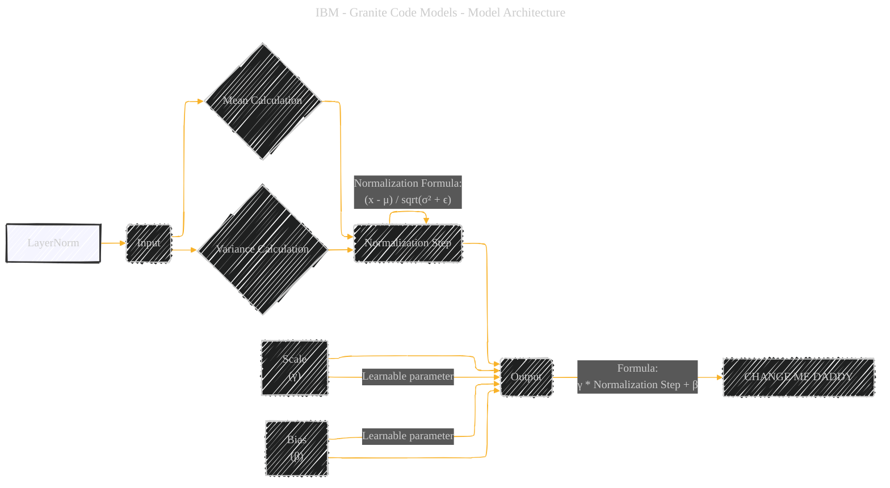

# LayerNorm
> **Disclaimer:**
>
> This document contains my personal notes on the topic,
> compiled from publicly available documentation and various cited sources.
> The materials are intended for educational purposes, personal study, and reference.
> The content is dual-licensed:
> 1. **MIT License:** Applies to all code implementations (Swift, Mermaid, and other programming languages).
> 2. **Creative Commons Attribution 4.0 International License (CC BY 4.0):** Applies to all non-code content, including text, explanations, diagrams, and illustrations.
---

## LayerNorm - A Diagrammatic Guide 

The diagram below provides a succinct visual explanation of the LayerNorm process within the Granite Code Model architecture.

**Concept:** Layer Normalization within the Granite Code Model architecture

**Nodes:**

*   `LayerNorm`: Main node, representing the Layer Normalization technique.
*   `Input`: Input to the LayerNorm layer (Activations from the previous layer).
*   `Output`: Output of the LayerNorm layer (Normalized activations).
*   `Mean Calculation`: The calculation of the mean across the features.
*   `Variance Calculation`: The calculation of the variance across the features.
*   `Normalization Step`: The step where the input is normalized using the calculated mean and variance.
*   `Scale (γ)`: Learnable scale parameter.
*   `Bias (β)`: Learnable bias parameter.

**Edges:**

*   Edges show the flow of data and operations within the LayerNorm process.

**Mermaid Code Example:**

---

### Explanation of the diagram and the choices made

*   **Focus:**  The diagram concentrates only on the LayerNorm operation, omitting broader architectural details for clarity.
*   **Data Flow:** The directed edges show how data progresses through the LayerNorm process.
*   **Key Steps:** The core calculations (mean, variance, normalization) are highlighted as separate nodes.
*   **Learnable Parameters:**  The scale (γ) and bias (β) parameters are included, as they are key components of LayerNorm.
*   **Formula Annotations:** Key equations are included as edge annotations to provide a succinct mathematical description.
*   **Style:** A distinct fill color highlights the core concept "LayerNorm".

---

### Key Takeaways

*   The diagram represents the process of normalization, highlighting the importance of mean and variance calculation in LayerNorm.
*   The annotations provide context for the different steps and their formulas, making it easier to grasp the mathematical aspect.
*   The diagram can be expanded to include other normalization techniques (RMSNorm), providing a comparative visualization.

---
**Licenses:**

- **MIT License:**   - Full text in [LICENSE](LICENSE) file.
- **Creative Commons Attribution 4.0 International:**  - Legal details in [LICENSE-CC-BY](LICENSE-CC-BY) and at [Creative Commons official site](http://creativecommons.org/licenses/by/4.0/).

---